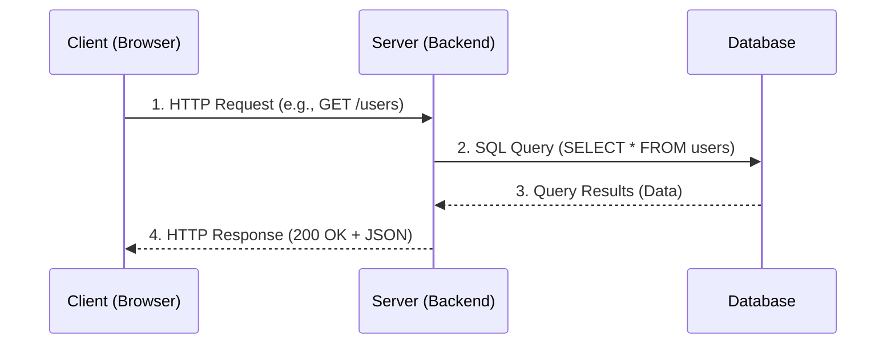
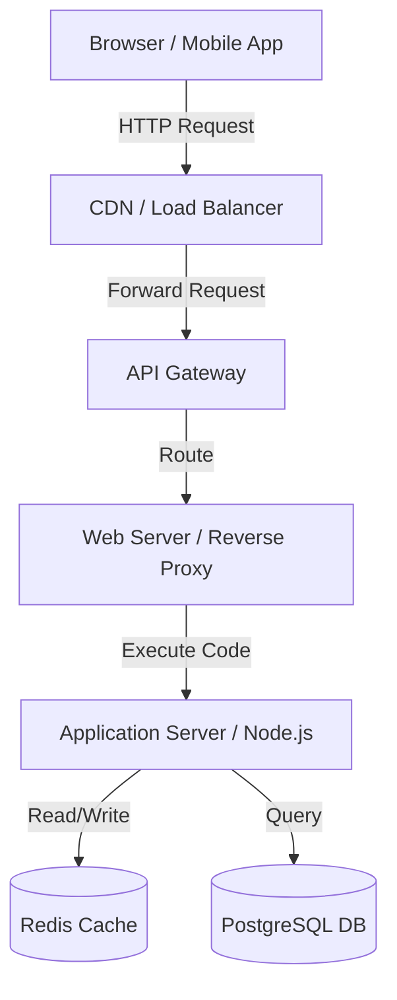

title: "Full Stack Fundamentals: Complete Beginner to Advanced"
subtitle: "From First Principles to Production-Grade Architecture"
author: "Principal Software Engineer"
version: "3.0"
date: "2026"

# Full Stack Fundamentals
## Complete Beginner to Advanced Engineering Handbook

> Welcome to the definitive engineering handbook on Full Stack Fundamentals for EnggVault. This document is designed as a university-level and professional software-engineering reference book. It covers the absolute basics of the internet to the complex architectures used in modern scalable web applications.

> **Difficulty:** Beginner → Intermediate → Advanced → System Design
> **Prerequisites:** None · **Next:** [02 — HTML →](../02-html/notes.md)

## Table of Contents

### Part I: The Internet & The Browser
- [Chapter 1: What is Full Stack Development?](#chapter-1-what-is-full-stack-development)
- [Chapter 2: How the Internet Works (Deep Dive)](#chapter-2-how-the-internet-works-deep-dive)
- [Chapter 3: The Browser & Rendering Engine](#chapter-3-the-browser--rendering-engine)
- [Chapter 4: Client-Server Architecture](#chapter-4-client-server-architecture)

### Part II: Core Web Technologies
- [Chapter 5: Web Architecture (N-Tier)](#chapter-5-web-architecture-n-tier)
- [Chapter 6: HTTP & Network Protocols](#chapter-6-http--network-protocols)
- [Chapter 7: Modern Tech Stacks](#chapter-7-modern-tech-stacks)

### Part III: Data & Infrastructure
- [Chapter 8: Database Fundamentals](#chapter-8-database-fundamentals)
- [Chapter 9: Version Control & Git Internals](#chapter-9-version-control--git-internals)
- [Chapter 10: Developer Tooling & Workflow](#chapter-10-developer-tooling--workflow)
- [Chapter 11: Deployment & Cloud Infrastructure](#chapter-11-deployment--cloud-infrastructure)

### Part IV: Production & Advanced Topics
- [Chapter 12: Security Fundamentals](#chapter-12-security-fundamentals)
- [Chapter 13: Performance Engineering](#chapter-13-performance-engineering)
- [Chapter 14: Real-World Architecture (System Design)](#chapter-14-real-world-architecture-system-design)
- [Chapter 15: Interview Preparation](#chapter-15-interview-preparation)
- [Chapter 16: Production Checklist](#chapter-16-production-checklist)
- [Chapter 17: Cheat Sheet](#chapter-17-cheat-sheet)

---

# CHAPTER 1: What is Full Stack Development?

A **full stack developer** designs and builds every layer of a web application — the user interface, the server-side logic, and the database. The term "full stack" refers to the complete set of software layers required to deliver a working application to a user.

## 1.1 The Layers of the Stack

| Layer | Responsibility | Examples |
|:------|:---------------|:---------|
| **Frontend (Client-side)** | The interface rendered in a user's browser. Responsible for UI, UX, and capturing inputs. | HTML, CSS, JavaScript, React, Next.js, Vue |
| **Backend (Server-side)** | The business logic layer. Processes data, enforces security, and communicates with the database. | Node.js, Python/Django, Java/Spring Boot |
| **Database (Data Layer)** | Persistent data storage and retrieval. | PostgreSQL, MongoDB, Redis |
| **Infrastructure / DevOps**| Where the application lives and how it is deployed. | AWS, Vercel, Docker, Kubernetes |

## 1.2 The Evolution of the Full Stack
- **Web 1.0 (1990s):** Static HTML pages delivered from a web server.
- **Web 2.0 (2000s):** Dynamic pages (PHP, Ruby on Rails) rendering HTML on the server on every request.
- **The SPA Era (2010s):** Single Page Applications (React, Angular). The server just sends JSON; the browser renders everything.
- **Modern Era (2020s+):** Server-Side Rendering (SSR) and Server Components (Next.js) mixing the best of both worlds.

## 1.3 Interview Questions
1. **What distinguishes a Full Stack developer from a Frontend or Backend developer?**
   *Answer:* A full-stack developer has working knowledge of all layers of an application, from configuring the database schema and writing server APIs to building the client-side user interface and deploying the application.

# CHAPTER 2: How the Internet Works (Deep Dive)

Before writing any code, engineers must understand the physical and logical infrastructure that delivers data across the globe.

## 2.1 Packets and Routing (BGP)
The internet is a global network of interconnected networks. Data does not travel in one continuous stream; it is broken into tiny chunks called **packets**.
- **Routers** read the destination IP address on the packet and forward it to the next router.
- **BGP (Border Gateway Protocol)** is the "postal service" of the internet, calculating the most efficient path between networks.

## 2.2 DNS Resolution (Domain Name System)
Computers communicate using IP addresses (e.g., `93.184.216.34`), but humans use domain names (`example.com`). DNS translates domain names to IP addresses.

When a user types `https://example.com`, the following sequence occurs:
1. **Local Cache:** The browser checks its internal cache and the OS cache.
2. **Resolver:** If not found, the OS queries the configured DNS Resolver (usually provided by the ISP or 1.1.1.1/8.8.8.8).
3. **Root Nameserver:** The resolver asks the Root Server, which directs it to the `.com` TLD (Top-Level Domain) server.
4. **TLD Nameserver:** The TLD server directs it to the Authoritative Nameserver for `example.com`.
5. **Authoritative Nameserver:** Returns the actual IP Address.

## 2.3 The TCP/IP Model
All web communication travels over the TCP/IP suite.
- **IP (Internet Protocol):** Handles addressing and routing packets from machine A to machine B.
- **TCP (Transmission Control Protocol):** Runs on top of IP. It ensures packets arrive reliably, in order, and without loss. It establishes a connection via a "Three-Way Handshake" (SYN, SYN-ACK, ACK).

## 2.4 TLS/SSL (HTTPS)
**HTTPS** adds a cryptographic layer (TLS) over TCP.
- Authenticates the server via a certificate issued by a trusted Certificate Authority (CA).
- Establishes an encrypted channel using asymmetric cryptography (to exchange a session key) and symmetric cryptography (to encrypt the actual data).

## 2.5 Interview Questions
1. **What happens exactly when you type a URL into your browser and press Enter?**
   *Answer:* DNS Resolution (Browser cache -> OS cache -> Resolver -> Root -> TLD -> Authoritative) to get the IP. TCP 3-way handshake to establish a connection. TLS handshake to secure the connection. The browser sends an HTTP GET request. The server processes it and returns an HTTP response containing HTML. The browser parses the HTML, requests CSS/JS assets, builds the DOM and CSSOM, and paints the pixels to the screen.

# CHAPTER 3: The Browser & Rendering Engine

A web browser is a complex runtime environment, arguably the most ubiquitous operating system on the planet.

## 3.1 The Rendering Pipeline
1. **Parsing:** The browser fetches the HTML and parses it into a tree called the **DOM** (Document Object Model).
2. **CSSOM:** It fetches CSS and builds the **CSSOM** (CSS Object Model).
3. **Render Tree:** It combines the DOM and CSSOM into a Render Tree (excluding hidden elements like `display: none`).
4. **Layout (Reflow):** It calculates the exact geometric position and size of every node on the screen.
5. **Paint:** It paints the pixels onto the screen.
6. **Compositing:** Layers are drawn in the correct order (z-index) on the GPU.

## 3.2 Browser Engines
| Browser | Engine | JavaScript Engine |
|:--------|:-------|:------------------|
| Chrome / Edge | Blink | V8 |
| Firefox | Gecko | SpiderMonkey |
| Safari | WebKit | JavaScriptCore |

## 3.3 The V8 Engine & The Event Loop
JavaScript is single-threaded. V8 is the engine that compiles JS to machine code.
- **Call Stack:** Where function calls are executed.
- **Web APIs:** Browser APIs (like `fetch` or `setTimeout`) execute in the background.
- **Callback Queue / Microtask Queue:** When Web APIs finish, their callbacks are placed here.
- **Event Loop:** Continuously checks if the Call Stack is empty. If it is, it pushes the first item from the queues onto the stack.

## 3.4 Interview Questions
1. **What is the DOM?**
   *Answer:* The Document Object Model is an in-memory tree representation of the HTML document. It provides an API that allows JavaScript to dynamically query and modify the structure, style, and content of the page.
2. **Why is JavaScript single-threaded, and how does it handle asynchronous operations?**
   *Answer:* JS is single-threaded to avoid complex concurrency issues like deadlocks when modifying the DOM. It handles async operations via the Event Loop, offloading heavy tasks to Web APIs and executing callbacks only when the main thread is idle.

# CHAPTER 4: Client-Server Architecture

Every web application is built on a **client-server** model.

## 4.1 The Model

## 4.2 Key Characteristics
- **Client (Frontend):** Responsible for rendering UI, capturing user input, and maintaining presentation state.
- **Server (Backend):** Responsible for business logic, data validation, security, and persistence.
- **Statelessness:** By default, every HTTP request is entirely independent. The server does not remember the client from one request to the next unless a session identifier (cookie/token) is provided.

# CHAPTER 5: Web Architecture (N-Tier)

A production web application is divided into distinct layers, ensuring separation of concerns.

## 5.1 N-Tier Architecture Diagram

## 5.2 Monolith vs. Microservices
- **Monolith:** All backend logic (auth, billing, user management) is compiled into a single massive application. Easier to deploy and debug, but difficult to scale massively.
- **Microservices:** Logic is split into dozens of independent, small applications that communicate over the network. Much harder to orchestrate (requires Kubernetes), but allows independent scaling of specific features.

# CHAPTER 6: HTTP & Network Protocols

**HTTP (Hypertext Transfer Protocol)** is the application-layer protocol defining how clients and servers communicate.

> **Note:** Deep dive in [Module 05 — HTTP, JSON & Fetch](../05-http-json-fetch/notes.md).

## 6.1 HTTP Methods & Status Codes
- **GET:** Read data.
- **POST:** Create data.
- **PUT/PATCH:** Update data.
- **DELETE:** Remove data.

**Crucial Status Codes:**
- `200 OK`, `201 Created`
- `400 Bad Request`, `401 Unauthorized`, `403 Forbidden`, `404 Not Found`
- `500 Internal Server Error`

## 6.2 The Evolution of HTTP
- **HTTP/1.1:** Text-based, keep-alive connections. Suffers from "Head of Line Blocking" (one slow request blocks all others on that connection).
- **HTTP/2:** Binary protocol, multiplexing (sending multiple parallel requests over a single TCP connection). Server push.
- **HTTP/3:** Uses QUIC (over UDP) instead of TCP. Eliminates TCP head-of-line blocking and provides faster connection setup.

## 6.3 REST vs GraphQL vs gRPC
- **REST:** Resource-based URLs (`/users/123`). Uses standard HTTP methods. Returns fixed JSON structures.
- **GraphQL:** Single endpoint (`/graphql`). The client specifies exactly what data it wants in a query language. Eliminates over-fetching.
- **gRPC:** High-performance framework by Google. Uses Protobufs instead of JSON. Operates over HTTP/2. Ideal for internal microservice-to-microservice communication.

# CHAPTER 7: Modern Tech Stacks

A **tech stack** is the combination of technologies used to build an application end-to-end.

## 7.1 Popular Stacks

| Stack | Technologies | Best For |
|:------|:-------------|:---------|
| **MERN** | MongoDB, Express, React, Node.js | Fast prototyping, full-stack JavaScript. |
| **T3 Stack** | Next.js, tRPC, Tailwind, Prisma | Type-safe modern React applications. |
| **Django / Python** | Django, PostgreSQL | Data-heavy applications, rapid development. |
| **Spring Boot / Java** | Spring, PostgreSQL, React/Angular | Enterprise applications, highly scalable microservices. |
| **Go / Fiber** | Go, PostgreSQL | Extremely high performance, low memory footprint microservices. |

# CHAPTER 8: Database Fundamentals

Databases are the source of truth for your application.

> **Note:** Deep dive in [Module 08 — Databases](../08-databases/notes.md).

## 8.1 SQL (Relational)
- Data is stored in strict tables with predefined schemas.
- Data is heavily normalized to avoid duplication.
- Uses JOINs to connect data.
- Strongly ACID compliant (Atomicity, Consistency, Isolation, Durability).
- *Examples:* PostgreSQL, MySQL.

## 8.2 NoSQL (Non-Relational)
- Data is stored in flexible documents (JSON), key-value pairs, or graphs.
- Schemas are fluid; data is often denormalized.
- Scales horizontally much easier than SQL.
- *Examples:* MongoDB, Redis, DynamoDB.

## 8.3 The CAP Theorem
In a distributed database system, you can only pick two of the following three guarantees:
- **Consistency:** Every read receives the most recent write or an error.
- **Availability:** Every request receives a non-error response.
- **Partition Tolerance:** The system continues to operate despite network failures dropping messages.
- *Conclusion:* Since network partitions (P) are inevitable, distributed databases must choose between CP (Consistency) or AP (Availability).

# CHAPTER 9: Version Control & Git Internals

**Git** is a distributed version control system. It tracks changes to files over time.

## 9.1 Git Architecture
Git does not store diffs; it stores **snapshots** of the entire project at specific points in time.
- **Working Directory:** The actual files on your disk.
- **Staging Area (Index):** Files marked to be included in the next commit.
- **Local Repository:** Your local `.git` directory containing all history.
- **Remote Repository:** The hosted copy (e.g., GitHub).

## 9.2 Branching Strategies
- **GitFlow:** Strict branches (`main`, `develop`, `feature/*`, `release/*`). Safe but slow, often leading to "merge hell".
- **Trunk-Based Development:** All developers push to `main` constantly, using short-lived feature branches and feature flags. Required for true CI/CD.

## 9.3 Interview Questions
1. **What is the difference between `git merge` and `git rebase`?**
   *Answer:* `merge` combines two branches and creates a new "merge commit", preserving the exact history. `rebase` rewrites history by placing the current branch's commits at the tip of the target branch, resulting in a cleaner, linear history, but is dangerous if the branch is shared publicly.

# CHAPTER 10: Developer Tooling & Workflow

Professional engineers rely on robust tooling to ensure code quality.

## 10.1 CI/CD (Continuous Integration / Continuous Deployment)
- **CI:** Automatically running a suite of automated tests and linters every time code is pushed to a PR. Prevents broken code from merging.
- **CD:** Automatically deploying the code to production immediately after it is merged to the main branch.
- *Tools:* GitHub Actions, GitLab CI.

## 10.2 Containerization (Docker)
"It works on my machine" is solved by Docker.
- **Image:** A lightweight, standalone, executable package that includes everything needed to run a piece of software (code, runtime, libraries).
- **Container:** A running instance of an image. It guarantees the application will behave exactly the same locally as it does on a Linux server in the cloud.

# CHAPTER 11: Deployment & Cloud Infrastructure

Where does code run?

## 11.1 Infrastructure Models
- **IaaS (Infrastructure as a Service):** You rent raw virtual machines (VMs). You configure the OS, networking, and scaling. (AWS EC2).
- **PaaS (Platform as a Service):** You just provide the code. The platform handles the OS, runtime, and scaling automatically. (Vercel, Render, Heroku).
- **SaaS (Software as a Service):** A fully managed application you consume (GitHub, Slack).

## 11.2 The Edge
Traditionally, servers sat in one data center (e.g., US-East). Users in Australia experienced high latency.
- **Edge Computing (Cloudflare Workers, Vercel Edge):** Deploying lightweight serverless functions to hundreds of mini-datacenters around the globe, executing code physically close to the user.

# CHAPTER 12: Security Fundamentals

Security is a primary requirement, not an afterthought.

## 12.1 OWASP Top 10 Concepts
- **Injection (SQLi):** Untrusted user data is executed as a command. Fixed via parameterized queries.
- **Broken Authentication:** Flaws in session/token management.
- **XSS (Cross-Site Scripting):** Executing malicious JavaScript in a victim's browser.
- **CSRF (Cross-Site Request Forgery):** Tricking a browser into taking action on an authenticated site.

> **Note:** Deep dive in [Module 09 — Authentication](../09-authentication/notes.md).

# CHAPTER 13: Performance Engineering

Performance directly correlates to user retention and revenue.

## 13.1 Core Web Vitals (Google SEO)
Google ranks websites based on objective performance metrics:
- **LCP (Largest Contentful Paint):** How long does it take for the largest image/text block to become visible?
- **FID (First Input Delay) / INP (Interaction to Next Paint):** How fast does the site respond when the user clicks a button?
- **CLS (Cumulative Layout Shift):** Does the page jump around unexpectedly while loading?

## 13.2 Optimization Strategies
- Minify and gzip/Brotli compress assets.
- Utilize a CDN (Content Delivery Network) to serve static assets from the Edge.
- Implement Caching (Redis) to avoid recalculating expensive database queries.

# CHAPTER 14: Real-World Architecture (System Design)

How does a full-stack application scale from 1 user to 1 million users?

## 14.1 Stage 1: The Monolith (1-1000 users)
- 1 Server running the API and the Database.
- Easy to deploy, cheap.
- Single point of failure.

## 14.2 Stage 2: Vertical Scaling (10k users)
- Upgrading the server to a larger machine with more RAM and CPU cores.
- Moving the database to a separate, dedicated server.

## 14.3 Stage 3: Horizontal Scaling (100k users)
- Spinning up 5 separate API servers.
- Placing a **Load Balancer** in front of them to distribute traffic.
- The servers must be **stateless**. Sessions must be moved to an external store like Redis.

## 14.4 Stage 4: Caching and Database Replication (1M users)
- The database becomes the bottleneck.
- **Read Replicas:** One Primary DB for writes, 3 Replica DBs for reads.
- **Caching Layer:** Placing Redis in front of the database to serve frequent queries instantly.

# CHAPTER 15: Interview Preparation

### Beginner
1. What is the difference between Frontend and Backend?
2. Explain what a full-stack developer is.
3. What is an API?

### Intermediate
4. Explain what happens when you type google.com into your browser.
5. What is the difference between TCP and UDP?
6. Explain the concept of horizontal vs. vertical scaling.
7. What is the CAP theorem?

### Advanced
8. Explain the browser rendering pipeline from DOM construction to screen paint.
9. How does the JavaScript Event Loop work under the hood?
10. Describe how you would scale a simple CRUD application to handle 1 million concurrent users.

# CHAPTER 16: Production Checklist

Before starting any full-stack project, ensure you have:
- [ ] Version control (Git) initialized with a `.gitignore`.
- [ ] A linter (ESLint) and formatter (Prettier) configured.
- [ ] CI/CD pipelines set up to run tests on every PR.
- [ ] Separate environments configured (Development, Staging, Production).
- [ ] Environment variables securely managed (no hardcoded secrets).
- [ ] Docker configured for identical local and production environments.

# CHAPTER 17: Cheat Sheet

### Essential Git Commands
- `git init`: Initialize repo.
- `git status`: Check working tree status.
- `git add .`: Stage all changes.
- `git commit -m "msg"`: Commit changes.
- `git push origin main`: Push to remote.
- `git rebase main`: Rebase current branch onto main.

### Common Ports
- **80:** HTTP
- **443:** HTTPS
- **5432:** PostgreSQL
- **27017:** MongoDB
- **6379:** Redis
- **3000 / 8080:** Common local Node.js development ports

> **Next Module →** [02 — HTML](../02-html/notes.md)
