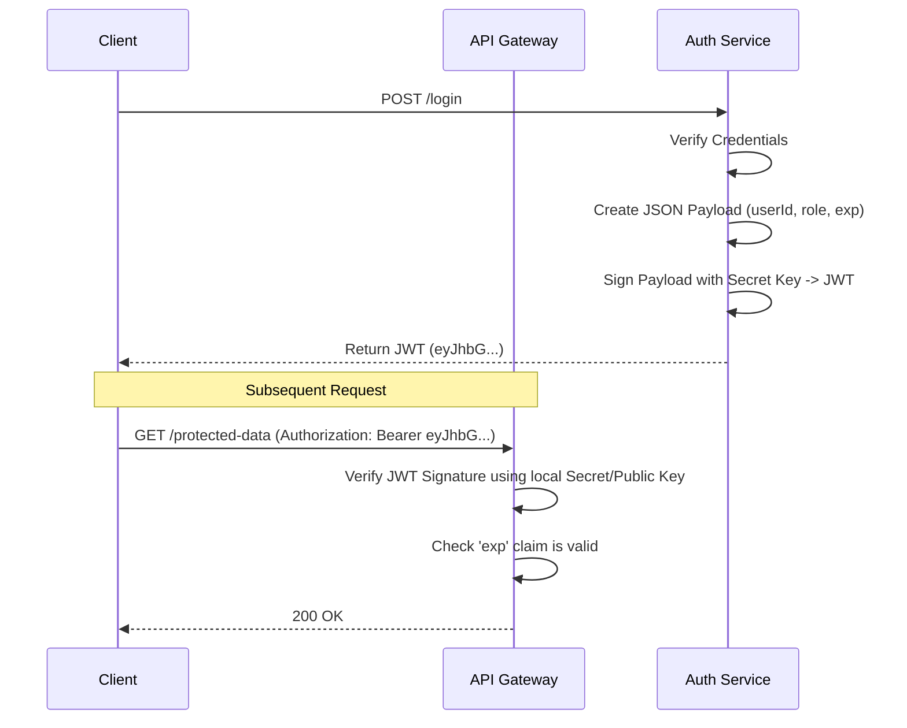
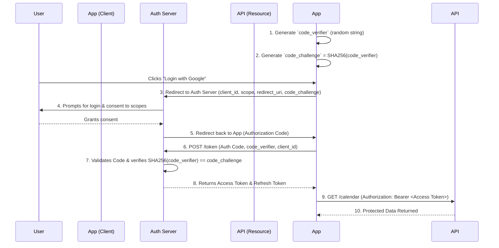
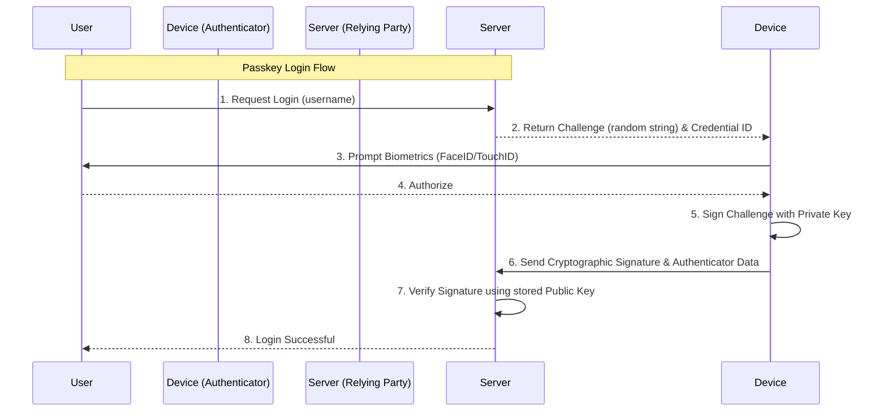
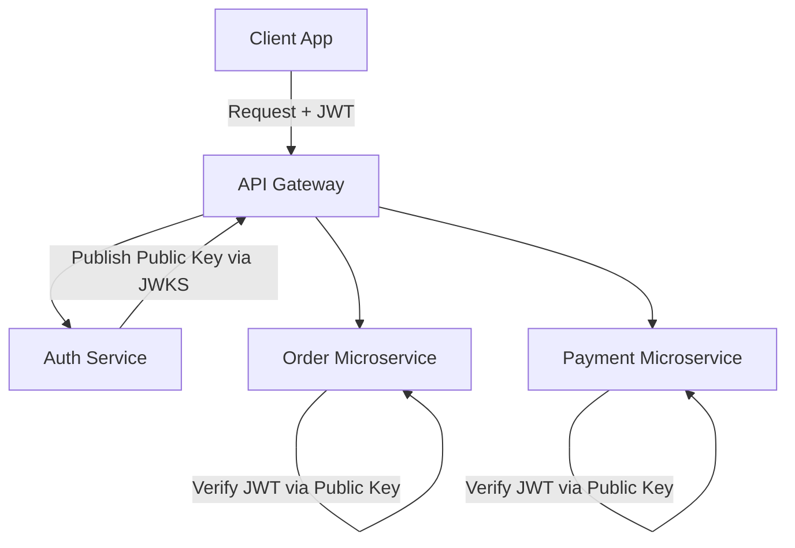
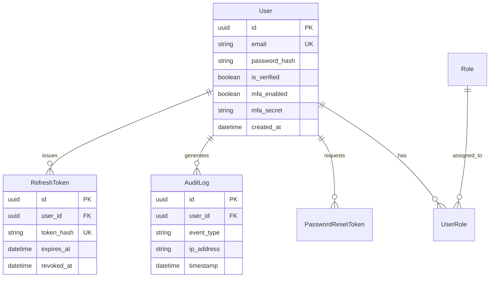

# Authentication: The Complete Engineering Handbook

Welcome to the definitive, deep-dive engineering handbook on Authentication. This document provides a comprehensive exploration of authentication principles, mechanics, security vectors, and production architectures, expanding on every crucial topic to ensure a thorough understanding.

**Difficulty:** Beginner to Advanced (Progressive)
**Prerequisites:** HTTP, REST APIs, Basic Node.js/Database knowledge
**Target Audience:** Software Engineers, Backend Developers, Full-stack Developers, Security Architects
**Learning Objectives:** Master the intricate details of passwords, sessions, cookies, stateless tokens, JWTs, OAuth 2.0, OpenID Connect, MFA, WebAuthn, authorization models, and highly scalable production system architectures.

## Table of Contents
1. [Authentication Fundamentals](#1-authentication-fundamentals)
2. [Complete Authentication Lifecycle](#2-complete-authentication-lifecycle)
3. [Password Authentication](#3-password-authentication)
4. [Sessions & Cookies](#4-sessions--cookies)
5. [Token Authentication & JWT](#5-token-authentication--jwt)
6. [OAuth 2.0 & OpenID Connect](#6-oauth-20--openid-connect)
7. [Multi-Factor Authentication & Passwordless](#7-multi-factor-authentication--passwordless)
8. [Authorization Models & Implementation](#8-authorization-models--implementation)
9. [Authentication Security & Threat Mitigation](#9-authentication-security--threat-mitigation)
10. [Authentication Architecture Patterns](#10-authentication-architecture-patterns)
11. [Production Implementation (Node.js & TypeScript)](#11-production-implementation-nodejs--typescript)
12. [Database & API Design](#12-database--api-design)
13. [Framework Integration Differences](#13-framework-integration-differences)
14. [Real-World Authentication System Design](#14-real-world-authentication-system-design)
15. [Interview Preparation (Beginner to Advanced)](#15-interview-preparation-beginner-to-advanced)
16. [Common Mistakes & Mitigations](#16-common-mistakes--mitigations)
17. [Production Checklist & Final Cheat Sheet](#17-production-checklist--final-cheat-sheet)

---

## 1. Authentication Fundamentals

### Identity and Credentials
At its core, **Authentication (AuthN)** is the process of verifying a claimed identity. When a client asserts, "I am User A," the system demands proof. This proof is provided via **credentials**. 

### Authentication vs Authorization
It is a common pitfall to conflate these two concepts, yet they represent entirely different boundaries in system design:
- **Authentication (AuthN):** Validates the *identity* of the user. (e.g., Verifying a password). Failure results in `401 Unauthorized`.
- **Authorization (AuthZ):** Validates the *permissions* of an already authenticated user. (e.g., Checking if the user has the 'admin' role). Failure results in `403 Forbidden`.

| Feature | Authentication (AuthN) | Authorization (AuthZ) |
| :--- | :--- | :--- |
| **Question** | Who are you? | What are you allowed to do? |
| **Mechanism** | Passwords, OTPs, Biometrics, SSO | RBAC, ABAC, ACLs, Policies |
| **Artifact Produced**| Session ID, ID Token, Access Token | Access Granted / Denied decision |
| **HTTP Status Code** | `401 Unauthorized` (You are unknown) | `403 Forbidden` (You are known, but lack rights) |

### Authentication Factors
Authentication mechanisms are categorized into logical "factors." To achieve strong security, systems require multiple distinct factors (MFA).
1. **Knowledge Factor (Something you know):** Passwords, PIN codes, answers to security questions. (Highly vulnerable to phishing and data breaches).
2. **Possession Factor (Something you have):** A smartphone (running an authenticator app), a hardware security key (YubiKey), a smart card, or access to a specific email inbox.
3. **Inherence Factor (Something you are):** Biometrics such as fingerprints, facial recognition (FaceID), retina scans, or voice prints.

---

## 2. Complete Authentication Lifecycle

Authentication is not a single `/login` endpoint; it is an entire lifecycle that must be securely managed from account creation to deletion.

### 1. Registration
The user provides initial identity claims (email/username) and sets up their initial credentials (password). Security considerations during registration include preventing user enumeration (not revealing if an email is already registered during the flow) and enforcing strong password policies.

### 2. Email Verification / Account Activation
Before an account is fully active, the system must verify the user controls the provided communication channel. This is typically done by sending a unique, time-limited token (e.g., a random hex string) to the email address. This prevents spam accounts and ensures the user can receive recovery emails later.

### 3. Login
The user provides their credentials. The system verifies them against the stored records. If successful, the system transitions the user from an unauthenticated state to an authenticated state by generating a Session ID or issuing an Access Token.

### 4. Password Reset and Account Recovery
When a user forgets their credentials, the system must provide a secure recovery path.
- **Flow:** User requests a reset -> System generates a short-lived (e.g., 15-minute), cryptographically secure, single-use token -> Sends token via email -> User clicks link -> Provides new password.
- **Security:** The reset endpoint must be rate-limited to prevent email spamming. The token must be single-use and invalidated immediately upon successful password change.

### 5. Logout
Terminating the authenticated state. For sessions, this means destroying the session on the server and clearing the cookie on the client. For stateless JWTs, it requires clearing the client-side token and optionally adding the token to a server-side denylist.

---

## 3. Password Authentication

Despite its flaws, password authentication remains the backbone of the internet. Proper implementation is critical.

### Plaintext Password Risks
Storing passwords in plaintext (or even weakly hashing them) is a catastrophic security failure. If a database is dumped, attackers gain immediate access to all accounts. Furthermore, due to widespread password reuse, a breach on your site compromises your users' accounts on other platforms (email, banking).

### Hashing vs Encryption
- **Encryption:** A reversible, two-way mathematical operation. You encrypt a string with a key, and decrypt it later with the same (or corresponding) key. Passwords should **never** be encrypted, because if the key is stolen, all passwords are compromised.
- **Hashing:** A one-way mathematical function. It transforms an input of any size into a fixed-length string. You cannot reverse a hash back to the original password. To verify a login, you hash the provided password and compare it to the stored hash.

### Salt and Pepper
- **Salt:** A unique, randomly generated string added to each user's password *before* hashing. 
  - *Purpose:* It defeats **Rainbow Tables** (massive pre-computed dictionaries of hashes). Because the salt is unique per user, an attacker would have to compute a completely new rainbow table for every single user, rendering the attack computationally unfeasible. The salt is stored in plaintext in the database alongside the hash.
- **Pepper:** A global secret string added to the password *before* hashing (or used as an HMAC key). 
  - *Purpose:* Unlike the salt, the pepper is **not** stored in the database. It is stored in the application's environment variables or a Secret Manager. If an attacker dumps the database via SQL Injection but doesn't compromise the application server, they cannot crack the hashes because they lack the pepper.

### Hashing Algorithms (KDFs)
Standard cryptographic hashes (like SHA-256) are designed to be extremely fast. This is terrible for passwords, as modern GPUs can calculate billions of SHA-256 hashes per second. We must use **Key Derivation Functions (KDFs)** that are intentionally slow and resource-intensive (Key Stretching).

| Algorithm | Mechanism | Security | Recommendation |
| :--- | :--- | :--- | :--- |
| **Argon2** | Memory-hard & CPU-hard. Winner of the Password Hashing Competition. | Highest | **Best Choice** (Use the `Argon2id` variant). |
| **bcrypt** | CPU-hard. Truncates passwords at 72 characters. | High | **Excellent standard**. Widely supported and battle-tested. |
| **scrypt** | Memory-hard. Designed to be expensive for ASICs. | High | Good alternative if Argon2 is unavailable. |
| **PBKDF2** | CPU-hard. Uses repeated hashing (variable iterations). | Moderate | NIST approved, but vulnerable to GPU cracking compared to others. |

### Password Policies & Password Managers
- **Policies:** NIST guidelines recommend moving away from arbitrary complexity rules (requiring one uppercase, one number, one symbol) as they lead to predictable passwords (e.g., `Password123!`). Instead, prioritize **length** (minimum 8-12 characters) and screen against lists of known breached passwords (e.g., using the HaveIBeenPwned API).
- **Password Managers:** Encourage users to use password managers (1Password, Bitwarden). Password managers generate long, complex, unique passwords for every site, mitigating credential stuffing.

### Common Password Attacks
- **Brute Force:** Systematically trying every possible combination of characters. 
  - *Mitigation:* Rate limiting (e.g., max 5 attempts per minute), account lockout after N failures, CAPTCHA.
- **Dictionary Attacks:** Trying common words, names, and variations of leaked passwords.
  - *Mitigation:* Enforce minimum length, check against breached password lists, use Argon2.
- **Credential Stuffing:** Attackers use massive lists of stolen username/password pairs from one breach to log into other services, assuming users reuse passwords.
  - *Mitigation:* Multi-Factor Authentication (MFA), monitoring for impossible travel or unusual login patterns.
- **Password Spraying:** Instead of trying many passwords against one account (which triggers lockouts), attackers try one common password (e.g., `Spring2024!`) against thousands of different accounts.
  - *Mitigation:* MFA, robust rate limiting at the IP level, not just the account level.


## 4. Sessions & Cookies

HTTP is inherently a stateless protocol. Every request is completely independent. To build applications where a user logs in once and remains logged in across page navigations, we must implement a mechanism to maintain state.

### Stateful Authentication (Server-Side Sessions)
In stateful authentication, the server bears the responsibility of remembering the user. 
1. The user authenticates (e.g., provides a valid password).
2. The server generates a large, cryptographically random string called a **Session ID** (e.g., a 128-bit UUID).
3. The server stores this Session ID in a session store (database, memory, or Redis), linking it to the user's ID.
4. The server sends the Session ID to the client, typically instructing the browser to store it in a cookie.
5. On every subsequent request, the browser automatically sends the Session ID cookie. The server looks up the ID in its store, identifies the user, and authorizes the request.

```mermaid
sequenceDiagram
    participant Browser (Client)
    participant API Server
    participant Redis (Session Store)
    
    Browser->>API Server: POST /login (username, password)
    API Server->>API Server: Verify Password Hash
    API Server->>Redis: SET session:abc123xyz {userId: 99, role: "admin"} EX 86400
    Redis-->>API Server: OK
    API Server-->>Browser: Set-Cookie: sessionId=abc123xyz; HttpOnly; Secure; SameSite=Lax
    
    Note over Browser,API Server: Subsequent Request
    Browser->>API Server: GET /api/dashboard (Cookie: sessionId=abc123xyz)
    API Server->>Redis: GET session:abc123xyz
    Redis-->>API Server: {userId: 99, role: "admin"}
    API Server-->>Browser: 200 OK (Dashboard Data)
```

### Session Storage: Redis
While you can store sessions in memory (RAM) or in a relational database (PostgreSQL), **Redis** is the industry standard.
- Memory is fast but volatile; if the server restarts, all users are logged out. Also, it doesn't work in multi-server environments (unless using sticky sessions, which is an anti-pattern).
- RDBMS (like PostgreSQL) are persistent but slow for the high volume of reads required (checking the session on *every single request*).
- **Redis** is an in-memory key-value store. It is blindingly fast, supports clustering for distributed systems, and natively handles **TTL (Time-To-Live)**. When you create a session in Redis, you can tell it to automatically delete the key after 24 hours, perfectly handling session expiration without manual database cleanup jobs.

### Session Expiration
- **Idle Timeout:** Expires the session if the user takes no action for a specific duration (e.g., 30 minutes). Every time the user makes a request, the TTL in Redis is reset. Common in banking apps.
- **Absolute Timeout:** Expires the session after a hard limit (e.g., 24 hours), regardless of activity. This forces the user to re-authenticate periodically, reducing the window of opportunity if a session is hijacked.

### Session Security Strategies
- **Session Rotation:** When a user logs in, their privilege level changes. To prevent **Session Fixation** attacks (where an attacker forces a known session ID onto a victim), the server must generate a brand new Session ID upon successful login and invalidate the old one. This should also happen on sensitive actions like password changes.
- **Session Invalidation:** When a user clicks "Logout," the server must actively delete the session record from Redis.
- **Concurrent Session Management:** You can query Redis to find all active sessions for a specific user, enabling features like "Log out of all other devices."

### Cookies: The Delivery Mechanism
Cookies are small pieces of data stored by the web browser. When configured correctly with strict security attributes, they are the most secure way to store Session IDs and Refresh Tokens.

#### Cookie Attributes (Crucial for Security)
- **`HttpOnly`:** When set to `true`, the browser prevents client-side JavaScript (e.g., `document.cookie`) from accessing the cookie. This completely mitigates XSS (Cross-Site Scripting) attacks attempting to steal the Session ID.
- **`Secure`:** When set to `true`, the browser will only send the cookie over encrypted HTTPS connections. It prevents the cookie from being sniffed on unencrypted Wi-Fi networks.
- **`SameSite`:** Mitigates CSRF (Cross-Site Request Forgery) attacks.
  - `Strict`: The cookie is only sent if the request originates from the same site. (Safest, but breaks navigation from external links).
  - `Lax`: The default modern standard. The cookie is not sent on cross-site POST requests (preventing CSRF), but is sent when a user clicks a top-level link to navigate to your site.
  - `None`: The cookie is sent with all cross-site requests. **Must** be used in conjunction with the `Secure` flag. Required for third-party contexts, like embedding your app in an iframe.
- **`Domain` & `Path`:** Restricts which URLs the cookie is sent to. Avoid setting wide domains (e.g., `.example.com`) unless necessary to share sessions across subdomains.
- **`Max-Age` & `Expires`:** Determines when the browser should delete the cookie. Without these, it becomes a "Session Cookie," which the browser deletes when it is closed.

### Cookies vs localStorage vs sessionStorage
A common debate is where to store authentication artifacts on the client.

| Feature | Cookies (with HttpOnly) | localStorage | sessionStorage |
| :--- | :--- | :--- | :--- |
| **XSS Vulnerable?** | No (JS cannot read it) | Yes (Trivially stolen via XSS) | Yes |
| **CSRF Vulnerable?** | Yes (Mitigated by `SameSite`) | No | No |
| **Data Transmission**| Automatically sent by browser | Manually added to HTTP headers | Manually added |
| **Lifespan** | Controlled by `Max-Age`/`Expires` | Persistent until manually cleared | Cleared when tab closes |
| **Best Use Case** | **Session IDs, Refresh Tokens** | UI preferences (theme), non-sensitive data | Ephemeral UI state (form drafts) |

**Golden Rule:** Never store Session IDs or Access Tokens in `localStorage`. If an attacker finds a single XSS vulnerability in your app (or any third-party npm package you use), they can steal the tokens of every user.

---

## 5. Token Authentication & JWT

As applications scale from monoliths to distributed microservices, stateful server-side sessions become a bottleneck. The alternative is stateless authentication using tokens.

### Stateful vs Stateless Authentication
- **Stateful (Sessions):** The server stores the state.
  - *Pros:* Immediate revocation (logout is instant), easy to manage concurrent sessions, highly secure since the client holds meaningless IDs.
  - *Cons:* Requires a centralized session store (Redis) that all microservices must query on every request, adding latency and a single point of failure.
- **Stateless (Tokens):** The client stores the state in a cryptographic token. The server verifies the token mathematically without querying a database.
  - *Pros:* Extremely scalable. Microservices can verify tokens locally.
  - *Cons:* Very difficult to revoke immediately before expiration. Payload is readable by the client.

### Bearer Tokens
A Bearer Token acts like cash or a hotel keycard: "Whoever bears this token is granted access." It is typically sent in the HTTP `Authorization` header:
`Authorization: Bearer <token_string>`

### JWT (JSON Web Token)
JWT (RFC 7519) is the industry standard format for stateless tokens. A JWT contains a payload of JSON data (claims) that is cryptographically signed by the issuer. This signature allows any service to verify that the payload has not been tampered with since it was issued.

#### JWT Structure
A JWT consists of three Base64Url-encoded parts separated by dots: `Header.Payload.Signature`

1. **Header:** Identifies the token type and the cryptographic algorithm used for signing.
   ```json
   {
     "alg": "HS256",
     "typ": "JWT"
   }
   ```
2. **Payload:** Contains the "claims" (statements about the user).
   - *Registered Claims (Standardized):* `iss` (Issuer), `sub` (Subject/User ID), `aud` (Audience), `exp` (Expiration time in Unix epoch), `nbf` (Not Before), `iat` (Issued At), `jti` (JWT ID).
   - *Custom Claims:* e.g., `{"role": "admin", "tenantId": "org_123"}`.
3. **Signature:** Created by hashing the encoded Header and encoded Payload along with a secret key using the specified algorithm.

*Critical Note: JWTs are **Encoded**, not **Encrypted** (unless using JWE - JSON Web Encryption). Anyone who intercepts a JWT can decode the Base64 payload and read its contents. Never put sensitive data like passwords or PII in a JWT payload.*



### Symmetric vs Asymmetric Signing
- **Symmetric (HS256):** Uses a single Shared Secret Key to both sign and verify the JWT. 
  - *Use Case:* Simple monoliths. 
  - *Flaw:* If you share the secret with a downstream microservice so it can verify the token, that microservice also has the power to forge new tokens.
- **Asymmetric (RS256 / ES256):** Uses a Private Key to sign the JWT, and a mathematical corresponding Public Key to verify it.
  - *Use Case:* Microservices and SSO. The Auth Service keeps the Private Key secret and signs tokens. All other microservices download the Public Key. They can verify the token's authenticity without ever having the ability to forge one.

### The Access Token & Refresh Token Pattern
Because stateless JWTs cannot be easily revoked, they must have a very short lifespan (e.g., 15 minutes) to minimize the damage if they are stolen. However, asking a user to log in every 15 minutes is unacceptable UX. This is solved by the **Refresh Token** pattern.

- **Access Token:** A short-lived (15m), stateless JWT sent with every API request to access resources.
- **Refresh Token:** A long-lived (e.g., 7 days), stateful (stored in the database), cryptographically random opaque string used *exclusively* to obtain new Access Tokens when the old one expires.

**Refresh Token Rotation:** To prevent a stolen Refresh Token from being used indefinitely, implement rotation. Every time a Refresh Token is used to get a new Access Token, the server invalidates the old Refresh Token and issues a brand new one. If an attacker steals a Refresh Token and uses it, the server will later detect a legitimate user attempting to use the old, invalidated token. This signals a breach, and the server should immediately invalidate the entire "token family," forcing the user to log in again.

### JWT Logout & Revocation Strategies
Logging out of a stateless system is inherently difficult because the token is just math—you cannot "delete" math from a database.
1. **Client-Side Deletion:** The client simply deletes the JWT from memory/cookies. *Flaw:* If an attacker copied the token, it remains mathematically valid on the server until its `exp` time is reached.
2. **Server-Side Token Blacklist (Denylist):** When a user logs out, the server extracts the `jti` (JWT ID) claim and stores it in Redis with a TTL matching the token's remaining lifespan. API Gateways must check this Redis blacklist on every request. *Trade-off:* This introduces stateful lookups back into your stateless architecture, but is mandatory for immediate revocation.
3. **Key Rotation:** If a massive breach occurs, you can rotate (change) the JWT signing keys. This instantly invalidates every single JWT issued under the old key, forcing all users globally to re-authenticate.


## 6. OAuth 2.0 & OpenID Connect

As the web evolved, applications needed to interact with each other on behalf of a user. Sharing passwords between apps is a massive security risk. OAuth 2.0 solves this.

### OAuth 2.0 (Delegated Authorization)
OAuth 2.0 is an **authorization** framework, *not* an authentication protocol. It allows an application to obtain limited access to an HTTP service on behalf of a resource owner without exposing their credentials. (Example: "Allow Application X to read your Google Calendar").

#### The 4 Roles of OAuth 2.0
1. **Resource Owner:** The user who owns the data (You).
2. **Client:** The application requesting access to the data (e.g., a startup's scheduling app).
3. **Authorization Server:** The server authenticating the user and issuing tokens (e.g., Google's OAuth server).
4. **Resource Server:** The API hosting the protected data (e.g., Google Calendar API).

#### Authorization Code Flow with PKCE (Production Standard)
Historically, SPAs and mobile apps used the "Implicit Flow," which returned tokens in the URL hash, making them vulnerable to interception. Modern security mandates the **Authorization Code Flow with PKCE (Proof Key for Code Exchange)** for all public clients. PKCE uses cryptographic hashing to ensure that the entity requesting the token is the exact same entity that initiated the login flow.



#### Other OAuth Flows
- **Client Credentials Flow:** Used for Machine-to-Machine (M2M) communication where there is no user involved. The Client authenticates itself to the Auth Server to get an Access Token.
- **Device Authorization Flow:** Used for input-constrained devices (Smart TVs, CLI tools). The device displays a short code, and the user visits a URL on their phone to authorize it.

### OpenID Connect (OIDC)
Developers started using OAuth 2.0 to authenticate users by asking for "profile" access and then calling a profile API to figure out who logged in. This was non-standardized. **OIDC** is an authentication layer built *on top* of OAuth 2.0 specifically to standardize identity verification.

#### The ID Token
While OAuth 2.0 provides an opaque Access Token meant only for the Resource Server, OIDC introduces the **ID Token**.
- The ID Token is *always* a JWT.
- It is intended for the **Client** to consume, not the API.
- It contains standard claims about the authenticated user (`name`, `email`, `picture`, `sub`).

#### OIDC Discovery and JWKS
Identity Providers (IdPs like Google or Auth0) publish a **Discovery Document** at a standard URL: `/.well-known/openid-configuration`. This JSON file contains all the metadata needed to interact with the IdP, most importantly the **JWKS URI** (JSON Web Key Set). The JWKS contains the Public Keys needed by the Client or API Gateway to verify the signatures of the ID Tokens and Access Tokens issued by the IdP.

| Feature | OAuth 2.0 | OpenID Connect (OIDC) |
| :--- | :--- | :--- |
| **Primary Purpose** | Delegated Authorization (Accessing APIs) | Authentication (Verifying Identity) |
| **Artifact Issued** | Access Token (Opaque or JWT) | ID Token (Always JWT) + Access Token |
| **Standard Scopes**| API-specific (e.g., `calendar.read`, `repo.write`) | `openid` (required), `profile`, `email` |

---

## 7. Multi-Factor Authentication & Passwordless

### Multi-Factor Authentication (MFA / 2FA)
MFA forces users to provide evidence from at least two different categories of factors (Knowledge, Possession, Inherence). It is the single most effective defense against credential stuffing and phishing.

| MFA Method | Description | Security Level | Drawbacks |
| :--- | :--- | :--- | :--- |
| **SMS OTP** | 6-digit code sent via text message. | Low | Vulnerable to SIM swapping and SS7 network interception. NIST deprecates this. |
| **Email OTP** | Code sent via email. | Low-Med | If the user uses the same password for their email, MFA is bypassed. |
| **TOTP** | Time-based One Time Password (Google Auth). Generates codes based on a shared secret and current time. | High | Requires user setup. If the phone is lost without backups, account is locked out. |
| **Hardware Key** | Physical token (YubiKey) using FIDO U2F. | Highest | Costs money; physical loss. |
| **Backup Codes** | Static codes generated once during setup. | High | Must be printed/stored securely by user. |

### Passwordless Authentication (FIDO2 / WebAuthn / Passkeys)
Moving away from passwords entirely eliminates phishing, credential stuffing, and brute-force attacks at the architectural level.

#### WebAuthn and Passkeys
Passkeys leverage public-key cryptography to replace passwords. The user's device (iPhone, Mac, Android) becomes the authenticator.

**Registration Flow:**
1. The server asks the client to create a credential.
2. The device generates a new public/private key pair. The private key is stored securely in the device's Secure Enclave and cannot be extracted.
3. The device prompts the user for biometric authorization (FaceID/TouchID).
4. The device sends the public key to the server, which stores it alongside the user's record.

**Login Flow:**

Because there is no shared secret (password) sent over the network, phishing is mathematically impossible. A fake website cannot intercept a password because there is no password to intercept.

---

## 8. Authorization Models & Implementation

Authentication answers "Who are you?". Authorization (AuthZ) answers "What are you allowed to do?". Once identity is established, the system must enforce strict boundaries.

### Authorization Models

1. **Role-Based Access Control (RBAC):**
   - Users are assigned Roles (Admin, Editor, Viewer).
   - Roles are assigned Permissions (`edit_post`, `delete_user`).
   - *Pros:* Simple to understand and implement. Standard for most applications.
   - *Cons:* "Role Explosion." As systems grow, you end up creating highly specific roles (e.g., `Editor_Region_A`, `Editor_Region_B`) which becomes unmanageable.

2. **Attribute-Based Access Control (ABAC):**
   - Access is granted based on attributes of the User, the Resource, and the Environment (e.g., Time of day).
   - *Example Policy:* "Allow access if User.Department == Resource.Department AND Time >= 09:00 AND Time <= 17:00."
   - *Pros:* Highly flexible and granular.
   - *Cons:* Complex to implement and evaluate. Can impact performance.

3. **Access Control Lists (ACL):**
   - Explicit lists attached to a specific resource dictating who can access it. (e.g., Sharing a Google Doc with three specific email addresses).

4. **Relationship-Based Access Control (ReBAC):**
   - Authorization is based on graph relationships. Used by systems like Google Zanzibar.
   - *Example:* "User A is a Member of Group X. Group X is the Owner of Folder Y. Document Z is inside Folder Y. Therefore, User A can read Document Z."

### Resource Ownership (A Common Pitfall)
A common mistake in RBAC is checking for a role but failing to check resource ownership. 
If an endpoint `PUT /posts/123` requires the "Editor" role, an authenticated Editor might be able to edit a post that belongs to a completely different user (IDOR vulnerability). 
*Solution:* Authorization logic must always include: `WHERE id = resource_id AND owner_id = current_user_id`.

### Implementation: Middleware vs Controllers
Authorization logic should be abstracted into central Middleware, not scattered throughout controller business logic. This prevents developers from forgetting to add authorization checks when creating new endpoints.

```typescript
// Good: Centralized Middleware approach
app.delete('/users/:id', requireAuth, requireRole('ADMIN'), (req, res) => {
    // Controller assumes authorization is already verified
    db.users.delete(req.params.id);
});
```


## 9. Authentication Security & Threat Mitigation

Authentication endpoints are the most frequently attacked surfaces of an application. Robust security is an ongoing process of mitigation.

### Foundational Security
1. **HTTPS / TLS:** Absolute prerequisite. Never transmit credentials over plaintext HTTP. Use HSTS (HTTP Strict Transport Security) to force the browser to always use HTTPS.
2. **Secret Management:** Never hardcode secrets (JWT keys, Peppers, Database passwords) in source code. Use environment variables injected at runtime, or robust Secret Managers (AWS Secrets Manager, HashiCorp Vault).
3. **Key Rotation:** Regularly change JWT asymmetric signing keys. If a key is compromised, rotating it will instantly invalidate all active JWTs, containing the blast radius.

### Mitigating Specific Threats

#### Cross-Site Request Forgery (CSRF)
An attacker tricks a victim's browser into making an unwanted request (e.g., submitting a form to transfer money) to a site where the user is currently authenticated. Because the browser automatically attaches cookies, the request succeeds.
- **Mitigation:** Use the `SameSite=Lax` or `SameSite=Strict` cookie attribute. For older browsers or complex architectures, implement Anti-CSRF tokens (unique hidden values in forms validated by the server). Stateless APIs using `Authorization: Bearer` headers are naturally immune to CSRF because the browser does not attach headers automatically.

#### Cross-Site Scripting (XSS)
An attacker injects malicious JavaScript into the application. If successful, they can read `localStorage` and steal Access Tokens or hijack sessions.
- **Mitigation:** Content Security Policy (CSP) headers to restrict where scripts can load from. Strict input sanitization and output encoding (React/Angular do this by default). Store Session IDs in `HttpOnly` cookies, which JavaScript cannot access.

#### Brute Force, Credential Stuffing & Password Spraying
- **Mitigation:**
  - **Rate Limiting:** Throttle requests to `/login`, `/register`, and `/forgot-password` based on IP address and User ID. (e.g., Max 5 failed attempts per IP per minute).
  - **Account Lockout:** Temporarily lock the account after X consecutive failed attempts. Provide an email link to unlock it.
  - **MFA:** The ultimate defense against credential-based attacks.

#### Token Theft and Replay Attacks
If an attacker intercepts a token (via network sniffing on unsecured Wi-Fi or XSS), they can replay it to impersonate the user.
- **Mitigation:** Keep Access Token lifespans extremely short (10-15 minutes). Implement strict Refresh Token Rotation (invalidate the family upon reuse detection). Bind tokens to the client's IP address or fingerprint (advanced, can cause issues with mobile networks changing IPs).

#### Session Hijacking and Fixation
- **Hijacking:** Stealing an active session ID. Mitigated by HTTPS and `HttpOnly` cookies.
- **Fixation:** Attacker creates a valid session on the site, forces the victim to use that session ID, waits for the victim to log in, and then uses the known ID to access the victim's account. Mitigated by rotating (regenerating) the Session ID immediately upon successful login.

#### Audit Logging
Maintain rigorous audit logs for security events. Log successful logins, failed logins, password changes, MFA enrollments, and account lockouts. This data is critical for incident response and identifying attack patterns.

---

## 10. Authentication Architecture Patterns

Authentication strategies change drastically depending on the scale and structure of the application.

### 1. Small to Medium Applications (Monolith)
- **Architecture:** Client -> Monolithic Backend -> Single Database.
- **Auth Strategy:** Server-side sessions (Cookies + Redis).
- **Why:** It's the simplest to implement, highly secure, and handles state natively. Revocation is instantaneous. The monolithic backend handles both auth and business logic.

### 2. Microservices Architecture
- **Architecture:** Client -> API Gateway -> Dozens of Microservices.
- **Auth Strategy (Centralized Auth, Distributed Validation):**
  1. The API Gateway routes `/login` requests to a dedicated **Auth Service**.
  2. The Auth Service verifies credentials against the database and issues an Asymmetric JWT (RS256).
  3. The Client includes the JWT in the `Authorization` header for subsequent requests.
  4. The API Gateway (and optionally downstream services) verify the JWT signature locally using the Auth Service's Public Key.
- **Why:** If every microservice had to query a central Redis database to validate a session, the database would become a massive bottleneck. Stateless JWTs allow each microservice to authenticate requests independently using cryptography.



### 3. Multi-Tenant SaaS (B2B)
- **Requirements:** Segmenting users by Organization (Tenant). User A in Tenant X should never see data in Tenant Y.
- **Auth Strategy:**
  - The database must enforce isolation (e.g., adding a `tenant_id` column to almost every table, or using PostgreSQL Row Level Security).
  - The JWT payload must include a `tenant_id` claim.
  - Authorization middleware must assert that the user's `tenant_id` matches the `tenant_id` of the resource being accessed.

### 4. Enterprise Authentication (SSO and Identity Federation)
- **Requirements:** Large enterprises (e.g., a hospital) have hundreds of internal tools. Employees cannot manage 100 different passwords.
- **Architecture:** Single Sign-On (SSO) using an Identity Provider (IdP) like Okta, Azure Active Directory, or Keycloak.
- **Auth Strategy:**
  - Applications (Clients) do not have a user database or password table.
  - When an employee tries to access an app, they are redirected to the IdP.
  - The IdP handles the complex login (MFA, Biometrics, Smart Cards).
  - The IdP redirects back to the application with an OIDC ID Token or SAML assertion.
  - The application trusts the IdP and grants access based on the ID Token.

### Zero Trust Architecture
A modern security paradigm stating: "Never trust, always verify."
- Do not trust requests just because they originate from inside the corporate VPN or internal network.
- Every single service-to-service communication must be authenticated and authorized (usually via mutual TLS or specialized machine-to-machine JWTs).

---

## 11. Production Implementation (Node.js & TypeScript)

A look at real-world implementation using Node.js, Express, PostgreSQL, Prisma, and Redis.

### Secure Password Hashing (Argon2)
Using the `argon2` package for key stretching.
```typescript
import argon2 from 'argon2';

export async function hashPassword(password: string): Promise<string> {
  // Use Argon2id for combined CPU/Memory hardness.
  // Tuning parameters should be adjusted based on server hardware.
  return await argon2.hash(password, {
    type: argon2.argon2id,
    memoryCost: 2 ** 16, // 64 MB RAM
    timeCost: 3,         // Iterations (CPU time)
    parallelism: 1,      // Threads
  });
}

export async function verifyPassword(hash: string, password: string): Promise<boolean> {
  try {
    return await argon2.verify(hash, password);
  } catch (err) {
    // Catching errors prevents timing attacks and crashes on malformed hashes
    return false;
  }
}
```

### Express Session Middleware (Cookie + Redis)
Setting up robust stateful sessions.
```typescript
import session from 'express-session';
import RedisStore from 'connect-redis';
import { createClient } from 'redis';
import express from 'express';

const app = express();

// Initialize Redis Client
const redisClient = createClient({ url: process.env.REDIS_URL });
redisClient.connect().catch(console.error);

app.use(session({
  store: new RedisStore({ client: redisClient, prefix: 'auth_session:' }),
  secret: process.env.SESSION_SECRET!, // Must be a long, random string
  resave: false, // Don't resave session if unmodified (saves Redis writes)
  saveUninitialized: false, // Don't create session until user actually logs in
  cookie: {
    secure: process.env.NODE_ENV === 'production', // true requires HTTPS
    httpOnly: true, // Mitigate XSS
    sameSite: 'lax', // Mitigate CSRF
    maxAge: 1000 * 60 * 60 * 24 * 7 // 7 days expiration
  }
}));
```

### Stateless JWT Generation and Refresh Tokens
```typescript
import jwt from 'jsonwebtoken';
import { randomBytes, createHash } from 'crypto';

// 1. Generate short-lived Access Token
export function generateAccessToken(userId: string, role: string): string {
  return jwt.sign(
    { sub: userId, role }, 
    process.env.JWT_SECRET!, 
    { expiresIn: '15m' }
  );
}

// 2. Generate long-lived, opaque Refresh Token
export function generateRefreshToken(): string {
  return randomBytes(40).toString('hex');
}

// 3. Hash Refresh Token before DB storage (Mitigates DB leaks)
export function hashRefreshToken(token: string): string {
  return createHash('sha256').update(token).digest('hex');
}
```

### Robust Middleware for AuthN and AuthZ
```typescript
import { Request, Response, NextFunction } from 'express';

// Authentication Middleware: Verifies Identity
export const requireAuth = (req: Request, res: Response, next: NextFunction) => {
  if (!req.session || !req.session.userId) {
    return res.status(401).json({ error: 'Unauthorized: Please log in' });
  }
  // Attach user context to request for downstream handlers
  req.user = { id: req.session.userId, role: req.session.role };
  next();
};

// Authorization Middleware: Verifies Permissions (RBAC)
export const requireRole = (requiredRole: string) => {
  return (req: Request, res: Response, next: NextFunction) => {
    // Relies on requireAuth running first
    if (req.user?.role !== requiredRole) {
      return res.status(403).json({ error: 'Forbidden: Insufficient privileges' });
    }
    next();
  };
};

// Application
app.delete('/admin/delete-database', requireAuth, requireRole('SUPERADMIN'), (req, res) => {
  // Safe to execute
});
```

---

## 12. Database & API Design

### Relational Database Schema (PostgreSQL via Prisma)
A production-ready schema supporting MFA, Refresh Token rotation, and Audit Logging.



**Prisma Schema Representation:**
```prisma
model User {
  id               String   @id @default(uuid())
  email            String   @unique
  passwordHash     String
  isVerified       Boolean  @default(false)
  mfaEnabled       Boolean  @default(false)
  mfaSecret        String?  // Nullable until enabled
  refreshTokens    RefreshToken[]
  auditLogs        AuditLog[]
  createdAt        DateTime @default(now())
}

model RefreshToken {
  id          String   @id @default(uuid())
  tokenHash   String   @unique
  userId      String
  user        User     @relation(fields: [userId], references: [id])
  expiresAt   DateTime // E.g., 7 days from creation
  revokedAt   DateTime? // Populated during token rotation or manual revocation
  replacedBy  String?   // Tracks token lineage during rotation
}
```

### Comprehensive API Design
Standard RESTful endpoints for the authentication lifecycle.

| Endpoint | Method | Purpose | Auth Required | Security Notes |
| :--- | :--- | :--- | :--- | :--- |
| `/auth/register` | `POST` | Create account | No | Rate limit. Do not reveal if email exists. |
| `/auth/login` | `POST` | Get session/token | No | Rate limit. Return generic errors. |
| `/auth/mfa/verify`| `POST` | Provide TOTP code | Partial | Requires pre-auth token from `/login`. |
| `/auth/logout` | `POST` | Destroy session | Yes | Invalidate token/session in DB. |
| `/auth/refresh` | `POST` | Exchange refresh token| No | Rotate token family on reuse detection. |
| `/auth/forgot-pw`| `POST` | Trigger reset email | No | Rate limit. Return generic success message. |
| `/auth/reset-pw` | `POST` | Set new password | No | Require strong password. Invalidate token. |
| `/auth/me` | `GET` | Get user details | Yes | Used by SPA to populate UI state. |

---

## 13. Framework Integration Differences

Authentication mechanics are heavily influenced by your chosen stack.

- **Node.js (Express/Fastify):** Highly manual. Developers must stitch together libraries (Argon2, jsonwebtoken, express-session, Passport.js). Excellent for learning the raw mechanics, but prone to implementation errors.
- **Next.js (React):** Dominated by `NextAuth.js` (now Auth.js). Abstract away massive complexity, handling JWTs inside encrypted HttpOnly cookies, seamless OAuth provider integration, and SSR authentication beautifully.
- **Spring Boot (Java):** `Spring Security` is a beast. Highly abstract, relying on complex filter chains. It is notoriously difficult to configure initially, but unparalleled for massive enterprise RBAC and OIDC integration.
- **Django (Python):** Provides a robust, built-in authentication framework out-of-the-box, complete with session management, user models, and an admin panel.
- **Laravel (PHP):** Offers `Laravel Sanctum` for lightweight API token authentication and `Breeze/Jetstream` for full-stack scaffolding. Developer experience is top-tier.
- **Go:** Typically relies on the standard `net/http` library combined with third-party JWT packages. Highly performant but requires manual scaffolding similar to Express.


## 14. Real-World Authentication System Design

### Architecture 1: Small B2B SaaS Platform
- **Context:** A project management tool for small teams.
- **Requirements:** Team-based roles (Owner, Member), simple email/password login, low complexity.
- **Architecture:** Node.js Monolith, PostgreSQL, Redis for caching/sessions.
- **Auth Strategy:** **Stateful Sessions with Cookies**. 
  - *Why:* It's the most secure default. Since there is only one backend server (or a few behind a load balancer), checking Redis for session validity on every request adds negligible latency. Revoking a compromised user's access is instantaneous.

### Architecture 2: High-Scale Consumer E-Commerce
- **Context:** Amazon/Shopify clone.
- **Requirements:** Millions of users, mobile app + web app, highly distributed backend, extreme availability during sales.
- **Architecture:** Microservices, API Gateway.
- **Auth Strategy:** **Stateless JWTs (Access Tokens) + Refresh Tokens**.
  - *Why:* The API Gateway handles the initial login and issues the tokens. The Client sends the Access Token. The Gateway verifies the signature mathematically and forwards the request. Downstream microservices don't need to perform database lookups to authorize requests, saving massive amounts of database overhead.

### Architecture 3: Enterprise Internal Platform (Zero Trust)
- **Context:** A multinational bank with 50,000 employees and 100 different internal applications.
- **Requirements:** Centralized identity management, employees shouldn't have 100 different passwords, mandatory MFA.
- **Architecture:** Identity Provider (Okta/Ping) + Application Clients.
- **Auth Strategy:** **OIDC / SAML Federation**.
  - *Why:* Applications act as "Relying Parties." They completely offload AuthN to the IdP. When an employee accesses the HR App, they are redirected to Okta. Okta enforces MFA, device health checks, and biometric verification. Okta returns an ID Token to the HR App.

---

## 15. Interview Preparation (Beginner to Advanced)

### Level 1: Fundamentals
**Q: Explain the difference between Authentication and Authorization.**
*A:* Authentication proves *who* you are (identity verification via passwords or MFA). Authorization determines *what* you can do (permissions and roles) once you are authenticated.

**Q: What is a Salt, and how does it prevent Rainbow Table attacks?**
*A:* A salt is a unique, random string added to a password before hashing. A rainbow table is a precomputed dictionary of hashes. Because the salt is unique per user, an attacker would have to compute a completely new rainbow table for every single user, rendering the attack computationally unfeasible.

### Level 2: Tokens and Sessions
**Q: Why shouldn't you store JWTs in localStorage?**
*A:* `localStorage` is accessible via client-side JavaScript. If the application suffers from an XSS (Cross-Site Scripting) vulnerability, the attacker can execute a script to steal the token and impersonate the user. Tokens should be stored in `HttpOnly` cookies, which the browser hides from JavaScript.

**Q: How do you instantly revoke a stateless JWT?**
*A:* You cannot revoke it natively because validation is purely mathematical. You must introduce state by maintaining a Token Blacklist (Denylist) in a fast store like Redis. The API Gateway must check this blacklist to ensure the JWT's `jti` (ID) hasn't been revoked.

### Level 3: Advanced System Design
**Q: Explain the Refresh Token Rotation pattern and what attack it prevents.**
*A:* Refresh Token Rotation means issuing a brand new Refresh Token every time the client uses one to get a new Access Token. It prevents infinite access by a stolen Refresh Token. If the server detects an old, invalidated Refresh Token being used, it assumes a breach has occurred and instantly revokes all tokens in that family, forcing the user to re-authenticate.

**Q: Explain the OAuth 2.0 PKCE flow and why it replaced the Implicit Flow.**
*A:* PKCE (Proof Key for Code Exchange) prevents authorization code interception attacks. The client generates a random `code_verifier` and sends a hashed version (`code_challenge`) to the Auth Server during the initial redirect. When exchanging the Auth Code for a token, the client sends the raw `code_verifier`. The server hashes it and compares it to the original challenge. This proves the client exchanging the code is the exact same client that requested it. It replaced the Implicit Flow because returning tokens directly in the URL hash was highly insecure.

---

## 16. Common Mistakes & Mitigations

| Mistake | Danger / Impact | Proper Mitigation |
| :--- | :--- | :--- |
| **Plaintext Passwords** | Total system compromise upon DB leak. | Use **Argon2** or **bcrypt** with unique salts. |
| **Long-lived Access Tokens**| If stolen via XSS/network sniff, the attacker has permanent access. | Set expiry to **15 minutes**. Implement Refresh Tokens. |
| **Missing Rate Limiting** | Allows Brute Force & Credential Stuffing attacks to succeed. | Throttle `/login` by IP. Lock accounts after 5 failures. |
| **Auth Logic in Controllers**| Developers forget to check permissions on new endpoints. | Use central **AuthZ Middleware** applied to router groups. |
| **Trusting Client-Side Roles**| A client can decode a JWT and modify their role to "admin". | **ALWAYS verify the JWT cryptographic signature** on the server before reading the payload. |
| **Detailed Error Messages** | Returning "User not found" allows attackers to enumerate valid emails. | Always return a generic **"Invalid credentials"** message. |
| **Insecure Redirect URIs** | Allows Open Redirect attacks during OAuth flows. | Strictly validate and whitelist exact Redirect URIs. |

---

## 17. Production Checklist & Final Cheat Sheet

### Production Authentication Checklist
Before deploying any authentication system to production, verify:
- [ ] Passwords are hashed using Argon2 or bcrypt with unique, per-user salts.
- [ ] HTTPS is strictly enforced (HSTS enabled). No plaintext traffic.
- [ ] Session IDs and Refresh Tokens are delivered via `HttpOnly`, `Secure`, and `SameSite` cookies.
- [ ] Access Tokens have short lifespans (e.g., 15 minutes).
- [ ] Refresh Token Rotation and Reuse Detection are fully implemented.
- [ ] Strict rate-limiting is applied to `/login`, `/register`, and `/forgot-password`.
- [ ] Highly sensitive actions (password change, account deletion, email change) require re-authentication (asking for password again) or MFA verification.
- [ ] Login and password reset endpoints return generic error messages to prevent user enumeration.
- [ ] JWT Secrets, Peppers, and API Keys are stored in a secure vault/environment, never in source code.
- [ ] Audit Logging is implemented for successful logins, failed logins, and privilege changes.

### Quick-Reference Cheat Sheet
- **AuthN:** Authentication (Proving Identity).
- **AuthZ:** Authorization (Checking Permissions).
- **Argon2:** The current gold standard for password hashing.
- **Salt:** Unique random data added *per user* before hashing (Stored in DB).
- **Pepper:** Global secret data added before hashing (Stored in Secret Manager).
- **Cookie `HttpOnly`:** Stops XSS attacks from reading the cookie.
- **Cookie `Secure`:** Forces the cookie to only travel over HTTPS.
- **Cookie `SameSite=Lax`:** Stops most CSRF attacks.
- **JWT Header:** Defines the signing algorithm (e.g., HS256, RS256).
- **JWT Payload:** Contains the data/claims (`sub`, `exp`, `role`).
- **JWT Signature:** The cryptographic proof of authenticity.
- **Symmetric JWT (HS256):** 1 Shared Secret Key for both signing and verifying.
- **Asymmetric JWT (RS256):** Private Key for signing, Public Key for verifying.
- **Access Token:** Short lifespan, proves authorization to access APIs.
- **Refresh Token:** Long lifespan, used solely to obtain new Access Tokens.
- **OAuth 2.0:** Framework for Delegated Authorization.
- **OIDC (OpenID Connect):** Identity authentication layer on top of OAuth 2.0.
- **MFA:** Multi-Factor Authentication (OTP, Authenticator Apps).
- **WebAuthn/Passkeys:** Public Key cryptography replacing passwords entirely.


