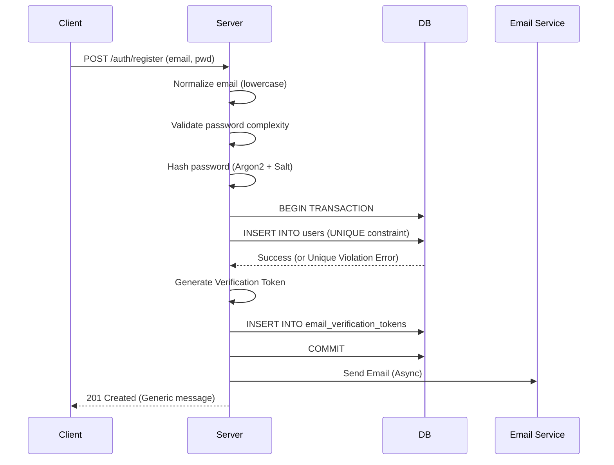
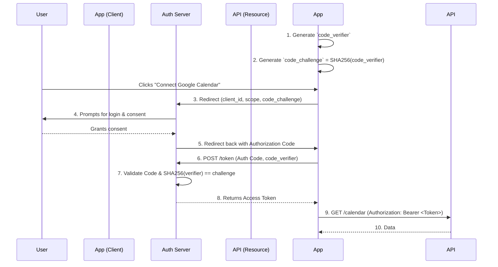
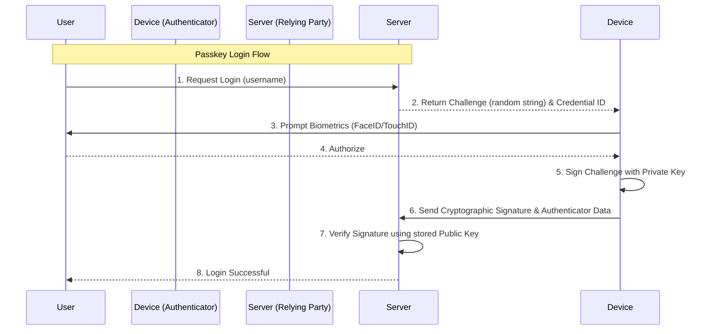
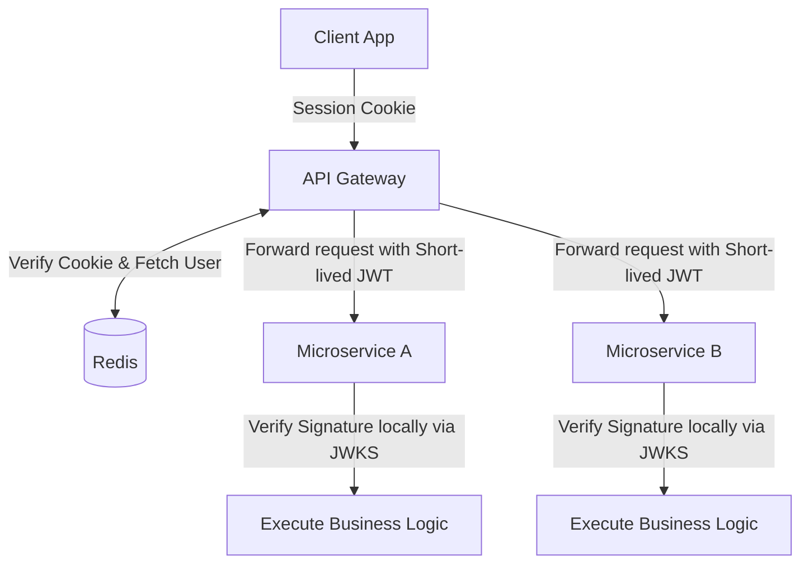

title: "Authentication & Identity: Complete Beginner to Advanced"
subtitle: "From Absolute Fundamentals to Massive Scale Identity Systems"
author: "Principal Security Architect"
version: "2.0"
date: "2026"

# Authentication & Identity
## Complete Beginner to Advanced Engineering Handbook

> Welcome to the definitive, deep-dive engineering handbook on Authentication for EnggVault. This document is designed as a university-level and professional software-engineering reference book. It covers authentication from absolute fundamentals to modern identity systems used in massive, large-scale production applications.

> **Difficulty:** Beginner → Intermediate → Advanced → Security Engineer → Backend Engineer → System Design → Production Architecture
> **Prerequisites:** [08 — Databases ←](../08-databases/notes.md) · **Next:** 10 — Authorization (Planned) →

## Table of Contents

### Part I: Foundations & Core Concepts
- [Chapter 1: Documentation Philosophy & Foundations](#chapter-1-documentation-philosophy-foundations)
- [Chapter 2: The Absolute Basics of Identity](#chapter-2-the-absolute-basics-of-identity)
- [Chapter 3: Real-World Analogies](#chapter-3-real-world-analogies)
- [Chapter 4: The Evolution of Authentication](#chapter-4-the-evolution-of-authentication)
- [Chapter 5: HTTP Fundamentals Required for Authentication](#chapter-5-http-fundamentals-required-for-authentication)
- [Chapter 6: Browser Authentication Behavior](#chapter-6-browser-authentication-behavior)

### Part II: Credentials & State Management
- [Chapter 7: The Registration System](#chapter-7-the-registration-system)
- [Chapter 8: Passwords A to Z](#chapter-8-passwords-a-to-z)
- [Chapter 9: Password Attacks](#chapter-9-password-attacks)
- [Chapter 10: Password Reset & Account Recovery](#chapter-10-password-reset-account-recovery)
- [Chapter 11: Email Verification](#chapter-11-email-verification)
- [Chapter 12: Session Authentication A to Z](#chapter-12-session-authentication-a-to-z)
- [Chapter 13: Session Security](#chapter-13-session-security)
- [Chapter 14: Cookies A to Z](#chapter-14-cookies-a-to-z)
- [Chapter 15: CSRF (Cross-Site Request Forgery)](#chapter-15-csrf-cross-site-request-forgery)
- [Chapter 16: CORS (Cross-Origin Resource Sharing)](#chapter-16-cors-cross-origin-resource-sharing)

### Part III: Modern Protocols & Decentralized Auth
- [Chapter 17: Token Authentication](#chapter-17-token-authentication)
- [Chapter 18: JWT A to Z (JSON Web Tokens)](#chapter-18-jwt-a-to-z-json-web-tokens)
- [Chapter 19: Refresh Token Architecture](#chapter-19-refresh-token-architecture)
- [Chapter 20: API Keys](#chapter-20-api-keys)
- [Chapter 21: OAuth 2.0 A to Z](#chapter-21-oauth-20-a-to-z)
- [Chapter 22: OpenID Connect (OIDC) A to Z](#chapter-22-openid-connect-oidc-a-to-z)
- [Chapter 23: MFA A to Z (Multi-Factor Authentication)](#chapter-23-mfa-a-to-z-multi-factor-authentication)
- [Chapter 24: Passkeys, WebAuthn, and FIDO2](#chapter-24-passkeys-webauthn-and-fido2)

### Part IV: Security Deep Dive & Authorization
- [Chapter 25: Authorization A to Z](#chapter-25-authorization-a-to-z)
- [Chapter 26: Security Attacks Deep Dive](#chapter-26-security-attacks-deep-dive)
- [Chapter 27: HTTP Security Headers](#chapter-27-http-security-headers)
- [Chapter 28: TLS / HTTPS](#chapter-28-tls-https)
- [Chapter 29: Secret Management](#chapter-29-secret-management)

### Part V: Engineering Implementation
- [Chapter 30: Database Design](#chapter-30-database-design)
- [Chapter 31: Authentication API Design](#chapter-31-authentication-api-design)
- [Chapter 32: Production Node.js Implementation](#chapter-32-production-nodejs-implementation)
- [Chapter 33: NestJS Authentication](#chapter-33-nestjs-authentication)
- [Chapter 34: Next.js Authentication (React)](#chapter-34-nextjs-authentication-react)
- [Chapter 35: Other Frameworks](#chapter-35-other-frameworks)
- [Chapter 36: Microservices Authentication](#chapter-36-microservices-authentication)
- [Chapter 37: Distributed Systems Considerations](#chapter-37-distributed-systems-considerations)
- [Chapter 38: Multi-Tenant Authentication](#chapter-38-multi-tenant-authentication)
- [Chapter 39: Enterprise Authentication Concepts](#chapter-39-enterprise-authentication-concepts)
- [Chapter 40: Authentication Observability](#chapter-40-authentication-observability)
- [Chapter 41: Rate Limiting and Abuse Prevention](#chapter-41-rate-limiting-and-abuse-prevention)

### Part VI: Production Architecture & Advanced Topics
- [Chapter 1: Documentation Philosophy & Foundations](#chapter-1-documentation-philosophy-foundations)
- [Chapter 2: The Absolute Basics of Identity](#chapter-2-the-absolute-basics-of-identity)
- [Chapter 3: Real-World Analogies](#chapter-3-real-world-analogies)
- [Chapter 4: The Evolution of Authentication](#chapter-4-the-evolution-of-authentication)
- [Chapter 5: HTTP Fundamentals Required for Authentication](#chapter-5-http-fundamentals-required-for-authentication)
- [Chapter 6: Browser Authentication Behavior](#chapter-6-browser-authentication-behavior)
- [Chapter 7: The Registration System](#chapter-7-the-registration-system)
- [Chapter 8: Passwords A to Z](#chapter-8-passwords-a-to-z)
- [Chapter 9: Password Attacks](#chapter-9-password-attacks)
- [Chapter 10: Password Reset & Account Recovery](#chapter-10-password-reset-account-recovery)
- [Chapter 11: Email Verification](#chapter-11-email-verification)
- [Chapter 12: Session Authentication A to Z](#chapter-12-session-authentication-a-to-z)
- [Chapter 13: Session Security](#chapter-13-session-security)
- [Chapter 14: Cookies A to Z](#chapter-14-cookies-a-to-z)
- [Chapter 15: CSRF (Cross-Site Request Forgery)](#chapter-15-csrf-cross-site-request-forgery)
- [Chapter 16: CORS (Cross-Origin Resource Sharing)](#chapter-16-cors-cross-origin-resource-sharing)
- [Chapter 17: Token Authentication](#chapter-17-token-authentication)
- [Chapter 18: JWT A to Z (JSON Web Tokens)](#chapter-18-jwt-a-to-z-json-web-tokens)
- [Chapter 19: Refresh Token Architecture](#chapter-19-refresh-token-architecture)
- [Chapter 20: API Keys](#chapter-20-api-keys)
- [Chapter 21: OAuth 2.0 A to Z](#chapter-21-oauth-20-a-to-z)
- [Chapter 22: OpenID Connect (OIDC) A to Z](#chapter-22-openid-connect-oidc-a-to-z)
- [Chapter 23: MFA A to Z (Multi-Factor Authentication)](#chapter-23-mfa-a-to-z-multi-factor-authentication)
- [Chapter 24: Passkeys, WebAuthn, and FIDO2](#chapter-24-passkeys-webauthn-and-fido2)
- [Chapter 25: Authorization A to Z](#chapter-25-authorization-a-to-z)
- [Chapter 26: Security Attacks Deep Dive](#chapter-26-security-attacks-deep-dive)
- [Chapter 27: HTTP Security Headers](#chapter-27-http-security-headers)
- [Chapter 28: TLS / HTTPS](#chapter-28-tls-https)
- [Chapter 29: Secret Management](#chapter-29-secret-management)
- [Chapter 30: Database Design](#chapter-30-database-design)
- [Chapter 31: Authentication API Design](#chapter-31-authentication-api-design)
- [Chapter 32: Production Node.js Implementation](#chapter-32-production-nodejs-implementation)
- [Chapter 33: NestJS Authentication](#chapter-33-nestjs-authentication)
- [Chapter 34: Next.js Authentication (React)](#chapter-34-nextjs-authentication-react)
- [Chapter 35: Other Frameworks](#chapter-35-other-frameworks)
- [Chapter 36: Microservices Authentication](#chapter-36-microservices-authentication)
- [Chapter 37: Distributed Systems Considerations](#chapter-37-distributed-systems-considerations)
- [Chapter 38: Multi-Tenant Authentication](#chapter-38-multi-tenant-authentication)
- [Chapter 39: Enterprise Authentication Concepts](#chapter-39-enterprise-authentication-concepts)
- [Chapter 40: Authentication Observability](#chapter-40-authentication-observability)
- [Chapter 41: Rate Limiting and Abuse Prevention](#chapter-41-rate-limiting-and-abuse-prevention)
- [Chapter 42: Account Enumeration](#chapter-42-account-enumeration)
- [Chapter 43: Logout and Session Management](#chapter-43-logout-and-session-management)
- [Chapter 44: Device Management](#chapter-44-device-management)
- [Chapter 45: Account Recovery](#chapter-45-account-recovery)
- [Chapter 46: Account Takeover (ATO)](#chapter-46-account-takeover-ato)
- [Chapter 47: Authentication Testing](#chapter-47-authentication-testing)
- [Chapter 48: Authentication Performance](#chapter-48-authentication-performance)
- [Chapter 49: Authentication System Design (Real-World Scenarios)](#chapter-49-authentication-system-design-real-world-scenarios)
- [Chapter 50: Real-World Architecture Patterns](#chapter-50-real-world-architecture-patterns)
- [Chapter 51: Security Best Practices](#chapter-51-security-best-practices)
- [Chapter 52: Common Mistakes](#chapter-52-common-mistakes)
- [Chapter 53: Interview Preparation](#chapter-53-interview-preparation)
- [Chapter 54: Authentication Decision Guide](#chapter-54-authentication-decision-guide)
- [Chapter 55: Production Authentication Checklist](#chapter-55-production-authentication-checklist)
- [Chapter 56: The Ultimate Cheat Sheet](#chapter-56-the-ultimate-cheat-sheet)


# CHAPTER 1: Documentation Philosophy & Foundations

Authentication is arguably the most critical component of any modern software system. A flaw in UI rendering is an annoyance; a flaw in authentication is a catastrophic breach.

This handbook follows a strict engineering philosophy. For every major concept, we explore:
- **The Core Definition:** What is it and why does it exist?
- **The Mechanism:** What happens internally, over HTTP, in the browser, and in the database?
- **The Security Posture:** What are the risks, attacks, and common mistakes?
- **The Production Reality:** How is it implemented securely, how does it scale, and what are the trade-offs?

We start with simple mental models and progressively dive into the complex technical layers required for zero-trust architectures.

## 1.1 Interview Questions

1. **Why is authentication considered more critical than UI bugs?**
   *Answer:* A UI bug degrades user experience, but an authentication flaw can lead to catastrophic data breaches, unauthorized access to sensitive PII, and complete system compromise.


# CHAPTER 2: The Absolute Basics of Identity

Before writing code, we must establish a precise vocabulary. In the security domain, terms like "user" and "identity" have strict definitions.

## 2.1 Key Definitions

- **Identity:** A set of attributes that describe a unique entity (a person, a device, or a service).
- **User:** A human being interacting with the system.
- **Account:** The digital representation of a user's identity within a specific system. It holds their data, history, and configuration.
- **Principal:** An entity (user, service account, or machine) that can be authenticated and authorized.
- **Subject:** The entity requesting access to a resource (often synonymous with Principal).
- **Identity Claim:** A statement an entity makes about itself (e.g., "My email is alice@example.com").
- **Credential:** Secret or unique data used to prove an identity claim (e.g., a password, a cryptographic key).
- **Secret:** Any piece of confidential data meant only for authorized entities (passwords, API keys, JWT signing keys).
- **Authenticator:** The mechanism or device used to provide credentials (e.g., a YubiKey, a password field, an authenticator app).
- **Identity Provider (IdP):** A trusted third-party system that creates, maintains, and manages identity information (e.g., Google, Okta, Active Directory).

## 2.2 The Four Pillars of Access Management

Developers frequently confuse Authentication and Authorization. They are fundamentally different steps in an access control pipeline.

| Concept | The Question It Answers | Example Action |
| :--- | :--- | :--- |
| **Identification** | *Which identity are you claiming?* | Entering your username or email address. |
| **Verification** | *Can we prove that claim?* | Checking if the email address actually belongs to you. |
| **Authentication** | *Who are you?* | Submitting a password or scanning a fingerprint to prove identity. |
| **Authorization** | *What are you allowed to do?* | Checking if the authenticated user has the 'Admin' role to delete a record. |

**Summary Rule:** Identification + Verification + Authentication = Establishing Trust. Authorization = Enforcing Trust boundaries.

## 2.3 Interview Questions

1. **What is the difference between Authentication and Authorization?**
   *Answer:* Authentication verifies *who* the user is (e.g., verifying a password). Authorization determines *what* the authenticated user is allowed to do (e.g., checking if they have admin privileges to delete a resource).
2. **Define an Identity Provider (IdP).**
   *Answer:* An IdP is a trusted third-party system that creates, maintains, and manages identity information and provides authentication services to relying applications (e.g., Google Workspace, Okta).


# CHAPTER 3: Real-World Analogies

Software authentication models heavily mimic physical security systems. 

- **The Passport (Identity Provider & JWT):** A passport is issued by a trusted authority (your government / IdP). It contains your photo and name (claims). It has a cryptographic watermark (signature) proving it wasn't forged. When you travel, the foreign country doesn't call your government; they just verify the watermark.
- **The Hotel Room Key (Sessions / Access Tokens):** When you check in (Login), the clerk verifies your ID and gives you a keycard. The keycard doesn't contain your name; it just grants access to Room 304 for 3 days. When you scan it, the door (Resource Server) doesn't ask who you are, it only asks "Is this key valid for this door?"
- **The Security Guard & ID Badge (Stateful vs Stateless):** 
  - *Stateful:* A security guard checks your name against a clipboard (Database/Redis). If you are fired, they cross your name off the clipboard instantly.
  - *Stateless:* You are issued a badge valid for exactly 24 hours. The guard just looks at the expiration date printed on the badge without checking the clipboard. If you are fired at noon, the guard will still let you in until the badge expires, unless a separate system (Revocation List) is added.

## 3.1 Interview Questions

1. **Explain the difference between Stateful and Stateless authentication using a real-world analogy.**
   *Answer:* Stateful authentication is like a security guard checking your name against a clipboard (database); if you are fired, they cross your name off instantly. Stateless authentication is like being issued a badge valid for 24 hours; the guard only checks the expiration date, meaning you can still access the building until the badge expires, even if you were fired.


# CHAPTER 4: The Evolution of Authentication

Authentication has evolved to combat increasingly sophisticated threats.

1. **Basic Username/Password (1990s):** Simple credentials sent over plaintext. Highly vulnerable to interception.
2. **Server-Side Sessions & Cookies (Early 2000s):** Stateful authentication. The server remembers the user via a Session ID stored in a cookie. Solved statefulness but introduced CSRF vulnerabilities and scaling challenges.
3. **API Keys (Mid 2000s):** Long-lived static strings used primarily for machine-to-machine communication. Difficult to revoke securely without rotating keys.
4. **Token Authentication (Late 2000s):** Moving away from cookies for mobile apps. Using headers (`Authorization: Bearer`). 
5. **JSON Web Tokens - JWT (2010s):** Stateless authentication. The token contains a cryptographically signed payload. Allowed microservices to scale horizontally without bottlenecking a central database.
6. **OAuth 2.0 (2012):** Delegated Authorization. Solved the problem of users sharing passwords between applications by introducing scoped access tokens.
7. **OpenID Connect - OIDC (2014):** An identity layer built on top of OAuth 2.0 to provide standard user profiles (Social Login).
8. **Multi-Factor Authentication - MFA (Mainstream 2010s):** Adding TOTP, SMS, or Email verification to combat massive credential stuffing attacks and data breaches.
9. **Hardware Security Keys (FIDO U2F):** Physical devices proving possession via public-key cryptography. Eliminated remote phishing.
10. **WebAuthn / Passkeys / FIDO2 (2020s):** Passwordless authentication. The device itself (iPhone, Android, Mac) acts as the authenticator using biometrics to unlock private keys. Makes phishing mathematically impossible.

## 4.1 Interview Questions

1. **Why did the industry move from Session/Cookie authentication to Token authentication (JWT)?**
   *Answer:* As architectures shifted from monoliths to microservices and mobile applications, relying on a centralized database for session lookups became a massive scaling bottleneck. Stateless tokens allow any microservice to verify identity mathematically without database lookups.


# CHAPTER 5: HTTP Fundamentals Required for Authentication

Authentication operates entirely over HTTP. You cannot build secure authentication without deeply understanding the protocol.

## 5.1 HTTP Requests and Responses
- **HTTP Request:** The client asks for something. Consists of a Method, a Path, Headers, and an optional Body.
- **HTTP Response:** The server answers. Consists of a Status Code, Headers, and an optional Body.

## 5.2 Key HTTP Methods
- `GET`: Read data. Never use `GET` for login or sending passwords, as query parameters are logged in server access logs and browser history.
- `POST`: Create data or submit credentials (e.g., `POST /login`). Data is hidden in the Body.
- `PUT` / `PATCH`: Update data.
- `DELETE`: Remove data (e.g., `DELETE /session` for logout).
- `OPTIONS`: Used by browsers for CORS preflight checks.

## 5.3 Crucial Status Codes for Auth
- **`200 OK` / `201 Created`:** Success.
- **`204 No Content`:** Success, but nothing to return (common for successful Logout).
- **`400 Bad Request`:** Client sent malformed data (e.g., missing password).
- **`401 Unauthorized`:** **Authentication Failed.** The client is anonymous or provided invalid credentials. The server does not know who they are.
- **`403 Forbidden`:** **Authorization Failed.** The server *knows* who the client is, but the client does not have the permissions required to access the resource.
- **`404 Not Found`:** Resource doesn't exist. Often used instead of 401/403 to hide the existence of a resource from unauthorized users.
- **`409 Conflict`:** e.g., Trying to register an email that already exists.
- **`429 Too Many Requests`:** Rate limiting triggered (crucial for defending against brute force).

## 5.4 Vital HTTP Headers
- **`Authorization`:** Used to send tokens (e.g., `Authorization: Bearer <token>`).
- **`Cookie`:** Sent by the browser to the server containing session data.
- **`Set-Cookie`:** Sent by the server to instruct the browser to store a cookie.
- **`Origin` & `Referer`:** Indicates where the request came from. Used in CORS and CSRF defense.
- **`User-Agent`:** Identifies the browser/device. Used for auditing and detecting suspicious logins.

## 5.5 Interview Questions

1. **Explain what a 401 and 403 HTTP status code mean.**
   *Answer:* `401 Unauthorized` means authentication failed (the server doesn't know who you are). `403 Forbidden` means authorization failed (the server knows who you are, but you lack the permissions to access the resource).
2. **Why should you never use `GET` requests for login or sending passwords?**
   *Answer:* `GET` request query parameters are logged in server access logs, proxy logs, and the user's browser history, exposing the plaintext password to anyone with access to those logs.


# CHAPTER 6: Browser Authentication Behavior

When building web applications, the browser acts as a complex intermediary with its own strict security sandbox. 

## 6.1 The Cookie Jar and Cookie Matching
Browsers maintain an internal database of cookies (the "Cookie Jar"). When the browser makes an HTTP request, it automatically checks the jar to see if any cookies match the target URL. 
- **Matching:** If a cookie's `Domain` and `Path` match the URL, and if network conditions match security flags (`Secure`, `SameSite`), the browser silently appends the `Cookie` header to the request. The JavaScript code making the request (`fetch` or `XMLHttpRequest`) does not need to know the cookie exists.

## 6.2 The Same-Origin Policy (SOP)
The most critical security boundary in the browser. It restricts how a document or script loaded from one **origin** can interact with a resource from another origin.
- An origin is defined by the **Scheme + Host + Port** (e.g., `https://api.example.com:443`).
- Because of SOP, JavaScript on `https://evil.com` cannot read the DOM or responses from `https://bank.com`.

## 6.3 Browser Storage Mechanisms
- **Cookies:** Automatically sent with requests. Can be protected from JavaScript via `HttpOnly`. Used for Session IDs and Auth Tokens.
- **localStorage:** Persistent key-value store. Accessible via JavaScript. Exists until cleared. **Vulnerable to XSS (Cross-Site Scripting).** Never store access tokens here.
- **sessionStorage:** Similar to localStorage, but cleared when the browser tab is closed. Also vulnerable to XSS.
- **IndexedDB:** Complex client-side database. Vulnerable to XSS.
- **Service Workers:** Background scripts acting as network proxies. Can intercept requests and append tokens dynamically.

## 6.4 Browser Password Managers & Credential Management API
Modern browsers integrate password managers. To ensure browsers correctly prompt users to save or autofill passwords, developers must use correct HTML attributes: `<input type="password" autocomplete="current-password">`. The **Credential Management API** allows JavaScript to interact directly with the browser's password manager and biometric sensors (Passkeys).

## 6.5 Interview Questions

1. **What is the Same-Origin Policy (SOP)?**
   *Answer:* It is a critical browser security boundary that restricts how a document or script loaded from one origin can interact with a resource from another origin. It prevents malicious scripts from reading data across domains.


# CHAPTER 7: The Registration System

Registration is the inception of an identity. A poorly designed registration flow leads to duplicate accounts, user enumeration vulnerabilities, and massive database race conditions.

## 7.1 The Registration Flow

1. **Client Submission:** User submits email, username, and password.
2. **Input Validation & Normalization (Backend):** 
   - Trim whitespace.
   - Lowercase the email address. (Some databases treat `User@example.com` and `user@example.com` as distinct, leading to account hijacking).
   - Validate password strength policies.
3. **Check Existing User:** Query the database. (Must be protected against timing attacks).
4. **Password Hashing:** Hash the password using a strong KDF (Argon2 or bcrypt) and a unique salt.
5. **Database Transaction:** Insert the user record into the database. Use a `UNIQUE` constraint on the email column to prevent race conditions.
6. **Email Verification Trigger:** Generate a secure random token, hash it, store it, and fire an asynchronous event to send the verification email.
7. **Response:** Return a `201 Created` or a generic success message.



## 7.2 Security & Production Considerations

- **Race Conditions:** If two requests arrive at the exact same millisecond to register the same email, the application code check (`SELECT * FROM users WHERE email=?`) might return `false` for both, resulting in two inserts. **Always rely on a Database `UNIQUE` constraint** to enforce uniqueness at the storage layer. Catch the resulting constraint violation error in code.
- **User Enumeration Prevention:** If a user registers with an existing email, the server should return `200 OK` (or `201 Created`) with a generic message like: "If this email is not registered, an account has been created. Please check your email for a verification link." If it returns `409 Conflict: Email already in use`, an attacker can write a script to check millions of emails to see who uses your service.
- **Rate Limiting & Abuse Prevention:** Registration endpoints must be strictly rate-limited by IP address to prevent bots from creating thousands of spam accounts. Implementing a CAPTCHA or invisible bot-protection is highly recommended.
- **Idempotency:** If the client retries the request due to a network timeout, the server should handle the unique constraint gracefully and not crash.

## 7.3 Interview Questions

1. **Why should you rely on a Database `UNIQUE` constraint for email addresses during registration rather than just application logic?**
   *Answer:* If two registration requests arrive at the exact same millisecond, the application-level check might return `false` for both, resulting in duplicate inserts (a race condition). A database constraint guarantees integrity at the storage layer.
2. **How do you prevent User Enumeration during the registration flow?**
   *Answer:* If a user tries to register an existing email, return a generic `200 OK` message like "If this email is not registered, an account has been created." Do not return a `409 Conflict` revealing that the email exists.


# CHAPTER 8: Passwords A to Z

Despite the industry's push toward passwordless solutions, passwords remain the bedrock of global authentication. Mishandling them results in catastrophic data breaches.

## 8.1 The Problem with Plaintext
Storing passwords in plaintext means that if an attacker dumps your database via SQL Injection, they immediately have the credentials for every user. Because humans reuse passwords across multiple sites, a breach on your platform compromises your users' email, banking, and social media accounts. You have a moral and legal obligation to protect this data.

## 8.2 Hashing vs. Encryption vs. Encoding
- **Encoding (e.g., Base64):** A public algorithm to translate data into a different format. It provides zero security. Anyone can decode it.
- **Encryption (e.g., AES-256):** A two-way mathematical operation. You encrypt a string with a key, and decrypt it later with the same key. **Do not encrypt passwords.** If an attacker steals your database and your encryption key, all passwords are compromised.
- **Hashing (e.g., SHA-256, Argon2):** A one-way mathematical function. It transforms an input of any size into a fixed-length string (a digest). It is mathematically impossible to reverse a hash back to the original password. To verify a login, you hash the provided password and compare it to the stored hash.

## 8.3 Cryptographic Hashes vs. Password Hashes
**Do not use SHA-256 or SHA-512 directly for passwords.** 
Standard cryptographic hashes are designed for speed (e.g., checking file integrity). A modern GPU cluster can calculate over 100 billion SHA-256 hashes per second. This makes them highly vulnerable to brute force and dictionary attacks. 

We must use **Key Derivation Functions (KDFs)**, also known as Password Hashes. These are intentionally designed to be slow and resource-intensive, a concept known as **Key Stretching** or **Work Factor**.

## 8.4 Memory Hardness and Time Hardness
To defeat custom-built cracking hardware (ASICs) and GPU farms, modern algorithms rely on:
- **Time Hardness (Iterations):** Forcing the CPU to run the algorithm thousands of times in a loop.
- **Memory Hardness:** Forcing the algorithm to use a massive chunk of RAM (e.g., 64MB) during calculation. GPUs have thousands of cores but very little RAM per core, severely crippling their ability to parallelize memory-hard algorithms.

## 8.5 Hashing Algorithms Comparison

| Algorithm | Design Focus | Security Level | Production Recommendation |
| :--- | :--- | :--- | :--- |
| **MD5 / SHA-1** | Fast cryptographic hashes | Broken | **NEVER USE.** |
| **SHA-256 / 512** | Fast cryptographic hashes | Very Weak for Passwords | **NEVER USE DIRECTLY.** |
| **PBKDF2** | CPU-hard (Iterations) | Moderate | Use only if constrained by legacy systems (NIST approved, but easily cracked by GPUs). |
| **scrypt** | Memory-hard | High | Good alternative if Argon2 is unavailable. |
| **bcrypt** | CPU-hard (Memory-bound) | High | **Excellent standard.** Widely supported. (Note: Truncates passwords at 72 bytes). |
| **Argon2** | CPU-hard & Memory-hard | Highest | **Best Choice.** Winner of the Password Hashing Competition. Use the `Argon2id` variant. |

## 8.6 Salt and Pepper
- **Salt:** A unique, randomly generated string added to each user's password *before* hashing. 
  - *Purpose:* It defeats **Rainbow Tables** (massive pre-computed dictionaries of hashes). Because the salt is unique per user, an attacker would have to compute a completely new rainbow table for every single user, rendering the attack computationally unfeasible. The salt is stored in plaintext in the database alongside the hash. Modern algorithms (bcrypt, Argon2) handle salt generation automatically.
- **Pepper:** A global secret string added to the password *before* hashing (or used as an HMAC key on the resulting hash). 
  - *Purpose:* Unlike the salt, the pepper is **never** stored in the database. It is stored in the application's environment variables or a Secret Manager. If an attacker dumps the database but doesn't compromise the application server, they cannot crack the hashes because they lack the pepper.

## 8.7 Internal Verification Flow
1. Fetch user record from DB by email.
2. Extract the Salt from the stored hash string.
3. Append Salt (and Pepper) to the provided login password.
4. Run the hash algorithm using the stored Work Factor parameters.
5. Compare the resulting hash with the stored hash using a **constant-time comparison function** to prevent timing attacks.

---

## 8.8 Interview Questions

1. **Why shouldn't we store passwords in plaintext?**
   *Answer:* If the database is compromised via SQL Injection or a leak, attackers immediately have access to all user passwords. Due to password reuse, this compromises the users' accounts on other platforms as well.
2. **How does bcrypt or Argon2 differ from SHA-256?**
   *Answer:* SHA-256 is designed to be fast, making it vulnerable to brute-force attacks via GPU clusters. bcrypt and Argon2 are Key Derivation Functions (KDFs) designed to be computationally slow and memory-hard, drastically increasing the time and cost to crack hashes.
3. **What is a salt and why is it used?**
   *Answer:* A salt is a unique random string appended to a password before hashing. It ensures that two users with the same password have different hashes, completely neutralizing pre-computed Rainbow Table attacks.
4. **Scenario: You are migrating 10 million users from an old MD5 database to a new Argon2 database without forcing password resets. How?**
   *Answer:* When a user successfully logs in, grab their plaintext password, hash it with Argon2, and update the DB. Alternatively, wrap the existing MD5 hash inside Argon2 (`Argon2(MD5(password))`) so all users are instantly protected.


# CHAPTER 9: Password Attacks

Understanding how systems are compromised dictates how we build defenses.

- **Brute Force:** Trying every possible combination (aaaa, aaab, aaac). 
  - *Defense:* Rate limiting, account lockouts, CAPTCHA, computationally expensive hashing (Argon2).
- **Dictionary Attack:** Trying common words, names, and variations of leaked passwords (e.g., `Password123!`).
  - *Defense:* Enforce minimum password length (12+ characters), screen against compromised password lists (HaveIBeenPwned API).
- **Credential Stuffing:** Attackers take a database dump from a breached site (Site A) and use automated bots to test those exact email/password pairs on your site (Site B). Works due to widespread password reuse.
  - *Defense:* Multi-Factor Authentication (MFA), monitoring for impossible travel or unusual IP patterns.
- **Password Spraying:** Instead of trying many passwords against one account (which triggers lockouts), attackers try one very common password (e.g., `Company2024!`) against thousands of different accounts.
  - *Defense:* IP-based rate limiting, MFA.
- **Phishing & Social Engineering:** Tricking a user into typing their credentials into a fake website.
  - *Defense:* FIDO2/WebAuthn (Passkeys) which mathematically bind the credential to the physical origin URL.

## 9.1 Interview Questions

1. **What is a Credential Stuffing attack and how is it mitigated?**
   *Answer:* Attackers use automated bots to test email/password pairs leaked from other websites against your application. It is mitigated by Multi-Factor Authentication (MFA) and monitoring for unusual login patterns.
2. **What is Password Spraying?**
   *Answer:* Instead of trying many passwords against one account (which triggers lockouts), attackers try one very common password against thousands of different accounts to stay under rate limits.


# CHAPTER 10: Password Reset & Account Recovery

Account recovery is often the weakest link in authentication. If an attacker can bypass login by abusing the reset flow, your hashing security is irrelevant.

## 10.1 Secure Reset Flow
1. **User requests reset:** Endpoint `POST /auth/forgot-password`.
2. **Generate Token:** Server generates a cryptographically secure, random, high-entropy token (e.g., 64 random bytes encoded as hex).
3. **Hash and Store:** The server **hashes** the token (using SHA-256) and stores it in the database with a strict expiration time (e.g., 15 minutes) and linking it to the user ID. *Why hash it?* If the database is leaked, attackers cannot use the reset tokens.
4. **Send Email:** Send an email with a link containing the *raw* token: `https://app.com/reset?token=abc...`
5. **User clicks link:** The client extracts the token and prompts the user for a new password.
6. **Validation & Reset:** Endpoint `POST /auth/reset-password`. Server hashes the provided token, compares it to the database, verifies it hasn't expired, updates the user's password, and **deletes the reset token** (making it single-use).
7. **Session Invalidation:** Crucially, the server must invalidate all active sessions and refresh tokens for that user to kick out potential attackers.

## 10.2 Security Mitigations
- **User Enumeration:** `POST /auth/forgot-password` must always return a generic `200 OK` ("If the email exists, a link has been sent"). Do not return `404 Not Found`.
- **Timing Attacks:** Ensure the response time is roughly equal whether the email exists or not.
- **Rate Limiting:** Aggressively rate limit this endpoint to prevent email spamming (e.g., 1 request per user per 5 minutes).

## 10.3 Interview Questions

1. **Explain how to implement a secure "Forgot Password" flow.**
   *Answer:* Generate a high-entropy random token, hash it, and store the hash in the DB with a short expiration. Send the raw token in an email link. When the user submits the new password and token, hash the provided token, verify it against the DB, update the password, and delete the token.


# CHAPTER 11: Email Verification

Similar to password reset, email verification relies on secure token exchange.

1. **Token Generation:** Upon registration, generate a secure random token, hash it, and store the hash with an expiration (e.g., 24 hours).
2. **Delivery:** Email the raw token as a link.
3. **Verification Endpoint:** `POST /auth/verify-email`. Hash the provided token, find it in the DB, and set `users.is_verified = true`. Delete the token.

**Replay Prevention:** A verification token must be single-use. If the token remains in the DB after verification, it introduces potential state-manipulation vulnerabilities.

## 11.1 Interview Questions

1. **Why must an email verification token be single-use?**
   *Answer:* To prevent replay attacks and state manipulation. Once a token is successfully verified, it must be deleted from the database immediately.


# CHAPTER 12: Session Authentication A to Z

Because HTTP is a stateless protocol, every request is completely independent. To build applications where a user logs in once and remains logged in across page navigations, we must implement a mechanism to maintain state.

## 12.1 What is a Session?
A session is a server-side record representing an active connection with an authenticated user. 

## 12.2 Stateful Authentication Flow
1. **Creation:** The user authenticates. The server generates a large, cryptographically random, unguessable string called a **Session ID** (e.g., a 128-bit UUID).
2. **Storage:** The server stores this Session ID in a session store, linking it to a chunk of state data (User ID, Role, Login Time).
3. **Delivery:** The server sends the Session ID to the client, instructing the browser to store it in a secure cookie.
4. **Lookup:** On every subsequent request, the browser automatically sends the Session ID cookie. The server looks up the ID in its store, identifies the user, and authorizes the request.

## 12.3 Session Storage Mechanisms
The session store is the most heavily hit component in a stateful architecture.
- **RAM (Memory):** Fast, but volatile. If the server restarts, everyone logs out. Fails entirely in multi-server load-balanced environments unless using "sticky sessions" (an architectural anti-pattern).
- **PostgreSQL / MySQL:** Persistent, but slow. Querying disk-backed databases on every single HTTP request will bottleneck your application.
- **Redis (The Standard):** An in-memory, distributed key-value store. It is blindingly fast (sub-millisecond lookups), supports clustering across multiple servers, and natively handles **TTL (Time-To-Live)** for automatic expiration. 

## 12.4 Session Expiration
- **Idle Timeout:** Expires the session if the user takes no action for a specific duration (e.g., 30 minutes). Every time the user makes a request, the TTL in Redis is reset. Common in banking and high-security apps.
- **Absolute Timeout:** Expires the session after a hard limit (e.g., 24 hours), regardless of activity. This forces the user to re-authenticate periodically, reducing the window of opportunity if a session is hijacked.

## 12.5 Interview Questions

1. **What is a Session ID?**
   *Answer:* A large, cryptographically random string generated by the server upon login, mapped to user state in a backend store (like Redis), and stored in a browser cookie.
2. **Why is Redis the industry standard for session storage over PostgreSQL?**
   *Answer:* Sessions require sub-millisecond lookups on every single HTTP request. Redis is an in-memory key-value store that provides massive speed and native support for Time-To-Live (TTL) auto-expiration.


# CHAPTER 13: Session Security

Managing state securely requires active defense against numerous attack vectors.

- **Session Hijacking:** Stealing an active Session ID via network sniffing (MitM) or Cross-Site Scripting (XSS).
  - *Mitigation:* Strict use of HTTPS and `HttpOnly` cookies.
- **Session Fixation:** An attacker tricks a victim into using a Session ID known to the attacker. The victim logs in, elevating the known session to an authenticated state. The attacker then uses the known ID to access the victim's account.
  - *Mitigation:* **Session Rotation.** The server *must* generate a brand new Session ID and delete the old one immediately upon successful login or any privilege escalation.
- **Session Replay:** Intercepting and reusing a session cookie.
  - *Mitigation:* HTTPS prevents interception. IP-binding or user-agent validation can help detect anomalies, though these are brittle due to mobile networks changing IPs.
- **Logout Invalidation:** When a user clicks "Logout," the server must actively `DELETE` the session record from Redis. Merely clearing the client-side cookie is insufficient; if an attacker has a copy of the cookie, the session remains alive on the server.

## 13.1 Interview Questions

1. **What is Session Fixation and how do you prevent it?**
   *Answer:* An attacker tricks a victim into using a Session ID known to the attacker. Prevention requires Session Rotation: the server must generate a brand new Session ID and invalidate the old one immediately upon successful login.


# CHAPTER 14: Cookies A to Z

Cookies are the delivery and storage mechanism for state in the browser. When configured correctly, they are the most secure way to store authentication artifacts (Session IDs and Refresh Tokens).

## 14.1 The Set-Cookie Header
The server commands the browser to store a cookie using the response header:
`Set-Cookie: sessionId=abc123xyz; Domain=api.example.com; Path=/; Max-Age=86400; Secure; HttpOnly; SameSite=Lax`

## 14.2 Cookie Security Attributes (Critical)

- **`HttpOnly`:** Instructs the browser to forbid client-side JavaScript (e.g., `document.cookie`) from accessing the cookie. **This completely neutralizes XSS attacks attempting to steal Session IDs.**
- **`Secure`:** Instructs the browser to only send the cookie over encrypted HTTPS connections. Prevents network sniffing on public Wi-Fi.
- **`Domain`:** Restricts which hosts receive the cookie. By default, it is the exact host that set it. Setting `Domain=.example.com` allows sharing the session across `app.example.com` and `api.example.com`.
- **`Path`:** Restricts which URL paths receive the cookie (e.g., `Path=/api`).
- **`Max-Age` & `Expires`:** Determines when the browser deletes the cookie. Without these, it is a "Session Cookie," deleted when the browser tab closes.

## 14.3 Same-Origin vs Same-Site
- **Origin:** Scheme + Host + Port (`https://api.example.com:443`).
- **Site:** The Top-Level Domain plus one (eTLD+1). `api.example.com` and `app.example.com` are different *origins*, but they are the same *site* (`example.com`).

## 14.4 The `SameSite` Attribute (CSRF Defense)
Dictates when the browser will send cookies on cross-site requests.
- **`Strict`:** Cookie is *only* sent if the request originates from the same site. Safest, but breaks UX (if a user clicks a link to your app from an email, they appear logged out because the cookie wasn't sent).
- **`Lax`:** (Modern Browser Default). Cookie is not sent on cross-site POST requests (preventing CSRF), but *is* sent for top-level safe navigations (clicking a link). This is the ideal balance.
- **`None`:** Cookie is sent with all cross-site requests. **Must** be used in conjunction with the `Secure` flag. Required for third-party contexts (e.g., embedding your app in an iframe, or having a separated SPA domain).

## 14.5 Cookies vs localStorage vs sessionStorage

| Storage Type | XSS Vulnerable? | CSRF Vulnerable? | Data Transmission | Best Use Case |
| :--- | :--- | :--- | :--- | :--- |
| **Cookies (HttpOnly)** | **No** (JS cannot read) | Yes (Mitigated by `SameSite`) | Automatic via HTTP Headers | **Session IDs, Refresh Tokens** |
| **localStorage** | **Yes** (Trivially stolen) | No | Manual via JS headers | Theme prefs, non-sensitive data |
| **sessionStorage** | **Yes** (Trivially stolen) | No | Manual via JS headers | Ephemeral UI form state |

**Production Rule:** Never store Session IDs or Access Tokens in `localStorage`. A single rogue NPM dependency or XSS flaw will compromise every user's token.

## 14.6 Interview Questions

1. **What is the difference between a Session Cookie and a persistent cookie?**
   *Answer:* A Session Cookie lacks a `Max-Age` or `Expires` attribute and is deleted when the browser closes. A persistent cookie has an expiration date and survives browser restarts.
2. **What does `HttpOnly` mean?**
   *Answer:* It is a cookie attribute that forbids client-side JavaScript from accessing the cookie. It completely neutralizes Cross-Site Scripting (XSS) attacks attempting to steal Session IDs.
3. **What is the difference between localStorage and Cookies for token storage?**
   *Answer:* localStorage is easily accessible via JavaScript, making it highly vulnerable to XSS. HttpOnly cookies cannot be read by JS, making them the secure choice for storing sensitive authentication artifacts.


# CHAPTER 15: CSRF (Cross-Site Request Forgery)

If cookies are so secure against XSS, what is their weakness? The answer is CSRF.

## 15.1 What is CSRF?
Because browsers *automatically* attach cookies to requests matching a domain, an attacker can trick a user's browser into executing an unwanted action on a site where the user is currently authenticated.

## 15.2 The Attack Flow
1. User logs into `bank.com`. The browser stores a Session Cookie.
2. User visits `evil.com`.
3. `evil.com` contains a hidden form that submits a `POST` request to `https://bank.com/transfer?amount=1000&to=Attacker`.
4. The browser sees a request going to `bank.com`, so it automatically attaches the user's Session Cookie.
5. `bank.com` sees a valid Session Cookie and processes the transfer. The user is robbed.

## 15.3 CSRF Defenses
1. **`SameSite=Lax` or `Strict` Cookies:** Modern browsers use `Lax` by default, which refuses to send the cookie on cross-site `POST` requests. This stops 99% of CSRF attacks natively.
2. **Synchronizer Token Pattern (Anti-CSRF Tokens):** Used heavily in older architectures or when `SameSite=None` is required. The server generates a unique, cryptographically random token and embeds it in the HTML form. When the form submits, the server verifies the token. Since `evil.com` cannot read the HTML of `bank.com` (due to the Same-Origin Policy), it cannot include the token in its forged request.
3. **Double-Submit Cookie:** An alternative to synchronizer tokens. The server sets a random value in a cookie, and the SPA reads this cookie and includes it as a custom header (`X-CSRF-Token`). `evil.com` can forge the request, but it cannot read the cookie to populate the custom header.
4. **Stateless APIs (Bearer Tokens):** If your API relies on the `Authorization: Bearer <token>` header instead of cookies, it is inherently immune to CSRF. Browsers do not automatically attach custom headers. (However, this requires storing the token somewhere, which risks XSS).

## 15.4 Interview Questions

1. **What is Cross-Site Request Forgery (CSRF) and how is it mitigated?**
   *Answer:* CSRF is an attack where a malicious site tricks a user's browser into executing an unwanted action on a trusted site where they are authenticated. It is mitigated using `SameSite=Lax` cookies, Synchronizer Tokens, or Double-Submit cookies.


# CHAPTER 16: CORS (Cross-Origin Resource Sharing)

CORS is frequently misunderstood as a security feature for the server. **CORS is a security feature for the browser.**

## 16.1 The Same-Origin Policy (SOP)
SOP prevents JavaScript on `evil.com` from reading data fetched from `api.bank.com`. However, legitimate SPAs (e.g., `app.mycompany.com`) often need to fetch data from APIs on a different origin (`api.mycompany.com`).

## 16.2 How CORS Works
CORS is a mechanism to relax the SOP. It allows the server to explicitly tell the browser, "Yes, I allow `app.mycompany.com` to read my responses."

1. **Simple Requests:** Browser sends the request. Server responds with data and `Access-Control-Allow-Origin: https://app.mycompany.com`. If the origin doesn't match, the browser blocks the JavaScript from reading the response (even though the server successfully processed the request).
2. **Preflight Requests (`OPTIONS`):** For complex requests (e.g., using `Content-Type: application/json` or custom headers like `Authorization`), the browser first sends an `OPTIONS` request asking for permission.
   - Server responds: `Access-Control-Allow-Methods: POST, GET, OPTIONS` and `Access-Control-Allow-Headers: Authorization`.
   - If approved, the browser sends the actual `POST` request.

## 16.3 `Access-Control-Allow-Credentials`
If the SPA needs to send cookies (or use HTTP Basic Auth), it must configure `fetch({ credentials: 'include' })`. In response, the server **must** return `Access-Control-Allow-Credentials: true`. 
*Security Rule:* When `Credentials: true` is used, the server is forbidden from using a wildcard `Access-Control-Allow-Origin: *`. It must specify the exact origin to prevent massive CSRF-like data leakage.

**Important Note:** CORS prevents a browser from reading data; it does *not* prevent a server from executing a request. It is not an authentication mechanism.

## 16.4 Interview Questions

1. **Does CORS protect the server from being called by malicious origins?**
   *Answer:* No. CORS is a browser-enforced security feature. The server still receives and processes the request, but CORS prevents the malicious client-side JavaScript from *reading* the server's response.


# CHAPTER 17: Token Authentication

As systems moved from monolithic applications to mobile apps and distributed microservices, stateful server-side sessions became a scaling bottleneck. Token authentication was born.

## 17.1 Bearer Tokens
A Bearer Token acts like physical cash or a hotel keycard: "Whoever bears this token is granted access." It is passed manually via HTTP headers:
`Authorization: Bearer <token>`

## 17.2 Stateless Authentication
Unlike sessions where the server stores state, **stateless authentication forces the client to store the state inside a cryptographic token**. The server mathematically verifies the token without querying a database.

**The Trade-off:**
- *Pro:* Massive horizontal scalability. Any microservice can verify the token locally.
- *Con:* Extremely difficult to revoke the token before it expires, because there is no central database to check.

## 17.3 Interview Questions

1. **What is the primary trade-off of stateless authentication?**
   *Answer:* Massive horizontal scalability (no database lookups required to verify tokens) comes at the cost of being extremely difficult to immediately revoke a token before it naturally expires.


# CHAPTER 18: JWT A to Z (JSON Web Tokens)

JWT (RFC 7519) is the industry standard for stateless tokens. 

## 18.1 JWT Structure
A JWT consists of three Base64Url-encoded parts separated by periods: `Header.Payload.Signature`

## 18.1 1. Header (JOSE Header)
Defines the token type and the cryptographic algorithm used for the signature.
```json
{
  "alg": "HS256",
  "typ": "JWT"
}
```

## 18.2 2. Payload (Claims)
Contains the statements (claims) about the entity and metadata.
- **Registered Claims:** Standardized by RFC. 
  - `iss` (Issuer): Who created the token.
  - `sub` (Subject): The user ID.
  - `aud` (Audience): Who the token is intended for.
  - `exp` (Expiration Time): Crucial for security. Epoch timestamp.
  - `iat` (Issued At): When it was created.
  - `jti` (JWT ID): Unique identifier for the token (used for revocation/blacklists).
- **Custom Claims:** e.g., `{"role": "admin", "tenantId": "org_123"}`.

*Security Warning:* JWTs are **encoded, not encrypted**. Anyone who intercepts a JWT can decode it and read the payload. **Never store sensitive data (passwords, PII, internal IDs) inside a JWT payload.**

## 18.3 3. Signature
The most critical part. Created by taking the encoded Header, the encoded Payload, a Secret Key, and hashing them using the algorithm specified in the header.

## 18.2 Cryptographic Algorithms

1. **Symmetric (e.g., HS256 - HMAC + SHA-256):**
   - Uses a **single Shared Secret Key** to both sign and verify the JWT.
   - *Problem:* If the Auth Service shares the secret with the Billing Service so it can verify tokens, the Billing Service now possesses the key required to *forge* new tokens.

2. **Asymmetric (e.g., RS256 - RSA, ES256 - ECDSA):**
   - Uses a **Private Key** to sign, and a **Public Key** to verify.
   - *Solution:* The Auth Service securely holds the Private Key and signs tokens. All other microservices download the Public Key (via a JWKS endpoint). They can verify the token's mathematical authenticity without ever possessing the ability to forge one.

## 18.3 JWT Verification Steps Internally
When an API Gateway receives a JWT:
1. Decode the Header. Check the `alg` (algorithm).
2. Fetch the corresponding Public Key (for RS256) or Shared Secret (for HS256).
3. Compute the signature of the `Header.Payload` using the key.
4. Compare the computed signature to the Signature attached to the JWT. If they match, the payload has not been tampered with.
5. Check `exp` (has it expired?).
6. Check `iss` and `aud` (was it issued by us, for us?).

## 18.4 JWT Vulnerabilities
- **The "None" Algorithm Attack:** Attackers change the header to `{"alg": "none"}`, strip the signature, and submit it. If the server library isn't configured to reject "none", it accepts forged admin tokens.
- **Algorithm Confusion (HS256 vs RS256):** Attacker grabs the server's Public Key, creates a forged token, signs it using HS256 (symmetric) using the Public Key as the shared secret, and changes the header to `alg: HS256`. If the server expects RS256 but blindly trusts the header, it will try to verify using HS256 with its Public Key, resulting in a successful verification of a forged token. *Mitigation:* Hardcode allowed algorithms in the verification library configuration.

## 18.5 Interview Questions

1. **Explain the structure of a JWT.**
   *Answer:* It consists of three Base64Url-encoded parts separated by periods: Header (algorithm), Payload (claims like user ID and expiration), and Signature (mathematical proof of integrity).
2. **Is a JWT encrypted? Can anyone read the payload?**
   *Answer:* Standard JWTs are encoded, not encrypted. Anyone who intercepts the token can decode it and read the payload. Therefore, sensitive data (like passwords or PII) must never be stored inside a JWT.
3. **What is the difference between Symmetric (HS256) and Asymmetric (RS256) signing?**
   *Answer:* HS256 uses a single shared secret to both sign and verify tokens. RS256 uses a Private Key to sign tokens (kept only by the Auth server) and a Public Key to verify them (distributed to all microservices).


# CHAPTER 19: Refresh Token Architecture

Because stateless JWTs cannot be natively revoked, they must have a very short lifespan (e.g., 10-15 minutes). If stolen, the window of exploitation is small. But making users log in every 15 minutes is terrible UX. Enter the **Refresh Token Pattern**.

## 19.1 Architecture
- **Access Token:** Short-lived (15m), stateless (JWT), sent with every API request.
- **Refresh Token:** Long-lived (7-30 days), stateful (stored in the database), high-entropy random string, used *exclusively* at the `/auth/refresh` endpoint to get new Access Tokens.

## 19.2 Refresh Token Security & Rotation
Refresh tokens represent long-term access. If stolen (e.g., via a compromised device), an attacker can generate infinite Access Tokens.
- **Refresh Token Rotation:** Every time a Refresh Token is exchanged for a new Access Token, the server **invalidates the old Refresh Token and issues a new one**.
- **Reuse Detection:** If an attacker steals a Refresh Token, the victim and the attacker now both have copies. One of them uses it, the token rotates, and the old token is invalidated. When the *other* party tries to use the now-invalidated old token, the server detects a reuse anomaly. The server must immediately revoke the *entire family* of tokens for that user, cutting off the attacker and forcing the victim to re-authenticate securely.

## 19.3 Interview Questions

1. **Scenario: Your JWTs are stateless and valid for 15 mins. How do you design the system to maintain horizontal scalability but allow revocation?**
   *Answer:* Use the Refresh Token Architecture. The short-lived Access Token is stateless, minimizing DB lookups. The long-lived Refresh Token is stateful and stored in a DB. To revoke access, delete the Refresh Token; the user will be fully locked out within 15 minutes.
2. **What is Refresh Token Reuse Detection?**
   *Answer:* If an attacker steals a refresh token and uses it, it rotates. If the legitimate user then tries to use the old, invalidated token, the server detects the anomaly and revokes the entire family of tokens, neutralizing the attacker.


# CHAPTER 20: API Keys

API Keys are long-lived static strings used primarily for Machine-to-Machine (M2M) authentication (e.g., your backend calling the Stripe API).

## 20.1 Security Concepts
- **Public vs Secret:** Public keys (e.g., Stripe Publishable Key) are safe in the browser and used for low-privilege actions. Secret keys must remain on the backend.
- **Prefixes:** Format keys with prefixes (e.g., `sk_prod_abc123`). This allows GitHub and secret scanners to detect accidentally committed keys instantly.
- **Storage:** Hash Secret API keys in the database (like passwords) using SHA-256. If your DB leaks, attackers cannot use the API keys.
- **API Keys vs JWT:** API Keys are stateful and require a DB lookup to validate scope/permissions. JWTs are stateless.

## 20.2 Interview Questions

1. **Scenario: How do you securely authenticate a cron job running on an EC2 instance that needs to pull data from your API?**
   *Answer:* Use a long-lived, high-entropy API Key (or the OAuth 2.0 Client Credentials flow). Store the key in a Secret Manager and verify it via a fast hashed-lookup in the database.


# CHAPTER 21: OAuth 2.0 A to Z

OAuth 2.0 is an **Authorization Framework**, not an authentication protocol. It solves the "Delegated Authorization" problem: allowing Application A to access data in Application B on behalf of the User, without the User giving Application A their password.

## 21.1 Roles in OAuth 2.0
1. **Resource Owner:** The user (You).
2. **Client:** The application requesting access (A startup's calendar app).
3. **Authorization Server:** The server verifying identity and issuing tokens (Google).
4. **Resource Server:** The API hosting the protected data (Google Calendar API).

## 21.2 Authorization Code Flow with PKCE
This is the modern, secure standard for SPAs, mobile apps, and web backends.

**The Problem PKCE Solves:** In the standard Auth Code flow, the Auth Server redirects the user back to the Client with an Authorization Code in the URL. If a malicious app on a mobile device intercepts this URL, it can steal the code and exchange it for a token. PKCE (Proof Key for Code Exchange) uses cryptographic hashing to prove that the Client exchanging the code is the exact same Client that initiated the request.

**The Flow:**
1. **Client Setup:** The Client generates a random string (`code_verifier`). It hashes it using SHA-256 to create the (`code_challenge`).
2. **Redirect:** The Client redirects the user to the Auth Server, including the `code_challenge`, `client_id`, `scope` (e.g., `calendar.read`), and `redirect_uri`.
3. **Consent:** The Auth Server authenticates the user and asks, "Do you allow this app to read your calendar?"
4. **Auth Code:** The Auth Server redirects the user back to the Client with a short-lived `Authorization Code`.
5. **Token Exchange:** The Client makes a backend `POST /token` request to the Auth Server, providing the Auth Code AND the original raw `code_verifier`.
6. **Validation:** The Auth Server hashes the `code_verifier`. If it matches the `code_challenge` from Step 2, it issues the Access Token.
7. **Resource Access:** The Client uses the Access Token to call the Resource Server.



## 21.3 Other Flows
- **Client Credentials Flow:** For M2M communication (cron jobs, microservices). No user is involved. The Client authenticates directly with the Auth Server using a Client ID and Secret to get an Access Token.
- **Device Authorization Flow:** For input-constrained devices (Smart TVs). The device shows a code. The user goes to a URL on their phone, logs in, and enters the code.

## 21.4 Interview Questions

1. **Scenario: Explain the OAuth 2.0 Authorization Code Flow with PKCE. Why is PKCE necessary?**
   *Answer:* PKCE generates a cryptographic challenge/verifier pair. It ensures that the client exchanging the Authorization Code for an Access Token is the exact same client that initiated the flow. This prevents malicious apps from stealing the Authorization Code via intercepted redirect URIs.


# CHAPTER 22: OpenID Connect (OIDC) A to Z

Developers started abusing OAuth 2.0 to authenticate users by asking for "profile" scopes and hitting a profile API. OIDC was built *on top* of OAuth 2.0 to standardize Identity Authentication.

## 22.1 The ID Token
While OAuth 2.0 issues an Access Token meant for the *Resource Server*, OIDC issues an **ID Token** meant for the *Client*.
- The ID Token is **always a JWT**.
- It contains standard claims (`sub` for user ID, `name`, `email`, `picture`).
- It allows the Client to immediately know who logged in without making an extra API call.

## 22.2 OIDC Discovery & JWKS
How does an API Gateway verify a Google ID Token? 
IdPs publish a **Discovery Document** at a standard URL (e.g., `https://accounts.google.com/.well-known/openid-configuration`). 
This JSON document contains the **`jwks_uri`** (JSON Web Key Set). The JWKS contains the Public Keys (RS256) used by the IdP to sign tokens. Microservices download these keys, cache them, and use them to verify incoming JWT signatures locally.

| Feature | OAuth 2.0 | OpenID Connect (OIDC) |
| :--- | :--- | :--- |
| **Primary Goal** | Delegated Authorization (API Access) | Authentication (Identity Verification) |
| **Token Type** | Access Token (Opaque or JWT) | ID Token (Always JWT) + Access Token |
| **Scopes**| API-specific (`calendar.read`) | Identity-specific (`openid`, `profile`, `email`) |

## 22.3 Interview Questions

1. **How does OAuth 2.0 differ from OpenID Connect (OIDC)?**
   *Answer:* OAuth 2.0 is an Authorization framework used to grant scoped access to APIs (Resource Servers). OIDC is an Identity layer built *on top* of OAuth 2.0 designed specifically for Authentication, providing the client with an ID Token containing user profile information.
2. **What is the purpose of the JWKS endpoint in OIDC?**
   *Answer:* The JSON Web Key Set (JWKS) endpoint hosts the Public Keys of the Identity Provider. Microservices download these keys to locally and statelessly verify the signatures of incoming JWTs.


# CHAPTER 23: MFA A to Z (Multi-Factor Authentication)

MFA forces users to provide evidence from at least two different categories of factors (Knowledge, Possession, Inherence). It is the single most effective defense against credential stuffing and phishing.

## 23.1 MFA Methods Comparison

| MFA Method | Description | Security Level | Drawbacks |
| :--- | :--- | :--- | :--- |
| **SMS OTP** | 6-digit code sent via text message. | Low | Vulnerable to SIM swapping and SS7 network interception. NIST deprecates this for high-security systems. |
| **Email OTP** | Code sent via email. | Low-Med | If the user uses the same password for their email, MFA is bypassed. |
| **TOTP** | Time-based One Time Password (Google Auth). Generates codes based on a shared secret (QR code) and current time. | High | Requires user setup. If the phone is lost without backups, account is locked out. Subject to real-time proxy phishing. |
| **Hardware Key** | Physical token (YubiKey) using FIDO U2F. | Highest | Costs money; physical loss. Phishing resistant. |
| **Push / Number Matching**| App prompts user to tap a number displayed on the screen. | High | Mitigates "MFA Fatigue" attacks where attackers spam push notifications until the user hits "Approve". |

## 23.2 Backup & Recovery
When implementing MFA, you **must** implement a recovery mechanism. If a user drops their phone in a lake, they lose their TOTP generator. 
- **Backup Codes:** Generate 10 static, single-use codes during setup. The user prints them. Hash these in the database like passwords.

## 23.3 Interview Questions

1. **What is Multi-Factor Authentication (MFA)?**
   *Answer:* MFA forces users to provide evidence from at least two different categories: Knowledge (password), Possession (phone/security key), and Inherence (biometrics).
2. **Why is SMS OTP considered insecure for high-security applications?**
   *Answer:* SMS is highly vulnerable to SIM swapping attacks (where an attacker ports your number to their device) and SS7 network interception.


# CHAPTER 24: Passkeys, WebAuthn, and FIDO2

Moving away from passwords entirely eliminates phishing, credential stuffing, and brute-force attacks at the architectural level.

## 24.1 The FIDO2 Architecture
FIDO2 consists of two components:
1. **WebAuthn (Web Authentication API):** The browser API that JavaScript uses to talk to authenticators.
2. **CTAP (Client to Authenticator Protocol):** The protocol the browser uses to talk to the hardware (USB YubiKey, Bluetooth, or the device's internal Secure Enclave).

## 24.2 How Passkeys Work (Public Key Cryptography)
Passkeys leverage asymmetric cryptography. There is no "shared secret" (like a password) sent over the network.

**Registration Flow:**
1. The server (Relying Party) generates a random `challenge`.
2. The browser calls `navigator.credentials.create()`.
3. The device generates a new public/private key pair specific to that domain (Origin binding). The private key is stored securely in the device's Secure Enclave and cannot be extracted.
4. The device prompts the user for biometric authorization (FaceID/TouchID).
5. The device sends the **Public Key** to the server, which stores it.

**Login Flow:**


**Why it's Phishing Resistant:**
The WebAuthn API enforces **Origin Binding**. If an attacker tricks a user into visiting `paypa1.com` instead of `paypal.com`, the browser asks the authenticator for a key mapped to `paypa1.com`. The device won't find one, and the flow fails. The user cannot accidentally give away their credential.

## 24.3 Interview Questions

1. **How do Passkeys prevent phishing attacks at a mathematical level?**
   *Answer:* Passkeys use asymmetric cryptography and WebAuthn. The cryptographic signature generated by the device is mathematically bound to the Origin (URL) of the website. Even if a user is tricked into visiting `evil-bank.com`, the device will refuse to provide the signature for `real-bank.com`, making phishing impossible.


# CHAPTER 25: Authorization A to Z

Authentication answers "Who are you?". Authorization (AuthZ) answers "What are you allowed to do?". Once identity is established, the system must enforce strict boundaries.

## 25.1 Authorization Models

1. **Role-Based Access Control (RBAC):**
   - The most common model. Users are assigned Roles (Admin, Editor, Viewer). Roles are granted Permissions (Create, Read, Update, Delete).
   - *Pros:* Simple to implement and audit.
   - *Cons:* "Role Explosion." As systems grow, you end up with highly specific roles (e.g., `Viewer_RegionUS_ProductA`).
2. **Attribute-Based Access Control (ABAC):**
   - Decisions are based on boolean evaluations of attributes (User attributes, Resource attributes, Environment attributes).
   - *Example:* "Allow access IF user.department == resource.department AND time < 5 PM."
   - *Pros:* Extremely granular.
   - *Cons:* Complex to implement and computationally heavy to evaluate at runtime.
3. **Relationship-Based Access Control (ReBAC):**
   - Inspired by Google's Zanzibar paper. Access is determined by a graph of relationships.
   - *Example:* "User A can edit Document B because User A is in Group C, which is a member of Folder D, which contains Document B."
   - *Pros:* Handles complex organizational structures perfectly.
   - *Cons:* Requires a specialized graph database or external service (like Auth0 FGA or SpiceDB).
4. **Policy-as-Code (OPA, Cedar):**
   - Decouples authorization logic from application code. Policies are written in a specialized language (Rego for Open Policy Agent, Cedar for AWS) and evaluated by a sidecar or central engine.

## 25.2 The IDOR Vulnerability
Insecure Direct Object Reference (IDOR) is the most common authorization failure.
- *The Flaw:* Checking if a user is logged in, but failing to check if they *own* the requested resource.
- *Example:* `GET /api/invoices/1234`. The backend checks if the user has a valid JWT, but forgets to check if `invoice_1234.user_id == current_user.id`. Any logged-in user can steal anyone else's invoice by guessing the ID.

## 25.3 Interview Questions
1. **Explain the difference between RBAC and ABAC.**
   *Answer:* RBAC grants permissions based on static roles (e.g., Admin). ABAC grants permissions by dynamically evaluating attributes of the user, resource, and environment (e.g., allowing access only if the user is in the same country as the server).
2. **What is an IDOR vulnerability?**
   *Answer:* Insecure Direct Object Reference occurs when an application provides direct access to objects based on user-supplied input without verifying if the user has the authority to access that specific object (checking ownership).

# CHAPTER 26: Security Attacks Deep Dive

Understanding attack vectors is crucial for building resilient authentication and authorization systems.

## 26.1 Cross-Site Scripting (XSS)
- **Concept:** Attackers inject malicious JavaScript into your website, which is then executed by victim browsers.
- **Impact on Auth:** The script can read `localStorage` and steal JWTs, or make authenticated API calls on behalf of the user.
- **Defenses:** 
  - Never store sensitive tokens in `localStorage`.
  - Use Content Security Policy (CSP) headers.
  - Frameworks like React/Angular auto-escape HTML. Never use `dangerouslySetInnerHTML` with untrusted data.

## 26.2 Server-Side Request Forgery (SSRF)
- **Concept:** An attacker forces your backend server to make an HTTP request to an internal system (e.g., AWS Metadata Service or an internal Redis instance) that is normally protected behind the firewall.
- **Impact on Auth:** Can be used to extract internal cloud credentials or bypass IP-based authentication.

## 26.3 Broken Authentication & Session Management
- **Concept:** Flaws in the implementation of session IDs or token expiration.
- **Examples:**
  - Generating Session IDs sequentially (`session_1`, `session_2`) instead of using a CSPRNG.
  - Failing to invalidate the old session when a user upgrades privileges (Session Fixation).
  - Failing to revoke JWTs upon password changes.

## 26.4 Interview Questions
1. **Why is XSS so devastating to token-based authentication?**
   *Answer:* If tokens are stored in `localStorage` or memory accessible to JavaScript, an XSS payload can easily read and exfiltrate them. This is why sensitive tokens must be stored in `HttpOnly` cookies.

# CHAPTER 27: HTTP Security Headers

Security headers instruct the browser on how to behave, acting as a critical layer of defense-in-depth.

## 27.1 Core Headers
- **`Strict-Transport-Security` (HSTS):** Forces the browser to only communicate over HTTPS for the specified duration. Prevents protocol downgrade attacks.
- **`Content-Security-Policy` (CSP):** A whitelist of allowed sources for scripts, images, and styles. Drastically mitigates XSS. (e.g., `default-src 'self'; script-src 'self' https://trusted.com`).
- **`X-Frame-Options`:** Prevents Clickjacking by instructing the browser not to render the site inside an `<iframe>`. (Modern alternative is the `frame-ancestors` CSP directive).
- **`X-Content-Type-Options: nosniff`:** Prevents the browser from trying to "guess" the MIME type, stopping attacks where malicious HTML is uploaded disguised as an image.

## 27.2 Interview Questions
1. **What does HSTS do?**
   *Answer:* HTTP Strict Transport Security instructs the browser to never load the site over plaintext HTTP. Even if a user types `http://`, the browser internally upgrades the request to `https://` before sending it over the network.

# CHAPTER 28: TLS / HTTPS

Authentication is useless without encryption in transit. If you send a password or a Session Cookie over HTTP, anyone on the network (e.g., a coffee shop Wi-Fi) can sniff it in plaintext.

## 28.1 The TLS Handshake
1. **ClientHello:** Client sends supported cipher suites and a random string.
2. **ServerHello:** Server selects a cipher suite, sends its SSL Certificate (containing its Public Key), and a random string.
3. **Verification:** The client verifies the certificate against its trusted Certificate Authorities (CAs).
4. **Key Exchange:** The client encrypts a "Pre-Master Secret" using the server's Public Key and sends it.
5. **Symmetric Encryption:** Both sides use the random strings and Pre-Master Secret to generate the same Symmetric Session Key. All further traffic is encrypted using this fast symmetric key.

## 28.2 Interview Questions
1. **Why does TLS use both Asymmetric and Symmetric cryptography?**
   *Answer:* Asymmetric cryptography (Public/Private keys) is slow but allows secure key exchange over an untrusted network. Once the identities are verified and a shared secret is established, the connection switches to Symmetric cryptography (like AES) because it is orders of magnitude faster for bulk data encryption.

# CHAPTER 29: Secret Management

If an attacker gains read access to your application server, they shouldn't immediately be able to compromise your entire database.

## 29.1 Managing API Keys and Peppers
- **NEVER hardcode secrets in source code.**
- **Environment Variables:** Better, but often logged accidentally or exposed in crash dumps.
- **Secret Managers:** Use AWS Secrets Manager, Google Cloud Secret Manager, or HashiCorp Vault. The application fetches secrets at runtime or via sidecar injection.

## 29.2 Principle of Least Privilege
- The database user your application uses to connect should *not* have permission to `DROP TABLE`.
- The IAM role assigned to your EC2 instance should only have access to the specific S3 buckets it requires.

## 29.3 Interview Questions
1. **How should an application securely access its database password?**
   *Answer:* The password should be stored in a centralized Secret Manager. The application authenticates to the Secret Manager using a machine identity (e.g., an AWS IAM Role attached to the instance) and retrieves the password dynamically at startup, holding it only in memory.

# CHAPTER 30: Database Design

Authentication systems heavily rely on robust relational schema design.

## 30.1 The Users Table
```sql
CREATE TABLE users (
    id UUID PRIMARY KEY DEFAULT gen_random_uuid(),
    email VARCHAR(255) UNIQUE NOT NULL,
    password_hash VARCHAR(255) NOT NULL,
    is_verified BOOLEAN DEFAULT false,
    role VARCHAR(50) DEFAULT 'USER',
    created_at TIMESTAMP WITH TIME ZONE DEFAULT NOW(),
    updated_at TIMESTAMP WITH TIME ZONE DEFAULT NOW()
);
```

## 30.2 The Sessions Table (If using PostgreSQL instead of Redis)
```sql
CREATE TABLE sessions (
    id VARCHAR(128) PRIMARY KEY, -- The secure random Session ID
    user_id UUID REFERENCES users(id) ON DELETE CASCADE,
    expires_at TIMESTAMP WITH TIME ZONE NOT NULL,
    ip_address INET,
    user_agent TEXT,
    created_at TIMESTAMP WITH TIME ZONE DEFAULT NOW()
);
CREATE INDEX idx_sessions_user_id ON sessions(user_id);
```

## 30.3 The Refresh Tokens Table
```sql
CREATE TABLE refresh_tokens (
    id UUID PRIMARY KEY DEFAULT gen_random_uuid(),
    token_hash VARCHAR(255) NOT NULL UNIQUE,
    user_id UUID REFERENCES users(id) ON DELETE CASCADE,
    family_id UUID NOT NULL, -- Used for Revocation / Reuse Detection
    expires_at TIMESTAMP WITH TIME ZONE NOT NULL,
    is_revoked BOOLEAN DEFAULT false,
    created_at TIMESTAMP WITH TIME ZONE DEFAULT NOW()
);
```

## 30.4 Interview Questions
1. **Why must the `refresh_tokens` table contain a `family_id`?**
   *Answer:* It supports Refresh Token Rotation and reuse detection. When a token is rotated, the new token belongs to the same family. If an old, revoked token is used, the system can instantly revoke the entire family by querying the `family_id`, mitigating the theft.

# CHAPTER 31: Authentication API Design

A standard RESTful Auth API implementation must be precise and secure.

## 31.1 Standard Endpoints
- `POST /auth/register` (Email, Password) -> Returns `201 Created`
- `POST /auth/login` (Email, Password) -> Returns `200 OK` (Sets `HttpOnly` Session Cookie)
- `POST /auth/logout` -> Returns `204 No Content` (Clears Cookie, deletes session from DB)
- `GET /auth/me` -> Returns `200 OK` (Returns the current user's profile based on the Cookie)
- `POST /auth/refresh` -> (Cookie containing Refresh Token) -> Returns new Access Token (JWT) in JSON body and sets new Refresh Token Cookie.

## 31.2 Interview Questions
1. **Why should `POST /auth/logout` explicitly delete the session from the backend database?**
   *Answer:* If you only clear the cookie on the client-side, the session remains perfectly valid on the server. If an attacker had copied the cookie, they could still use it to access the account until it naturally expires.

# CHAPTER 32: Production Node.js Implementation

Building authentication from scratch in Node.js (Express) using industry standards.

## 32.1 Password Hashing with Argon2
```javascript
const argon2 = require('argon2');

async function hashPassword(plainText) {
    return await argon2.hash(plainText, {
        type: argon2.argon2id,
        memoryCost: 2 ** 16, // 64 MB
        timeCost: 3,         // Iterations
        parallelism: 1       // Threads
    });
}

async function verifyPassword(plainText, hash) {
    return await argon2.verify(hash, plainText);
}
```

## 32.2 Secure Cookies with Express
```javascript
app.post('/login', async (req, res) => {
    const user = await authenticate(req.body.email, req.body.password);
    const sessionId = generateSecureId();
    await redis.set(`session:${sessionId}`, user.id, 'EX', 86400); // 24 hours
    
    res.cookie('sessionId', sessionId, {
        httpOnly: true,
        secure: process.env.NODE_ENV === 'production',
        sameSite: 'lax',
        maxAge: 86400 * 1000 // ms
    });
    res.json({ success: true });
});
```

# CHAPTER 33: NestJS Authentication

NestJS provides a robust architecture using dependency injection and Guards.

## 33.1 Passport.js Integration
NestJS natively wraps Passport.js. You create "Strategies" (e.g., `JwtStrategy`, `LocalStrategy`).
- **`@UseGuards(JwtAuthGuard)`**: A decorator placed on controllers to protect routes. The Guard executes before the route handler, parsing the JWT from the `Authorization` header and attaching the payload to `req.user`.

```typescript
@Injectable()
export class JwtStrategy extends PassportStrategy(Strategy) {
  constructor() {
    super({
      jwtFromRequest: ExtractJwt.fromAuthHeaderAsBearerToken(),
      ignoreExpiration: false,
      secretOrKey: process.env.JWT_SECRET, // In prod, use RS256 JWKS
    });
  }

  async validate(payload: any) {
    // This payload is automatically validated for signature and expiration by Passport
    return { userId: payload.sub, role: payload.role };
  }
}
```

# CHAPTER 34: Next.js Authentication (React)

Authentication in Next.js bridges Server-Side Rendering (SSR) and Client-Side SPAs.

## 34.1 NextAuth.js (Auth.js)
The industry standard library for Next.js. It handles OAuth (Google/GitHub), Magic Links, and Credentials.
- By default, it stores session state in an **encrypted JWE (JSON Web Encryption) Cookie**. It is completely stateless unless configured to use a database.
- **Middleware:** Next.js allows you to intercept requests at the edge. You can use Middleware to check for the NextAuth session cookie and instantly redirect unauthenticated users to `/login` before rendering a page.

```javascript
// middleware.ts
export { default } from "next-auth/middleware"

export const config = {
  matcher: ["/dashboard/:path*", "/api/protected/:path*"]
}
```

# CHAPTER 35: Other Frameworks

## 35.1 Python (Django & FastAPI)
- **Django:** Has a massively powerful built-in authentication system. It uses PBKDF2 by default, manages stateful sessions in the database, and provides automatic CSRF protection via middleware.
- **FastAPI:** Natively supports OAuth 2.0 with Password Flow (Bearer Tokens). You use `Depends(OAuth2PasswordBearer)` to inject the verified user into your route handlers.

# CHAPTER 36: Microservices Authentication

How do 50 different microservices authenticate a user securely without crippling the database?

## 36.1 The API Gateway Pattern

1. **The Edge:** The API Gateway handles standard Stateful sessions (Cookies + Redis).
2. **Translation:** Upon receiving a valid request, the Gateway generates a short-lived (1 minute), stateless JWT containing the user's ID and roles, signed with a Private Key.
3. **Internal Routing:** It passes this JWT downstream in the `Authorization` header.
4. **Stateless Verification:** Microservices A and B mathematically verify the JWT signature using the Gateway's Public Key. They do not talk to the database.

## 36.2 Service-to-Service Authentication (mTLS)
When Service A calls Service B, it shouldn't use a user's JWT. It should use Machine-to-Machine identity.
- **Mutual TLS (mTLS):** A Service Mesh (like Istio) automatically handles this. Both the client and server present X.509 certificates to each other to prove their identity and encrypt the traffic.

## 36.3 Interview Questions
1. **In a microservices architecture, why shouldn't every service query the database to verify a token?**
   *Answer:* It creates a massive single point of failure and bottleneck. If a request touches 5 services, that's 5 database queries just for authentication. Using an API Gateway to translate stateful sessions into stateless JWTs allows downstream services to verify identity instantly via math.

# CHAPTER 37: Distributed Systems Considerations

## 37.1 Clock Skew
If the API Gateway creates a JWT, and Service A verifies it, a 5-second clock difference between their servers might cause Service A to reject the token as "not yet valid" (`nbf` claim) or prematurely expired.
- *Solution:* Always configure a `leeway` of ~10-30 seconds in your JWT verification library.

## 37.2 Distributed Revocation
If a JWT is valid for 15 minutes, but an admin clicks "Ban User", how do microservices know?
- *Solution:* Publish a `USER_BANNED` event to a Kafka/RabbitMQ topic. Microservices subscribe to this topic and add the user to a local in-memory blacklist until all their currently active JWTs expire.

# CHAPTER 38: Multi-Tenant Authentication

SaaS applications (Slack, Jira) serve many companies (tenants) from a shared codebase.

## 38.1 The Challenge
A user might be an Admin in Company A, and a Viewer in Company B, using the same email address. The authentication system must isolate data perfectly.

## 38.2 Authentication Flow in Multi-Tenancy
- When generating a JWT, the payload **must** include the `tenant_id` for the context they are currently logged into.
- Payload: `{"sub": "user_123", "tenant_id": "org_abc", "role": "admin"}`
- If they switch workspaces, the frontend must hit an endpoint to request a *new* token scoped to the new tenant. They cannot be logged into two tenants simultaneously with the same token.

## 38.3 Interview Questions
1. **How do you handle JWTs when a user belongs to multiple organizations in a B2B SaaS application?**
   *Answer:* A single JWT should be scoped strictly to a single tenant context by including a `tenant_id` claim. If the user switches workspaces, the application must exchange their session/refresh token for a new JWT mapped to the new tenant.

# CHAPTER 39: Enterprise Authentication Concepts

Enterprise applications have entirely different requirements than consumer apps.

## 39.1 SAML (Security Assertion Markup Language)
The dinosaur of enterprise SSO, still widely used by banks and governments. It uses XML instead of JSON. 
- *Flow:* The user clicks login, gets redirected to their corporate IdP (Active Directory), logs in, and the IdP POSTs a digitally signed XML assertion back to your app.

## 39.2 SCIM (System for Cross-domain Identity Management)
SSO handles logging in, but what happens when an employee is hired or fired? 
- SCIM is a standardized REST API. When a company hires someone in Workday, Workday uses SCIM to automatically call your app and provision their account. When they are fired, SCIM calls your app to deactivate them instantly.

# CHAPTER 40: Authentication Observability

If you cannot see an attack, you cannot stop it.

## 40.1 Audit Logging
Every authentication event MUST be logged:
- Successful logins (IP, User Agent, Timestamp).
- Failed logins (crucial for detecting brute force).
- Password changes and MFA resets.
- *Security Rule:* **Never log passwords or raw session tokens.** 

## 40.2 Metrics and Alarms
Set up Prometheus/Datadog metrics for:
- `auth_login_failures_total`: If this spikes by 500% in 1 minute, you are experiencing a credential stuffing attack. Trigger an alarm.
- `auth_token_refresh_latency`: Cryptography is heavy. Monitor latency.

# CHAPTER 41: Rate Limiting and Abuse Prevention

The `/login` endpoint is the most attacked surface on the internet.

## 41.1 Layered Defenses
1. **IP-Based Rate Limiting:** (e.g., max 10 failed attempts per IP per minute). Easily bypassed by botnets rotating proxies.
2. **Account-Based Rate Limiting:** Lock an account for 15 minutes after 5 failed attempts. *Danger:* Attackers can maliciously lock out your entire user base by intentionally failing logins (Denial of Service).
3. **Invisible CAPTCHA (reCAPTCHA/Turnstile):** Analyzes mouse movements and browser fingerprints to block bots without annoying real users. Highly recommended on registration and login.

# CHAPTER 42: Social Login (OAuth Providers)

Integrating "Login with Google/Apple" drastically reduces friction.

## 42.1 The Flow
1. User clicks "Login with Google".
2. You redirect them to Google with your `client_id` and a redirect URI.
3. They log in to Google. Google redirects them back to your backend with an Authorization Code.
4. Your backend swaps the Code for an ID Token (OIDC).
5. Your backend reads the email from the ID Token, finds the user in your DB (or creates a new one), and issues *your own* Session/JWT to the browser.

## 42.2 Security Considerations
- **Account Linking:** What happens if a user signs up with `john@gmail.com` via password, then later clicks "Login with Google"? If you blindly link them, an attacker might create a fake Google account with that email (if Google didn't verify it, though they do). Always rely on the `email_verified` claim.
- **State Parameter:** You must pass a random `state` string in step 2 and verify it in step 3 to prevent CSRF login attacks.

# CHAPTER 43: Magic Links and Passwordless Auth

Email-based passwordless authentication.

## 43.1 Architecture
1. User enters their email.
2. Backend generates a high-entropy Token, hashes it, and stores it in the database with a 15-minute TTL.
3. Backend emails a link: `https://app.com/verify?token=12345`.
4. User clicks the link. Backend verifies the token, marks the email as verified, deletes the token, and issues a Session Cookie.

## 43.2 The Pre-Fetching Problem
Some enterprise email scanners (like Proofpoint or Office 365 ATP) will automatically "click" links in emails to check for malware. If the verify endpoint is a `GET` request, the scanner will consume the single-use token, and the user's link will be invalid by the time they click it.
- *Solution:* The emailed link should point to a frontend page. The frontend page must require the user to explicitly click a "Confirm Login" button, which triggers a `POST` request to the backend.

# CHAPTER 44: Device Management

Users expect to see a list of "Active Sessions" and click "Log Out of All Other Devices."

## 44.1 Implementation
- Your `sessions` or `refresh_tokens` database table must store `user_agent`, `ip_address`, and `last_active_at`.
- When the user clicks "Log Out All", the server queries: `DELETE FROM sessions WHERE user_id = $1 AND id != $2`.

## 44.2 Interview Questions
1. **How do you implement a "Log Out of All Devices" feature in a stateless JWT architecture?**
   *Answer:* You cannot easily revoke active short-lived stateless JWTs. You must revoke the long-lived Refresh Tokens stored in the database. For immediate effect, you must add the user's ID to a centralized Redis blacklist, and the API Gateway must check this blacklist before trusting the stateless JWT.

# CHAPTER 45: Account Recovery

When a user loses their phone (MFA) and forgets their password, how do they get back in?

## 45.1 Identity Verification
Customer Support must verify identity. This might involve verifying a government ID (via services like Stripe Identity or Onfido) or verifying details of recent transactions.
- *Danger:* This is a massive vector for Social Engineering attacks against your support staff. Attackers will call support crying that they lost their phone.

## 45.2 Account Deletion (GDPR/CCPA)
Users must have the ability to delete their accounts. 
- You must perform a hard delete or cryptographically secure anonymization of PII.
- If you use a microservices architecture, you must broadcast an `ACCOUNT_DELETED` event so all services wipe the user's data.

# CHAPTER 46: Account Takeover (ATO)

ATO occurs when an attacker successfully breaches an account.

## 46.1 Post-Breach Defenses
If an attacker logs in, you can still limit the damage:
- **Re-authentication for High-Risk Actions:** If a user tries to change their password, delete the account, or transfer money, the system must force them to re-enter their password or provide an MFA code *again*, even if they are already logged in. This stops an attacker who found a laptop unlocked in a coffee shop.
- **Email Notifications:** Immediately email the user when a new login occurs from an unrecognized device, or when security settings are changed. Provide a "Wasn't me? Lock account immediately" link.

# CHAPTER 47: Authentication Testing

Testing authentication requires specialized strategies beyond standard unit tests.

## 47.1 Strategies
- **Unit Testing:** Mock the database. Test the Argon2 hashing logic, JWT generation, and token verification functions in isolation.
- **Integration Testing:** Spin up a real Test Database and Redis instance using Docker (Testcontainers). Issue a `POST /register`, then a `POST /login`, and assert that Redis contains the session key.
- **E2E (End-to-End) Testing:** Cypress or Playwright. *Warning:* Testing UI login flows is extremely slow. For testing protected routes, do not run the UI login macro before every test. Instead, have a setup script inject a valid JWT or Session Cookie directly into the browser context, bypassing the UI completely.
- **Security Testing:** Run automated vulnerability scanners (OWASP ZAP) against the Auth API to check for missing headers, insecure cookies, and injection flaws.

# CHAPTER 48: Authentication Performance

Authentication is a massive CPU bottleneck because cryptography is intentionally slow.

## 48.1 The Argon2 Bottleneck
If Argon2 takes 500ms to hash a password, and your Node.js server receives 100 simultaneous login requests, the Event Loop will block. 
- *Solution:* Offload password hashing to a separate microservice, use Worker Threads, or utilize a specialized Identity Provider.

## 48.2 JWT Verification Speed
Asymmetric (RS256) verification is fast, but if every microservice has to download the Public Key from a JWKS endpoint on every request, latency skyrockets. 
- *Solution:* Microservices must cache the Public Key in memory and refresh it periodically (e.g., every 24 hours).

# CHAPTER 49: Authentication System Design (Real-World Scenarios)

Different products require wildly different authentication architectures.

1. **B2C E-commerce (Amazon):** Low friction is paramount. Allow guest checkout. Support Social Login (Google/Apple). Use Long-lived sessions (Remember Me) so users don't have to log in repeatedly.
2. **B2B SaaS (Slack):** Multi-tenancy is critical. Rely heavily on OIDC/SAML for enterprise SSO. Strict Session Expiration and SCIM provisioning.
3. **Banking / FinTech:** Maximum security. Absolute idle timeouts (logout after 15 mins of inactivity). Mandatory MFA for login. Step-up authentication (re-prompting for password) before transferring funds.
4. **Mobile Applications:** Do not use cookies. Use the OAuth 2.0 Authorization Code Flow with PKCE. Store the Refresh Token securely in the iOS Secure Enclave / Android Keystore. Use Biometrics to unlock the token.
5. **IoT / Smart Devices (TVs):** No keyboard available. Use the OAuth 2.0 Device Authorization Flow. The TV displays a 6-digit code. The user logs in on their phone and enters the code, granting the TV an Access Token.
6. **Internal Admin Dashboards:** Restrict access at the network level (VPN / Zero Trust Network Access). Enforce strict Hardware Key MFA (YubiKey). 
7. **Microservices Backend:** Use an API Gateway to handle user authentication, translating sessions/cookies into short-lived JWTs that are passed down to internal microservices. Use mTLS for service-to-service auth.

# CHAPTER 50: Real-World Architecture Patterns

## 50.1 The BFF Pattern (Backend-for-Frontend)
Instead of a React SPA handling JWTs natively (which is vulnerable to XSS if stored in localStorage), the SPA talks to a dedicated Backend server. The Backend server handles the OAuth flow, stores the tokens securely, and issues an `HttpOnly` encrypted Session Cookie to the SPA. This is the most secure pattern for modern web apps.

## 50.2 Zero Trust Architecture
Do not trust the network. Just because a request comes from inside the VPN does not mean it is authenticated. Every single microservice must verify the JWT signature and evaluate authorization policies locally.

# CHAPTER 51: Security Best Practices

1. **Never build your own cryptography.** Use standard, audited libraries (Argon2, jsonwebtoken).
2. **Default to Deny.** Routes should be protected by default. You should explicitly whitelist public routes (e.g., `/login`).
3. **Validate All Inputs.** Trust nothing from the client.
4. **Use TLS for everything.** No exceptions.
5. **Keep dependencies updated.** Most authentication breaches happen via vulnerable NPM/PyPI packages, not flaws in custom business logic.

# CHAPTER 52: Common Mistakes

A master list of catastrophic errors developers make in authentication.

1. **Storing Passwords in Plaintext:** Or using MD5/SHA256.
2. **Storing JWTs in localStorage:** A single XSS flaw compromises all active users.
3. **Ignoring Token Expiration:** Accepting a JWT without checking the `exp` claim.
4. **Trusting the JWT Header blindly:** Vulnerable to the `"alg": "none"` attack.
5. **Implementing "Remember Me" insecurely:** By just putting the User ID in a long-lived cookie without a cryptographic signature.
6. **Lack of Rate Limiting:** Allowing brute force attacks on `/login`.
7. **Verbose Error Messages:** Returning "User does not exist" instead of "Invalid Credentials."
8. **Logging Secrets:** Accidentally `console.log(req.body)` containing passwords.
9. **Not invalidating sessions on password change:** An attacker who guessed the password remains logged in even after the victim changes it.
10. **Using HTTP `GET` for sensitive operations:** `GET /reset-password?new_pw=123`. Passwords end up in browser history and server logs.
11. **Failing to check resource ownership:** The IDOR vulnerability (checking role but not owner).
12. **Assuming an IP address is a secure identifier:** IP spoofing is trivial.
13. **Not using parameterized queries:** Leading to SQL Injection on the login form.
14. **Putting PII in JWT payloads:** JWTs are not encrypted.
15. **Not using a constant-time comparison for hashes:** Opening the system to timing attacks.

# CHAPTER 53: Authentication Decision Guide

When starting a new project, use this matrix to choose your architecture.

| Requirement | Recommended Solution | Rationale |
| :--- | :--- | :--- |
| **Simple Monolith (Rails, Django)** | Stateful Sessions (Redis) + Cookies | Simple, built-in, secure by default. Instant revocation. |
| **SPA + Dedicated API** | BFF Pattern (Cookies for SPA, JWTs backend) | Protects SPA from XSS while maintaining API statelessness. |
| **Mobile App (iOS/Android)** | OAuth 2.0 PKCE + Refresh Tokens | Mobile apps don't handle cookies well. Secure Enclave protects tokens. |
| **B2B SaaS** | OIDC + SAML Integration (Auth0, Okta) | You cannot build enterprise SSO from scratch easily. Buy, don't build. |
| **Service to Service (Internal)** | mTLS or Client Credentials Flow | Requires machine identity, not user identity. |

# CHAPTER 54: Production Authentication Checklist

Before launching to production, verify every item on this list.

## 54.1 Passwords & Storage
- [ ] Passwords hashed using Argon2id.
- [ ] Unique salt generated per user.
- [ ] Pepper used and stored securely in a Secret Manager.
- [ ] Minimum password length enforced (12+ characters).

## 54.2 Sessions & Tokens
- [ ] All Cookies use `HttpOnly`, `Secure`, and `SameSite=Lax` (or `Strict`).
- [ ] Session IDs generated using a CSPRNG (Cryptographically Secure Pseudo-Random Number Generator).
- [ ] JWTs signed with RS256 (Asymmetric) in distributed systems.
- [ ] JWTs have short lifespans (< 15 mins).
- [ ] Refresh Tokens are rotated on every use.
- [ ] Refresh Token reuse detection implemented.

## 54.3 API & Network Security
- [ ] HTTPS enforced on all endpoints (HSTS configured).
- [ ] Strict IP-based rate limiting on `/login` and `/register`.
- [ ] Generic error messages used to prevent user enumeration.
- [ ] CORS strictly configured (No `Access-Control-Allow-Origin: *` with credentials).
- [ ] Constant-time comparison used for all hash/token validations.

## 54.4 Observability
- [ ] Audit logs implemented for all authentication events.
- [ ] PII, passwords, and tokens are scrubbed from logs.
- [ ] Alerts configured for credential stuffing spikes.

# CHAPTER 55: The Ultimate Cheat Sheet

## 55.1 Terminology Quick Reference
- **IdP:** Identity Provider (Google, Okta).
- **SP / RP:** Service Provider / Relying Party (Your app).
- **SSO:** Single Sign-On.
- **MFA / 2FA:** Multi-Factor Authentication.
- **JWT:** JSON Web Token (Stateless).
- **JWKS:** JSON Web Key Set (Public keys for verifying JWTs).
- **CORS:** Cross-Origin Resource Sharing.
- **CSRF:** Cross-Site Request Forgery.
- **XSS:** Cross-Site Scripting.

## 55.2 HTTP Status Quick Reference
- **401 Unauthorized:** You are not logged in.
- **403 Forbidden:** You are logged in, but you lack permission (Authorization failure).
- **429 Too Many Requests:** Rate limiting triggered.

> **Next Module →** 10 — Authorization (Planned)
> **Previous Module ←** [08 — Databases](../08-databases/notes.md)
