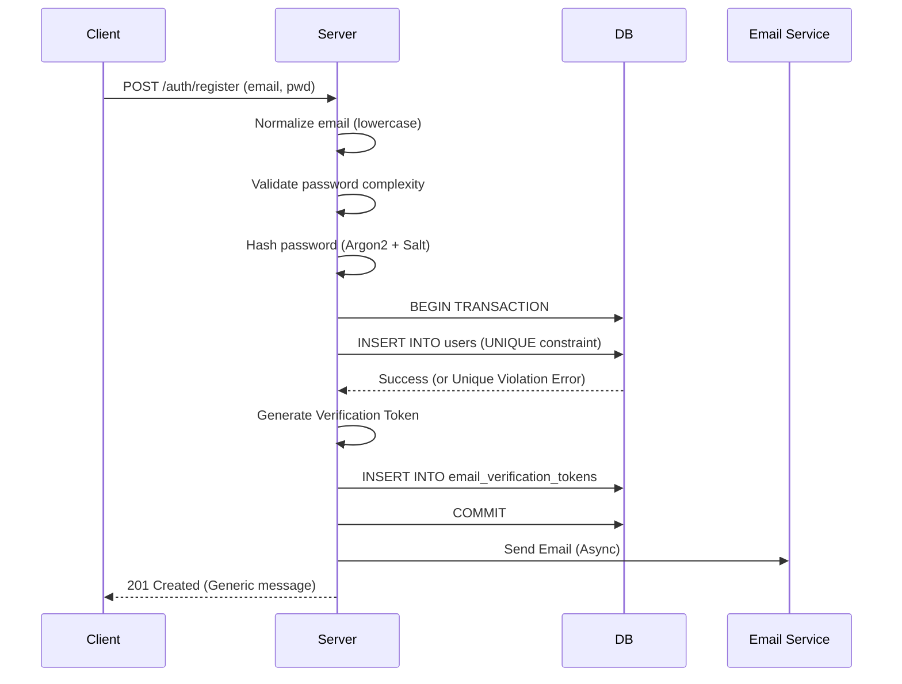
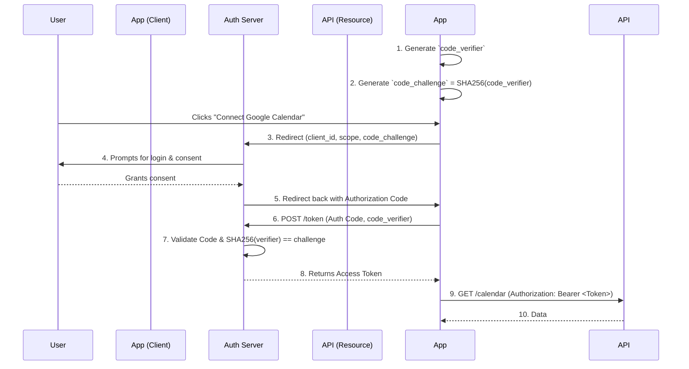
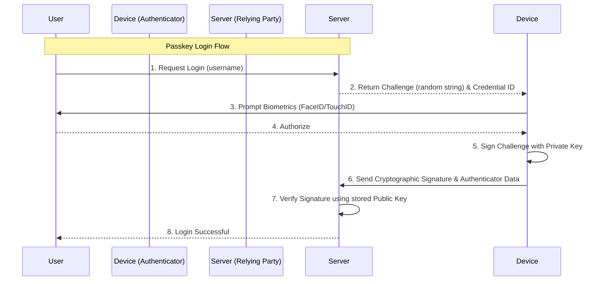
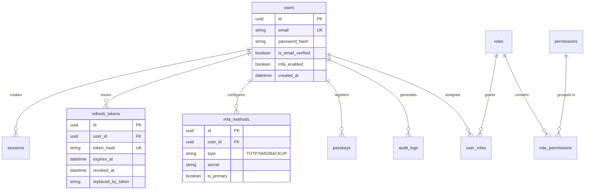

# Authentication: The Complete Engineering Handbook

Welcome to the definitive, deep-dive engineering handbook on Authentication for EnggVault. This document is designed as a university-level and professional software-engineering reference book. It covers authentication from absolute fundamentals to modern identity systems used in massive, large-scale production applications.

**Difficulty:** Beginner → Intermediate → Advanced → Security Engineer → Backend Engineer → System Design → Production Architecture
**Prerequisites:** Basic web development knowledge.
**Target Audience:** Software Engineers, Backend Developers, Full-stack Developers, Security Architects.

---

## 1. Documentation Philosophy & Foundations

Authentication is arguably the most critical component of any modern software system. A flaw in UI rendering is an annoyance; a flaw in authentication is a catastrophic breach.

This handbook follows a strict engineering philosophy. For every major concept, we explore:
- **The Core Definition:** What is it and why does it exist?
- **The Mechanism:** What happens internally, over HTTP, in the browser, and in the database?
- **The Security Posture:** What are the risks, attacks, and common mistakes?
- **The Production Reality:** How is it implemented securely, how does it scale, and what are the trade-offs?

We start with simple mental models and progressively dive into the complex technical layers required for zero-trust architectures.

---

## 2. The Absolute Basics of Identity

Before writing code, we must establish a precise vocabulary. In the security domain, terms like "user" and "identity" have strict definitions.

### Key Definitions

- **Identity:** A set of attributes that describe a unique entity (a person, a device, or a service).
- **User:** A human being interacting with the system.
- **Account:** The digital representation of a user's identity within a specific system. It holds their data, history, and configuration.
- **Principal:** An entity (user, service account, or machine) that can be authenticated and authorized.
- **Subject:** The entity requesting access to a resource (often synonymous with Principal).
- **Identity Claim:** A statement an entity makes about itself (e.g., "My email is alice@example.com").
- **Credential:** Secret or unique data used to prove an identity claim (e.g., a password, a cryptographic key).
- **Secret:** Any piece of confidential data meant only for authorized entities (passwords, API keys, JWT signing keys).
- **Authenticator:** The mechanism or device used to provide credentials (e.g., a YubiKey, a password field, an authenticator app).
- **Identity Provider (IdP):** A trusted third-party system that creates, maintains, and manages identity information (e.g., Google, Okta, Active Directory).

### The Four Pillars of Access Management

Developers frequently confuse Authentication and Authorization. They are fundamentally different steps in an access control pipeline.

| Concept | The Question It Answers | Example Action |
| :--- | :--- | :--- |
| **Identification** | *Which identity are you claiming?* | Entering your username or email address. |
| **Verification** | *Can we prove that claim?* | Checking if the email address actually belongs to you. |
| **Authentication** | *Who are you?* | Submitting a password or scanning a fingerprint to prove identity. |
| **Authorization** | *What are you allowed to do?* | Checking if the authenticated user has the 'Admin' role to delete a record. |

**Summary Rule:** Identification + Verification + Authentication = Establishing Trust. Authorization = Enforcing Trust boundaries.

---

## 3. Real-World Analogies

Software authentication models heavily mimic physical security systems. 

- **The Passport (Identity Provider & JWT):** A passport is issued by a trusted authority (your government / IdP). It contains your photo and name (claims). It has a cryptographic watermark (signature) proving it wasn't forged. When you travel, the foreign country doesn't call your government; they just verify the watermark.
- **The Hotel Room Key (Sessions / Access Tokens):** When you check in (Login), the clerk verifies your ID and gives you a keycard. The keycard doesn't contain your name; it just grants access to Room 304 for 3 days. When you scan it, the door (Resource Server) doesn't ask who you are, it only asks "Is this key valid for this door?"
- **The Security Guard & ID Badge (Stateful vs Stateless):** 
  - *Stateful:* A security guard checks your name against a clipboard (Database/Redis). If you are fired, they cross your name off the clipboard instantly.
  - *Stateless:* You are issued a badge valid for exactly 24 hours. The guard just looks at the expiration date printed on the badge without checking the clipboard. If you are fired at noon, the guard will still let you in until the badge expires, unless a separate system (Revocation List) is added.

---

## 4. The Evolution of Authentication

Authentication has evolved to combat increasingly sophisticated threats.

1. **Basic Username/Password (1990s):** Simple credentials sent over plaintext. Highly vulnerable to interception.
2. **Server-Side Sessions & Cookies (Early 2000s):** Stateful authentication. The server remembers the user via a Session ID stored in a cookie. Solved statefulness but introduced CSRF vulnerabilities and scaling challenges.
3. **API Keys (Mid 2000s):** Long-lived static strings used primarily for machine-to-machine communication. Difficult to revoke securely without rotating keys.
4. **Token Authentication (Late 2000s):** Moving away from cookies for mobile apps. Using headers (`Authorization: Bearer`). 
5. **JSON Web Tokens - JWT (2010s):** Stateless authentication. The token contains a cryptographically signed payload. Allowed microservices to scale horizontally without bottlenecking a central database.
6. **OAuth 2.0 (2012):** Delegated Authorization. Solved the problem of users sharing passwords between applications by introducing scoped access tokens.
7. **OpenID Connect - OIDC (2014):** An identity layer built on top of OAuth 2.0 to provide standard user profiles (Social Login).
8. **Multi-Factor Authentication - MFA (Mainstream 2010s):** Adding TOTP, SMS, or Email verification to combat massive credential stuffing attacks and data breaches.
9. **Hardware Security Keys (FIDO U2F):** Physical devices proving possession via public-key cryptography. Eliminated remote phishing.
10. **WebAuthn / Passkeys / FIDO2 (2020s):** Passwordless authentication. The device itself (iPhone, Android, Mac) acts as the authenticator using biometrics to unlock private keys. Makes phishing mathematically impossible.

---

## 5. HTTP Fundamentals Required for Authentication

Authentication operates entirely over HTTP. You cannot build secure authentication without deeply understanding the protocol.

### HTTP Requests and Responses
- **HTTP Request:** The client asks for something. Consists of a Method, a Path, Headers, and an optional Body.
- **HTTP Response:** The server answers. Consists of a Status Code, Headers, and an optional Body.

### Key HTTP Methods
- `GET`: Read data. Never use `GET` for login or sending passwords, as query parameters are logged in server access logs and browser history.
- `POST`: Create data or submit credentials (e.g., `POST /login`). Data is hidden in the Body.
- `PUT` / `PATCH`: Update data.
- `DELETE`: Remove data (e.g., `DELETE /session` for logout).
- `OPTIONS`: Used by browsers for CORS preflight checks.

### Crucial Status Codes for Auth
- **`200 OK` / `201 Created`:** Success.
- **`204 No Content`:** Success, but nothing to return (common for successful Logout).
- **`400 Bad Request`:** Client sent malformed data (e.g., missing password).
- **`401 Unauthorized`:** **Authentication Failed.** The client is anonymous or provided invalid credentials. The server does not know who they are.
- **`403 Forbidden`:** **Authorization Failed.** The server *knows* who the client is, but the client does not have the permissions required to access the resource.
- **`404 Not Found`:** Resource doesn't exist. Often used instead of 401/403 to hide the existence of a resource from unauthorized users.
- **`409 Conflict`:** e.g., Trying to register an email that already exists.
- **`429 Too Many Requests`:** Rate limiting triggered (crucial for defending against brute force).

### Vital HTTP Headers
- **`Authorization`:** Used to send tokens (e.g., `Authorization: Bearer <token>`).
- **`Cookie`:** Sent by the browser to the server containing session data.
- **`Set-Cookie`:** Sent by the server to instruct the browser to store a cookie.
- **`Origin` & `Referer`:** Indicates where the request came from. Used in CORS and CSRF defense.
- **`User-Agent`:** Identifies the browser/device. Used for auditing and detecting suspicious logins.

---

## 6. Browser Authentication Behavior

When building web applications, the browser acts as a complex intermediary with its own strict security sandbox. 

### The Cookie Jar and Cookie Matching
Browsers maintain an internal database of cookies (the "Cookie Jar"). When the browser makes an HTTP request, it automatically checks the jar to see if any cookies match the target URL. 
- **Matching:** If a cookie's `Domain` and `Path` match the URL, and if network conditions match security flags (`Secure`, `SameSite`), the browser silently appends the `Cookie` header to the request. The JavaScript code making the request (`fetch` or `XMLHttpRequest`) does not need to know the cookie exists.

### The Same-Origin Policy (SOP)
The most critical security boundary in the browser. It restricts how a document or script loaded from one **origin** can interact with a resource from another origin.
- An origin is defined by the **Scheme + Host + Port** (e.g., `https://api.example.com:443`).
- Because of SOP, JavaScript on `https://evil.com` cannot read the DOM or responses from `https://bank.com`.

### Browser Storage Mechanisms
- **Cookies:** Automatically sent with requests. Can be protected from JavaScript via `HttpOnly`. Used for Session IDs and Auth Tokens.
- **localStorage:** Persistent key-value store. Accessible via JavaScript. Exists until cleared. **Vulnerable to XSS (Cross-Site Scripting).** Never store access tokens here.
- **sessionStorage:** Similar to localStorage, but cleared when the browser tab is closed. Also vulnerable to XSS.
- **IndexedDB:** Complex client-side database. Vulnerable to XSS.
- **Service Workers:** Background scripts acting as network proxies. Can intercept requests and append tokens dynamically.

### Browser Password Managers & Credential Management API
Modern browsers integrate password managers. To ensure browsers correctly prompt users to save or autofill passwords, developers must use correct HTML attributes: `<input type="password" autocomplete="current-password">`. The **Credential Management API** allows JavaScript to interact directly with the browser's password manager and biometric sensors (Passkeys).

---

## 7. The Registration System

Registration is the inception of an identity. A poorly designed registration flow leads to duplicate accounts, user enumeration vulnerabilities, and massive database race conditions.

### The Registration Flow

1. **Client Submission:** User submits email, username, and password.
2. **Input Validation & Normalization (Backend):** 
   - Trim whitespace.
   - Lowercase the email address. (Some databases treat `User@example.com` and `user@example.com` as distinct, leading to account hijacking).
   - Validate password strength policies.
3. **Check Existing User:** Query the database. (Must be protected against timing attacks).
4. **Password Hashing:** Hash the password using a strong KDF (Argon2 or bcrypt) and a unique salt.
5. **Database Transaction:** Insert the user record into the database. Use a `UNIQUE` constraint on the email column to prevent race conditions.
6. **Email Verification Trigger:** Generate a secure random token, hash it, store it, and fire an asynchronous event to send the verification email.
7. **Response:** Return a `201 Created` or a generic success message.



### Security & Production Considerations

- **Race Conditions:** If two requests arrive at the exact same millisecond to register the same email, the application code check (`SELECT * FROM users WHERE email=?`) might return `false` for both, resulting in two inserts. **Always rely on a Database `UNIQUE` constraint** to enforce uniqueness at the storage layer. Catch the resulting constraint violation error in code.
- **User Enumeration Prevention:** If a user registers with an existing email, the server should return `200 OK` (or `201 Created`) with a generic message like: "If this email is not registered, an account has been created. Please check your email for a verification link." If it returns `409 Conflict: Email already in use`, an attacker can write a script to check millions of emails to see who uses your service.
- **Rate Limiting & Abuse Prevention:** Registration endpoints must be strictly rate-limited by IP address to prevent bots from creating thousands of spam accounts. Implementing a CAPTCHA or invisible bot-protection is highly recommended.
- **Idempotency:** If the client retries the request due to a network timeout, the server should handle the unique constraint gracefully and not crash.


## 8. Passwords A to Z

Despite the industry's push toward passwordless solutions, passwords remain the bedrock of global authentication. Mishandling them results in catastrophic data breaches.

### The Problem with Plaintext
Storing passwords in plaintext means that if an attacker dumps your database via SQL Injection, they immediately have the credentials for every user. Because humans reuse passwords across multiple sites, a breach on your platform compromises your users' email, banking, and social media accounts. You have a moral and legal obligation to protect this data.

### Hashing vs. Encryption vs. Encoding
- **Encoding (e.g., Base64):** A public algorithm to translate data into a different format. It provides zero security. Anyone can decode it.
- **Encryption (e.g., AES-256):** A two-way mathematical operation. You encrypt a string with a key, and decrypt it later with the same key. **Do not encrypt passwords.** If an attacker steals your database and your encryption key, all passwords are compromised.
- **Hashing (e.g., SHA-256, Argon2):** A one-way mathematical function. It transforms an input of any size into a fixed-length string (a digest). It is mathematically impossible to reverse a hash back to the original password. To verify a login, you hash the provided password and compare it to the stored hash.

### Cryptographic Hashes vs. Password Hashes
**Do not use SHA-256 or SHA-512 directly for passwords.** 
Standard cryptographic hashes are designed for speed (e.g., checking file integrity). A modern GPU cluster can calculate over 100 billion SHA-256 hashes per second. This makes them highly vulnerable to brute force and dictionary attacks. 

We must use **Key Derivation Functions (KDFs)**, also known as Password Hashes. These are intentionally designed to be slow and resource-intensive, a concept known as **Key Stretching** or **Work Factor**.

### Memory Hardness and Time Hardness
To defeat custom-built cracking hardware (ASICs) and GPU farms, modern algorithms rely on:
- **Time Hardness (Iterations):** Forcing the CPU to run the algorithm thousands of times in a loop.
- **Memory Hardness:** Forcing the algorithm to use a massive chunk of RAM (e.g., 64MB) during calculation. GPUs have thousands of cores but very little RAM per core, severely crippling their ability to parallelize memory-hard algorithms.

### Hashing Algorithms Comparison

| Algorithm | Design Focus | Security Level | Production Recommendation |
| :--- | :--- | :--- | :--- |
| **MD5 / SHA-1** | Fast cryptographic hashes | Broken | **NEVER USE.** |
| **SHA-256 / 512** | Fast cryptographic hashes | Very Weak for Passwords | **NEVER USE DIRECTLY.** |
| **PBKDF2** | CPU-hard (Iterations) | Moderate | Use only if constrained by legacy systems (NIST approved, but easily cracked by GPUs). |
| **scrypt** | Memory-hard | High | Good alternative if Argon2 is unavailable. |
| **bcrypt** | CPU-hard (Memory-bound) | High | **Excellent standard.** Widely supported. (Note: Truncates passwords at 72 bytes). |
| **Argon2** | CPU-hard & Memory-hard | Highest | **Best Choice.** Winner of the Password Hashing Competition. Use the `Argon2id` variant. |

### Salt and Pepper
- **Salt:** A unique, randomly generated string added to each user's password *before* hashing. 
  - *Purpose:* It defeats **Rainbow Tables** (massive pre-computed dictionaries of hashes). Because the salt is unique per user, an attacker would have to compute a completely new rainbow table for every single user, rendering the attack computationally unfeasible. The salt is stored in plaintext in the database alongside the hash. Modern algorithms (bcrypt, Argon2) handle salt generation automatically.
- **Pepper:** A global secret string added to the password *before* hashing (or used as an HMAC key on the resulting hash). 
  - *Purpose:* Unlike the salt, the pepper is **never** stored in the database. It is stored in the application's environment variables or a Secret Manager. If an attacker dumps the database but doesn't compromise the application server, they cannot crack the hashes because they lack the pepper.

### Internal Verification Flow
1. Fetch user record from DB by email.
2. Extract the Salt from the stored hash string.
3. Append Salt (and Pepper) to the provided login password.
4. Run the hash algorithm using the stored Work Factor parameters.
5. Compare the resulting hash with the stored hash using a **constant-time comparison function** to prevent timing attacks.

---

## 9. Password Attacks

Understanding how systems are compromised dictates how we build defenses.

- **Brute Force:** Trying every possible combination (aaaa, aaab, aaac). 
  - *Defense:* Rate limiting, account lockouts, CAPTCHA, computationally expensive hashing (Argon2).
- **Dictionary Attack:** Trying common words, names, and variations of leaked passwords (e.g., `Password123!`).
  - *Defense:* Enforce minimum password length (12+ characters), screen against compromised password lists (HaveIBeenPwned API).
- **Credential Stuffing:** Attackers take a database dump from a breached site (Site A) and use automated bots to test those exact email/password pairs on your site (Site B). Works due to widespread password reuse.
  - *Defense:* Multi-Factor Authentication (MFA), monitoring for impossible travel or unusual IP patterns.
- **Password Spraying:** Instead of trying many passwords against one account (which triggers lockouts), attackers try one very common password (e.g., `Company2024!`) against thousands of different accounts.
  - *Defense:* IP-based rate limiting, MFA.
- **Phishing & Social Engineering:** Tricking a user into typing their credentials into a fake website.
  - *Defense:* FIDO2/WebAuthn (Passkeys) which mathematically bind the credential to the physical origin URL.

---

## 10. Password Reset & Account Recovery

Account recovery is often the weakest link in authentication. If an attacker can bypass login by abusing the reset flow, your hashing security is irrelevant.

### Secure Reset Flow
1. **User requests reset:** Endpoint `POST /auth/forgot-password`.
2. **Generate Token:** Server generates a cryptographically secure, random, high-entropy token (e.g., 64 random bytes encoded as hex).
3. **Hash and Store:** The server **hashes** the token (using SHA-256) and stores it in the database with a strict expiration time (e.g., 15 minutes) and linking it to the user ID. *Why hash it?* If the database is leaked, attackers cannot use the reset tokens.
4. **Send Email:** Send an email with a link containing the *raw* token: `https://app.com/reset?token=abc...`
5. **User clicks link:** The client extracts the token and prompts the user for a new password.
6. **Validation & Reset:** Endpoint `POST /auth/reset-password`. Server hashes the provided token, compares it to the database, verifies it hasn't expired, updates the user's password, and **deletes the reset token** (making it single-use).
7. **Session Invalidation:** Crucially, the server must invalidate all active sessions and refresh tokens for that user to kick out potential attackers.

### Security Mitigations
- **User Enumeration:** `POST /auth/forgot-password` must always return a generic `200 OK` ("If the email exists, a link has been sent"). Do not return `404 Not Found`.
- **Timing Attacks:** Ensure the response time is roughly equal whether the email exists or not.
- **Rate Limiting:** Aggressively rate limit this endpoint to prevent email spamming (e.g., 1 request per user per 5 minutes).

---

## 11. Email Verification

Similar to password reset, email verification relies on secure token exchange.

1. **Token Generation:** Upon registration, generate a secure random token, hash it, and store the hash with an expiration (e.g., 24 hours).
2. **Delivery:** Email the raw token as a link.
3. **Verification Endpoint:** `POST /auth/verify-email`. Hash the provided token, find it in the DB, and set `users.is_verified = true`. Delete the token.

**Replay Prevention:** A verification token must be single-use. If the token remains in the DB after verification, it introduces potential state-manipulation vulnerabilities.

---

## 12. Session Authentication A to Z

Because HTTP is a stateless protocol, every request is completely independent. To build applications where a user logs in once and remains logged in across page navigations, we must implement a mechanism to maintain state.

### What is a Session?
A session is a server-side record representing an active connection with an authenticated user. 

### Stateful Authentication Flow
1. **Creation:** The user authenticates. The server generates a large, cryptographically random, unguessable string called a **Session ID** (e.g., a 128-bit UUID).
2. **Storage:** The server stores this Session ID in a session store, linking it to a chunk of state data (User ID, Role, Login Time).
3. **Delivery:** The server sends the Session ID to the client, instructing the browser to store it in a secure cookie.
4. **Lookup:** On every subsequent request, the browser automatically sends the Session ID cookie. The server looks up the ID in its store, identifies the user, and authorizes the request.

### Session Storage Mechanisms
The session store is the most heavily hit component in a stateful architecture.
- **RAM (Memory):** Fast, but volatile. If the server restarts, everyone logs out. Fails entirely in multi-server load-balanced environments unless using "sticky sessions" (an architectural anti-pattern).
- **PostgreSQL / MySQL:** Persistent, but slow. Querying disk-backed databases on every single HTTP request will bottleneck your application.
- **Redis (The Standard):** An in-memory, distributed key-value store. It is blindingly fast (sub-millisecond lookups), supports clustering across multiple servers, and natively handles **TTL (Time-To-Live)** for automatic expiration. 

### Session Expiration
- **Idle Timeout:** Expires the session if the user takes no action for a specific duration (e.g., 30 minutes). Every time the user makes a request, the TTL in Redis is reset. Common in banking and high-security apps.
- **Absolute Timeout:** Expires the session after a hard limit (e.g., 24 hours), regardless of activity. This forces the user to re-authenticate periodically, reducing the window of opportunity if a session is hijacked.

---

## 13. Session Security

Managing state securely requires active defense against numerous attack vectors.

- **Session Hijacking:** Stealing an active Session ID via network sniffing (MitM) or Cross-Site Scripting (XSS).
  - *Mitigation:* Strict use of HTTPS and `HttpOnly` cookies.
- **Session Fixation:** An attacker tricks a victim into using a Session ID known to the attacker. The victim logs in, elevating the known session to an authenticated state. The attacker then uses the known ID to access the victim's account.
  - *Mitigation:* **Session Rotation.** The server *must* generate a brand new Session ID and delete the old one immediately upon successful login or any privilege escalation.
- **Session Replay:** Intercepting and reusing a session cookie.
  - *Mitigation:* HTTPS prevents interception. IP-binding or user-agent validation can help detect anomalies, though these are brittle due to mobile networks changing IPs.
- **Logout Invalidation:** When a user clicks "Logout," the server must actively `DELETE` the session record from Redis. Merely clearing the client-side cookie is insufficient; if an attacker has a copy of the cookie, the session remains alive on the server.

---

## 14. Cookies A to Z

Cookies are the delivery and storage mechanism for state in the browser. When configured correctly, they are the most secure way to store authentication artifacts (Session IDs and Refresh Tokens).

### The Set-Cookie Header
The server commands the browser to store a cookie using the response header:
`Set-Cookie: sessionId=abc123xyz; Domain=api.example.com; Path=/; Max-Age=86400; Secure; HttpOnly; SameSite=Lax`

### Cookie Security Attributes (Critical)

- **`HttpOnly`:** Instructs the browser to forbid client-side JavaScript (e.g., `document.cookie`) from accessing the cookie. **This completely neutralizes XSS attacks attempting to steal Session IDs.**
- **`Secure`:** Instructs the browser to only send the cookie over encrypted HTTPS connections. Prevents network sniffing on public Wi-Fi.
- **`Domain`:** Restricts which hosts receive the cookie. By default, it is the exact host that set it. Setting `Domain=.example.com` allows sharing the session across `app.example.com` and `api.example.com`.
- **`Path`:** Restricts which URL paths receive the cookie (e.g., `Path=/api`).
- **`Max-Age` & `Expires`:** Determines when the browser deletes the cookie. Without these, it is a "Session Cookie," deleted when the browser tab closes.

### Same-Origin vs Same-Site
- **Origin:** Scheme + Host + Port (`https://api.example.com:443`).
- **Site:** The Top-Level Domain plus one (eTLD+1). `api.example.com` and `app.example.com` are different *origins*, but they are the same *site* (`example.com`).

### The `SameSite` Attribute (CSRF Defense)
Dictates when the browser will send cookies on cross-site requests.
- **`Strict`:** Cookie is *only* sent if the request originates from the same site. Safest, but breaks UX (if a user clicks a link to your app from an email, they appear logged out because the cookie wasn't sent).
- **`Lax`:** (Modern Browser Default). Cookie is not sent on cross-site POST requests (preventing CSRF), but *is* sent for top-level safe navigations (clicking a link). This is the ideal balance.
- **`None`:** Cookie is sent with all cross-site requests. **Must** be used in conjunction with the `Secure` flag. Required for third-party contexts (e.g., embedding your app in an iframe, or having a separated SPA domain).

### Cookies vs localStorage vs sessionStorage

| Storage Type | XSS Vulnerable? | CSRF Vulnerable? | Data Transmission | Best Use Case |
| :--- | :--- | :--- | :--- | :--- |
| **Cookies (HttpOnly)** | **No** (JS cannot read) | Yes (Mitigated by `SameSite`) | Automatic via HTTP Headers | **Session IDs, Refresh Tokens** |
| **localStorage** | **Yes** (Trivially stolen) | No | Manual via JS headers | Theme prefs, non-sensitive data |
| **sessionStorage** | **Yes** (Trivially stolen) | No | Manual via JS headers | Ephemeral UI form state |

**Production Rule:** Never store Session IDs or Access Tokens in `localStorage`. A single rogue NPM dependency or XSS flaw will compromise every user's token.


## 15. CSRF (Cross-Site Request Forgery)

If cookies are so secure against XSS, what is their weakness? The answer is CSRF.

### What is CSRF?
Because browsers *automatically* attach cookies to requests matching a domain, an attacker can trick a user's browser into executing an unwanted action on a site where the user is currently authenticated.

### The Attack Flow
1. User logs into `bank.com`. The browser stores a Session Cookie.
2. User visits `evil.com`.
3. `evil.com` contains a hidden form that submits a `POST` request to `https://bank.com/transfer?amount=1000&to=Attacker`.
4. The browser sees a request going to `bank.com`, so it automatically attaches the user's Session Cookie.
5. `bank.com` sees a valid Session Cookie and processes the transfer. The user is robbed.

### CSRF Defenses
1. **`SameSite=Lax` or `Strict` Cookies:** Modern browsers use `Lax` by default, which refuses to send the cookie on cross-site `POST` requests. This stops 99% of CSRF attacks natively.
2. **Synchronizer Token Pattern (Anti-CSRF Tokens):** Used heavily in older architectures or when `SameSite=None` is required. The server generates a unique, cryptographically random token and embeds it in the HTML form. When the form submits, the server verifies the token. Since `evil.com` cannot read the HTML of `bank.com` (due to the Same-Origin Policy), it cannot include the token in its forged request.
3. **Double-Submit Cookie:** An alternative to synchronizer tokens. The server sets a random value in a cookie, and the SPA reads this cookie and includes it as a custom header (`X-CSRF-Token`). `evil.com` can forge the request, but it cannot read the cookie to populate the custom header.
4. **Stateless APIs (Bearer Tokens):** If your API relies on the `Authorization: Bearer <token>` header instead of cookies, it is inherently immune to CSRF. Browsers do not automatically attach custom headers. (However, this requires storing the token somewhere, which risks XSS).

---

## 16. CORS (Cross-Origin Resource Sharing)

CORS is frequently misunderstood as a security feature for the server. **CORS is a security feature for the browser.**

### The Same-Origin Policy (SOP)
SOP prevents JavaScript on `evil.com` from reading data fetched from `api.bank.com`. However, legitimate SPAs (e.g., `app.mycompany.com`) often need to fetch data from APIs on a different origin (`api.mycompany.com`).

### How CORS Works
CORS is a mechanism to relax the SOP. It allows the server to explicitly tell the browser, "Yes, I allow `app.mycompany.com` to read my responses."

1. **Simple Requests:** Browser sends the request. Server responds with data and `Access-Control-Allow-Origin: https://app.mycompany.com`. If the origin doesn't match, the browser blocks the JavaScript from reading the response (even though the server successfully processed the request).
2. **Preflight Requests (`OPTIONS`):** For complex requests (e.g., using `Content-Type: application/json` or custom headers like `Authorization`), the browser first sends an `OPTIONS` request asking for permission.
   - Server responds: `Access-Control-Allow-Methods: POST, GET, OPTIONS` and `Access-Control-Allow-Headers: Authorization`.
   - If approved, the browser sends the actual `POST` request.

### `Access-Control-Allow-Credentials`
If the SPA needs to send cookies (or use HTTP Basic Auth), it must configure `fetch({ credentials: 'include' })`. In response, the server **must** return `Access-Control-Allow-Credentials: true`. 
*Security Rule:* When `Credentials: true` is used, the server is forbidden from using a wildcard `Access-Control-Allow-Origin: *`. It must specify the exact origin to prevent massive CSRF-like data leakage.

**Important Note:** CORS prevents a browser from reading data; it does *not* prevent a server from executing a request. It is not an authentication mechanism.

---

## 17. Token Authentication

As systems moved from monolithic applications to mobile apps and distributed microservices, stateful server-side sessions became a scaling bottleneck. Token authentication was born.

### Bearer Tokens
A Bearer Token acts like physical cash or a hotel keycard: "Whoever bears this token is granted access." It is passed manually via HTTP headers:
`Authorization: Bearer <token>`

### Stateless Authentication
Unlike sessions where the server stores state, **stateless authentication forces the client to store the state inside a cryptographic token**. The server mathematically verifies the token without querying a database.

**The Trade-off:**
- *Pro:* Massive horizontal scalability. Any microservice can verify the token locally.
- *Con:* Extremely difficult to revoke the token before it expires, because there is no central database to check.

---

## 18. JWT A to Z (JSON Web Tokens)

JWT (RFC 7519) is the industry standard for stateless tokens. 

### JWT Structure
A JWT consists of three Base64Url-encoded parts separated by periods: `Header.Payload.Signature`

#### 1. Header (JOSE Header)
Defines the token type and the cryptographic algorithm used for the signature.
```json
{
  "alg": "HS256",
  "typ": "JWT"
}
```

#### 2. Payload (Claims)
Contains the statements (claims) about the entity and metadata.
- **Registered Claims:** Standardized by RFC. 
  - `iss` (Issuer): Who created the token.
  - `sub` (Subject): The user ID.
  - `aud` (Audience): Who the token is intended for.
  - `exp` (Expiration Time): Crucial for security. Epoch timestamp.
  - `iat` (Issued At): When it was created.
  - `jti` (JWT ID): Unique identifier for the token (used for revocation/blacklists).
- **Custom Claims:** e.g., `{"role": "admin", "tenantId": "org_123"}`.

*Security Warning:* JWTs are **encoded, not encrypted**. Anyone who intercepts a JWT can decode it and read the payload. **Never store sensitive data (passwords, PII, internal IDs) inside a JWT payload.**

#### 3. Signature
The most critical part. Created by taking the encoded Header, the encoded Payload, a Secret Key, and hashing them using the algorithm specified in the header.

### Cryptographic Algorithms

1. **Symmetric (e.g., HS256 - HMAC + SHA-256):**
   - Uses a **single Shared Secret Key** to both sign and verify the JWT.
   - *Problem:* If the Auth Service shares the secret with the Billing Service so it can verify tokens, the Billing Service now possesses the key required to *forge* new tokens.

2. **Asymmetric (e.g., RS256 - RSA, ES256 - ECDSA):**
   - Uses a **Private Key** to sign, and a **Public Key** to verify.
   - *Solution:* The Auth Service securely holds the Private Key and signs tokens. All other microservices download the Public Key (via a JWKS endpoint). They can verify the token's mathematical authenticity without ever possessing the ability to forge one.

### JWT Verification Steps Internally
When an API Gateway receives a JWT:
1. Decode the Header. Check the `alg` (algorithm).
2. Fetch the corresponding Public Key (for RS256) or Shared Secret (for HS256).
3. Compute the signature of the `Header.Payload` using the key.
4. Compare the computed signature to the Signature attached to the JWT. If they match, the payload has not been tampered with.
5. Check `exp` (has it expired?).
6. Check `iss` and `aud` (was it issued by us, for us?).

### JWT Vulnerabilities
- **The "None" Algorithm Attack:** Attackers change the header to `{"alg": "none"}`, strip the signature, and submit it. If the server library isn't configured to reject "none", it accepts forged admin tokens.
- **Algorithm Confusion (HS256 vs RS256):** Attacker grabs the server's Public Key, creates a forged token, signs it using HS256 (symmetric) using the Public Key as the shared secret, and changes the header to `alg: HS256`. If the server expects RS256 but blindly trusts the header, it will try to verify using HS256 with its Public Key, resulting in a successful verification of a forged token. *Mitigation:* Hardcode allowed algorithms in the verification library configuration.

---

## 19. Refresh Token Architecture

Because stateless JWTs cannot be natively revoked, they must have a very short lifespan (e.g., 10-15 minutes). If stolen, the window of exploitation is small. But making users log in every 15 minutes is terrible UX. Enter the **Refresh Token Pattern**.

### Architecture
- **Access Token:** Short-lived (15m), stateless (JWT), sent with every API request.
- **Refresh Token:** Long-lived (7-30 days), stateful (stored in the database), high-entropy random string, used *exclusively* at the `/auth/refresh` endpoint to get new Access Tokens.

### Refresh Token Security & Rotation
Refresh tokens represent long-term access. If stolen (e.g., via a compromised device), an attacker can generate infinite Access Tokens.
- **Refresh Token Rotation:** Every time a Refresh Token is exchanged for a new Access Token, the server **invalidates the old Refresh Token and issues a new one**.
- **Reuse Detection:** If an attacker steals a Refresh Token, the victim and the attacker now both have copies. One of them uses it, the token rotates, and the old token is invalidated. When the *other* party tries to use the now-invalidated old token, the server detects a reuse anomaly. The server must immediately revoke the *entire family* of tokens for that user, cutting off the attacker and forcing the victim to re-authenticate securely.

---

## 20. API Keys

API Keys are long-lived static strings used primarily for Machine-to-Machine (M2M) authentication (e.g., your backend calling the Stripe API).

### Security Concepts
- **Public vs Secret:** Public keys (e.g., Stripe Publishable Key) are safe in the browser and used for low-privilege actions. Secret keys must remain on the backend.
- **Prefixes:** Format keys with prefixes (e.g., `sk_prod_abc123`). This allows GitHub and secret scanners to detect accidentally committed keys instantly.
- **Storage:** Hash Secret API keys in the database (like passwords) using SHA-256. If your DB leaks, attackers cannot use the API keys.
- **API Keys vs JWT:** API Keys are stateful and require a DB lookup to validate scope/permissions. JWTs are stateless.

---

## 21. OAuth 2.0 A to Z

OAuth 2.0 is an **Authorization Framework**, not an authentication protocol. It solves the "Delegated Authorization" problem: allowing Application A to access data in Application B on behalf of the User, without the User giving Application A their password.

### Roles in OAuth 2.0
1. **Resource Owner:** The user (You).
2. **Client:** The application requesting access (A startup's calendar app).
3. **Authorization Server:** The server verifying identity and issuing tokens (Google).
4. **Resource Server:** The API hosting the protected data (Google Calendar API).

### Authorization Code Flow with PKCE
This is the modern, secure standard for SPAs, mobile apps, and web backends.

**The Problem PKCE Solves:** In the standard Auth Code flow, the Auth Server redirects the user back to the Client with an Authorization Code in the URL. If a malicious app on a mobile device intercepts this URL, it can steal the code and exchange it for a token. PKCE (Proof Key for Code Exchange) uses cryptographic hashing to prove that the Client exchanging the code is the exact same Client that initiated the request.

**The Flow:**
1. **Client Setup:** The Client generates a random string (`code_verifier`). It hashes it using SHA-256 to create the (`code_challenge`).
2. **Redirect:** The Client redirects the user to the Auth Server, including the `code_challenge`, `client_id`, `scope` (e.g., `calendar.read`), and `redirect_uri`.
3. **Consent:** The Auth Server authenticates the user and asks, "Do you allow this app to read your calendar?"
4. **Auth Code:** The Auth Server redirects the user back to the Client with a short-lived `Authorization Code`.
5. **Token Exchange:** The Client makes a backend `POST /token` request to the Auth Server, providing the Auth Code AND the original raw `code_verifier`.
6. **Validation:** The Auth Server hashes the `code_verifier`. If it matches the `code_challenge` from Step 2, it issues the Access Token.
7. **Resource Access:** The Client uses the Access Token to call the Resource Server.



### Other Flows
- **Client Credentials Flow:** For M2M communication (cron jobs, microservices). No user is involved. The Client authenticates directly with the Auth Server using a Client ID and Secret to get an Access Token.
- **Device Authorization Flow:** For input-constrained devices (Smart TVs). The device shows a code. The user goes to a URL on their phone, logs in, and enters the code.

---

## 22. OpenID Connect (OIDC) A to Z

Developers started abusing OAuth 2.0 to authenticate users by asking for "profile" scopes and hitting a profile API. OIDC was built *on top* of OAuth 2.0 to standardize Identity Authentication.

### The ID Token
While OAuth 2.0 issues an Access Token meant for the *Resource Server*, OIDC issues an **ID Token** meant for the *Client*.
- The ID Token is **always a JWT**.
- It contains standard claims (`sub` for user ID, `name`, `email`, `picture`).
- It allows the Client to immediately know who logged in without making an extra API call.

### OIDC Discovery & JWKS
How does an API Gateway verify a Google ID Token? 
IdPs publish a **Discovery Document** at a standard URL (e.g., `https://accounts.google.com/.well-known/openid-configuration`). 
This JSON document contains the **`jwks_uri`** (JSON Web Key Set). The JWKS contains the Public Keys (RS256) used by the IdP to sign tokens. Microservices download these keys, cache them, and use them to verify incoming JWT signatures locally.

| Feature | OAuth 2.0 | OpenID Connect (OIDC) |
| :--- | :--- | :--- |
| **Primary Goal** | Delegated Authorization (API Access) | Authentication (Identity Verification) |
| **Token Type** | Access Token (Opaque or JWT) | ID Token (Always JWT) + Access Token |
| **Scopes**| API-specific (`calendar.read`) | Identity-specific (`openid`, `profile`, `email`) |


## 23. MFA A to Z (Multi-Factor Authentication)

MFA forces users to provide evidence from at least two different categories of factors (Knowledge, Possession, Inherence). It is the single most effective defense against credential stuffing and phishing.

### MFA Methods Comparison

| MFA Method | Description | Security Level | Drawbacks |
| :--- | :--- | :--- | :--- |
| **SMS OTP** | 6-digit code sent via text message. | Low | Vulnerable to SIM swapping and SS7 network interception. NIST deprecates this for high-security systems. |
| **Email OTP** | Code sent via email. | Low-Med | If the user uses the same password for their email, MFA is bypassed. |
| **TOTP** | Time-based One Time Password (Google Auth). Generates codes based on a shared secret (QR code) and current time. | High | Requires user setup. If the phone is lost without backups, account is locked out. Subject to real-time proxy phishing. |
| **Hardware Key** | Physical token (YubiKey) using FIDO U2F. | Highest | Costs money; physical loss. Phishing resistant. |
| **Push / Number Matching**| App prompts user to tap a number displayed on the screen. | High | Mitigates "MFA Fatigue" attacks where attackers spam push notifications until the user hits "Approve". |

### Backup & Recovery
When implementing MFA, you **must** implement a recovery mechanism. If a user drops their phone in a lake, they lose their TOTP generator. 
- **Backup Codes:** Generate 10 static, single-use codes during setup. The user prints them. Hash these in the database like passwords.

---

## 24. Passkeys, WebAuthn, and FIDO2

Moving away from passwords entirely eliminates phishing, credential stuffing, and brute-force attacks at the architectural level.

### The FIDO2 Architecture
FIDO2 consists of two components:
1. **WebAuthn (Web Authentication API):** The browser API that JavaScript uses to talk to authenticators.
2. **CTAP (Client to Authenticator Protocol):** The protocol the browser uses to talk to the hardware (USB YubiKey, Bluetooth, or the device's internal Secure Enclave).

### How Passkeys Work (Public Key Cryptography)
Passkeys leverage asymmetric cryptography. There is no "shared secret" (like a password) sent over the network.

**Registration Flow:**
1. The server (Relying Party) generates a random `challenge`.
2. The browser calls `navigator.credentials.create()`.
3. The device generates a new public/private key pair specific to that domain (Origin binding). The private key is stored securely in the device's Secure Enclave and cannot be extracted.
4. The device prompts the user for biometric authorization (FaceID/TouchID).
5. The device sends the **Public Key** to the server, which stores it.

**Login Flow:**


**Why it's Phishing Resistant:**
The WebAuthn API enforces **Origin Binding**. If an attacker tricks a user into visiting `paypa1.com` instead of `paypal.com`, the browser asks the authenticator for a key mapped to `paypa1.com`. The device won't find one, and the flow fails. The user cannot accidentally give away their credential.

---

## 25. Authorization A to Z

Authentication answers "Who are you?". Authorization (AuthZ) answers "What are you allowed to do?". Once identity is established, the system must enforce strict boundaries.

### Authorization Models

1. **Role-Based Access Control (RBAC):**
   - Users are assigned Roles (Admin, Editor, Viewer). Roles have Permissions.
   - *Pros:* Simple to understand and implement. Standard for most applications.
   - *Cons:* "Role Explosion." As systems grow, you end up creating highly specific roles (e.g., `Editor_Region_A_Finance`) which becomes unmanageable.

2. **Attribute-Based Access Control (ABAC) / Policy-Based (PBAC):**
   - Access is granted based on attributes of the User, the Resource, and the Environment (e.g., Time of day).
   - *Example Policy:* "Allow access if User.Department == Resource.Department AND Time >= 09:00 AND Time <= 17:00."
   - *Pros:* Highly flexible and granular.
   - *Cons:* Complex to implement and evaluate. Can impact database performance.

3. **Access Control Lists (ACL):**
   - Explicit lists attached to a specific resource dictating who can access it. (e.g., Sharing a Google Doc with three specific email addresses).

4. **Relationship-Based Access Control (ReBAC):**
   - Authorization is based on graph relationships. Used by systems like Google Zanzibar.
   - *Example:* "User A is a Member of Group X. Group X is the Owner of Folder Y. Document Z is inside Folder Y. Therefore, User A can read Document Z."

### Resource Ownership (A Common Pitfall)
A critical mistake in RBAC is checking for a role but failing to check resource ownership. 
If an endpoint `PUT /posts/123` requires the "Editor" role, an authenticated Editor might be able to edit a post that belongs to a completely different user. This is an **Insecure Direct Object Reference (IDOR)** vulnerability.
*Solution:* Authorization logic must always include scope verification: `WHERE id = resource_id AND owner_id = current_user_id`.

### Implementation: Middleware
Authorization logic should be abstracted into central Middleware (Guards), not scattered throughout controller business logic. This creates a "Deny-by-default" architecture.

```typescript
// Express Middleware Example
export const requireRole = (requiredRole: string) => {
  return (req: Request, res: Response, next: NextFunction) => {
    // Relies on auth middleware running first to populate req.user
    if (req.user?.role !== requiredRole) {
      return res.status(403).json({ error: 'Forbidden: Insufficient privileges' });
    }
    next();
  };
};

// Usage
app.delete('/admin/users', requireAuth, requireRole('ADMIN'), (req, res) => { /* ... */ });
```

---

## 26. Security Attacks Deep Dive

Authentication endpoints are the most frequently attacked surfaces.

- **Cross-Site Scripting (XSS):** Attacker injects malicious JS. Impact: Steals `localStorage` tokens. Mitigation: CSP Headers, React/Angular auto-escaping, `HttpOnly` cookies.
- **Cross-Site Request Forgery (CSRF):** Attacker forces user's browser to execute unwanted actions. Mitigation: `SameSite` cookies, Anti-CSRF tokens.
- **Clickjacking:** Attacker loads your site in a transparent `<iframe>` over a malicious button. Mitigation: `X-Frame-Options: DENY` or CSP `frame-ancestors 'none'`.
- **Man-in-the-Middle (MitM):** Intercepting traffic on public Wi-Fi. Mitigation: TLS/HTTPS + HSTS.
- **OAuth Open Redirect:** Attacker modifies the `redirect_uri` in an OAuth flow to send the Auth Code to their server. Mitigation: Strictly whitelist exact, literal Redirect URIs in the Auth Server.

---

## 27. HTTP Security Headers

Modern browsers offer built-in security features activated by HTTP response headers.

- **Strict-Transport-Security (HSTS):** Forces the browser to *only* connect via HTTPS, preventing protocol downgrade attacks.
- **Content-Security-Policy (CSP):** The ultimate XSS defense. Restricts where scripts, images, and styles can be loaded from.
- **X-Content-Type-Options: nosniff:** Prevents browsers from trying to guess MIME types, which can lead to XSS if a user uploads a malicious file masquerading as an image.

---

## 28. TLS / HTTPS

HTTPS is non-negotiable for authentication.
- **Encryption in Transit:** Without TLS, passwords and session cookies are sent in plaintext over the internet.
- **Certificates:** An SSL/TLS certificate proves cryptographic ownership of a domain, verified by a Certificate Authority (CA) like Let's Encrypt.
- **TLS Termination:** In modern architectures, the Load Balancer or Reverse Proxy (Nginx, AWS ALB) handles the complex TLS decryption, forwarding plaintext HTTP to internal microservices over a secure VPC.

---

## 29. Secret Management

Code repositories are for code, not secrets.
- **The Rule:** NEVER commit API keys, database passwords, or JWT signing keys (e.g., HS256 secrets) to Git. If you do, assume they are instantly compromised by bots scanning GitHub.
- **Environment Variables (`.env`):** The simplest approach for monolithic apps.
- **Secret Managers (AWS Secrets Manager, HashiCorp Vault):** Required for production distributed systems. These allow for automatic secret rotation, audit logging of who accessed the secret, and versioning.


## 30. Database Design

A production authentication database requires careful design to support sessions, MFA, token revocation, and auditing.

### ER Diagram



### Prisma Schema Implementation
This schema implements token rotation, MFA, and soft-revocation.

```prisma
model User {
  id               String          @id @default(uuid())
  email            String          @unique
  passwordHash     String
  isEmailVerified  Boolean         @default(false)
  mfaEnabled       Boolean         @default(false)
  
  sessions         Session[]
  refreshTokens    RefreshToken[]
  mfaMethods       MfaMethod[]
  passkeys         Passkey[]
  roles            UserRole[]
  auditLogs        AuditLog[]
  
  createdAt        DateTime        @default(now())
  updatedAt        DateTime        @updatedAt
  
  @@index([email])
}

model RefreshToken {
  id               String    @id @default(uuid())
  tokenHash        String    @unique
  userId           String
  user             User      @relation(fields: [userId], references: [id], onDelete: Cascade)
  
  expiresAt        DateTime
  revokedAt        DateTime? // If populated, token is dead
  replacedBy       String?   // Tracks token family lineage for rotation
  
  createdAt        DateTime  @default(now())
  
  @@index([userId])
}

model AuditLog {
  id          String   @id @default(uuid())
  userId      String?
  user        User?    @relation(fields: [userId], references: [id], onDelete: SetNull)
  eventType   String   // e.g., "LOGIN_SUCCESS", "LOGIN_FAILED", "PASSWORD_RESET"
  ipAddress   String?
  userAgent   String?
  createdAt   DateTime @default(now())
  
  @@index([userId, eventType])
}
```

---

## 31. Authentication API Design

Standard production APIs must balance functionality with strict security.

| Method | Endpoint | Purpose | Auth | Security & Implementation Notes |
| :--- | :--- | :--- | :--- | :--- |
| `POST` | `/auth/register` | Create account | None | Strict IP rate-limiting. Normalize email (lowercase). Return generic 201 regardless of email existence to prevent enumeration. |
| `POST` | `/auth/login` | Get session/token | None | Rate limit by IP and Email. Return `401 Invalid credentials` (generic). If MFA enabled, return temporary token requiring MFA verify step. |
| `POST` | `/auth/mfa/verify` | Submit TOTP | Partial | Requires pre-auth token. Verifies TOTP code against DB secret. Issues final Access/Refresh tokens on success. |
| `POST` | `/auth/refresh` | Get new access token | None | Expects Refresh Token in `HttpOnly` cookie or body. Enforce **Token Rotation**: issue new Refresh Token, revoke old one. If old token was already revoked, flag as reuse and revoke entire token family. |
| `POST` | `/auth/logout` | End session | Yes | `DELETE` session from Redis or set `revokedAt` on Refresh Token. Instruct browser to clear cookies (`Set-Cookie: session=; Max-Age=0`). |
| `POST` | `/auth/forgot-pw` | Trigger reset email | None | Rate limit aggressively. Hash generated token before storing. Return generic success message. |
| `POST` | `/auth/reset-pw` | Set new password | None | Validate token hash against DB. Enforce password complexity. Invalidate all existing sessions/tokens upon success. |
| `GET`  | `/auth/me` | Fetch active user | Yes | Returns user profile. Used by SPAs to hydrate frontend state on page load. |

---

## 32. Production Node.js Implementation

Building a scalable Auth module in Node.js, TypeScript, Express, and Redis.

### 1. Secure Password Hashing (Argon2)
```typescript
import argon2 from 'argon2';

export class PasswordService {
  static async hash(password: string): Promise<string> {
    return await argon2.hash(password, {
      type: argon2.argon2id,
      memoryCost: 2 ** 16, // 64 MB
      timeCost: 3,         // Iterations
      parallelism: 1,      // Threads
    });
  }

  static async verify(hash: string, password: string): Promise<boolean> {
    try {
      return await argon2.verify(hash, password);
    } catch (err) {
      return false; // Prevents timing attacks or crashes on malformed hashes
    }
  }
}
```

### 2. JWT Generation & Verification
```typescript
import jwt from 'jsonwebtoken';

const PRIVATE_KEY = process.env.JWT_PRIVATE_KEY!; // For RS256
const PUBLIC_KEY = process.env.JWT_PUBLIC_KEY!;

export class TokenService {
  // Generate a short-lived, asymmetric Access Token
  static generateAccessToken(userId: string, role: string): string {
    return jwt.sign(
      { sub: userId, role }, 
      PRIVATE_KEY, 
      { algorithm: 'RS256', expiresIn: '15m' }
    );
  }

  static verifyAccessToken(token: string) {
    try {
      return jwt.verify(token, PUBLIC_KEY, { algorithms: ['RS256'] });
    } catch (error) {
      throw new Error('Invalid or Expired Token');
    }
  }
}
```

### 3. Authorization Middleware (Guards)
```typescript
import { Request, Response, NextFunction } from 'express';

// Authentication Middleware
export const requireAuth = (req: Request, res: Response, next: NextFunction) => {
  const token = req.cookies?.access_token || req.headers.authorization?.split(' ')[1];
  
  if (!token) return res.status(401).json({ error: 'Unauthorized' });

  try {
    const payload = TokenService.verifyAccessToken(token);
    req.user = { id: payload.sub as string, role: payload.role as string };
    next();
  } catch (err) {
    return res.status(401).json({ error: 'Unauthorized' });
  }
};

// Authorization Middleware (RBAC)
export const requireRole = (requiredRole: string) => {
  return (req: Request, res: Response, next: NextFunction) => {
    if (req.user?.role !== requiredRole) {
      return res.status(403).json({ error: 'Forbidden' });
    }
    next();
  };
};
```

---

## 33. NestJS Authentication

NestJS is a highly opinionated Node.js framework. It abstracts authentication via **Passport.js** and **Guards**.
- **Strategies:** You define a `JwtStrategy` that automatically extracts the token (from cookies or headers), validates the signature, and returns the payload.
- **Guards:** You apply `@UseGuards(JwtAuthGuard)` to controllers. The Guard executes before the route handler, allowing or denying the request based on the Strategy's outcome.
- **Decorators:** `@CurrentUser()` decorators allow you to extract the authenticated user entity directly into the controller method parameters cleanly.

---

## 34. Next.js Authentication (React)

Modern Next.js (App Router) has revolutionized full-stack React authentication.
- **NextAuth.js (Auth.js):** The dominant library. It effortlessly handles OAuth providers (Google, GitHub), database sessions (Prisma), and JWTs.
- **Server Components:** Auth checks happen on the server *before* rendering the HTML, preventing loading spinners and unauthorized flashes of content.
- **Middleware:** Next.js Middleware can intercept requests at the edge. You can verify a JWT in the middleware and redirect unauthenticated users to `/login` before the page even begins to render.
- **Client vs Server Protection:** Protecting a client-side route (`useEffect` redirect) is for UX. Real security requires validating the session inside **Server Actions** and **Route Handlers** before interacting with the database.

---

## 35. Other Frameworks

- **Spring Boot (Java):** `Spring Security` uses powerful filter chains. Difficult to configure, but unmatched for enterprise RBAC, SAML, and OIDC federation.
- **Django (Python):** Comes with a built-in authentication system. Provides robust session management and a free Admin UI out-of-the-box.
- **Laravel (PHP):** Offers `Laravel Sanctum` for SPA/API token auth, and `Breeze/Jetstream` for full-stack scaffolding. The developer experience is industry-leading.
- **Go:** Typically uses the standard `net/http` library combined with `golang-jwt`. Highly performant but requires manual wiring of middleware.

---

## 36. Microservices Authentication

In a monolith, authentication is easy: the server checks the database. In microservices, verifying credentials against a central database on every inter-service request will bring the system to its knees.

### The API Gateway Pattern
1. **Client** makes a request to the **API Gateway**.
2. The Gateway identifies the request lacks a token and routes it to the **Auth/Identity Service**.
3. The Auth Service verifies the password and issues a stateless **Asymmetric JWT (RS256)**.
4. On subsequent requests, the Client sends the JWT to the Gateway.
5. The Gateway (or downstream microservice) verifies the JWT signature locally using the Auth Service's Public Key. No database lookup is required.

### Service-to-Service Authentication (mTLS)
How does "Service A" securely call "Service B" without a user involved?
- **mTLS (Mutual TLS):** Handled by a Service Mesh (Istio/Linkerd). Both services present cryptographic certificates to prove their identity to each other.
- **Machine-to-Machine JWTs:** Service A uses an OAuth Client Credentials flow to obtain a token from the Auth Service before calling Service B.

---

## 37. Distributed Systems Considerations

When you scale from 1 server to 100, authentication breaks if not designed correctly.

- **Load Balancers:** Distribute traffic across servers. **Never use Sticky Sessions** (forcing a user to always hit Server A). It breaks horizontal scaling and zero-downtime deployments.
- **Shared Session State:** Because Server B cannot read Server A's RAM, sessions must be stored in a centralized, highly available store like **Redis Cluster**.
- **Clock Skew:** If Server A creates a JWT and Server B verifies it, a 5-second clock difference between their system times might cause Server B to reject the token as "not yet valid" (`nbf` claim). Always allow a small leeway in JWT verification.
- **Cache Invalidation:** When revoking a user's permissions, those permissions might be cached across various microservices. Implementing a globally consistent revocation strategy (e.g., publishing a "User Revoked" event to a Kafka topic) is necessary for high-security environments.


## 38. Multi-Tenant Authentication

SaaS applications (like Slack or Jira) are multi-tenant. They serve many different companies (tenants) from a single shared codebase and database.

### The Challenge
A user might belong to Company A as an Admin, and Company B as a Viewer, using the exact same email address. The authentication system must isolate data and permissions perfectly.

### Architectural Approaches
1. **Siloed Databases:** Each tenant gets their own separate database. Simplest for AuthZ, most expensive to operate.
2. **Shared Database, Separate Schemas:** Each tenant gets a PostgreSQL schema.
3. **Shared Database, Shared Schema (The Standard):** Every database table has a `tenant_id` column.

### Authentication Flow in Multi-Tenancy
- When generating a JWT for a user, the payload **must** include the `tenant_id` for the context they are currently logged into.
- `{"sub": "user_123", "tenant_id": "org_abc", "role": "admin"}`
- A user cannot be logged into two tenants simultaneously with the same token. If they switch workspaces, the frontend must request a new token scoped to the new tenant.
- **Critical Security Rule:** Every single database query must include the `tenant_id` to prevent cross-tenant data leakage.

### Enterprise Federation (SSO)
Enterprise clients will refuse to use your application if their employees have to create new passwords. They will demand Single Sign-On (SSO).
- **SAML (Security Assertion Markup Language):** An XML-based protocol. Older, heavy, but heavily entrenched in enterprise systems (Active Directory).
- **OIDC:** The modern standard.
- **Implementation:** You delegate authentication to the enterprise's IdP (e.g., Okta). Your app receives a token from Okta proving the employee is authenticated. Your app then matches the email to a user record in your DB. You no longer handle password resets or MFA for that user; Okta does.

---

## 39. Enterprise Authentication Concepts

When building B2B SaaS, authentication complexity multiplies.

- **SCIM (System for Cross-domain Identity Management):** A protocol used by IT departments to automate user provisioning. If an employee is fired in Workday, Workday uses SCIM to automatically tell your application to delete the user account instantly.
- **Just-in-Time (JIT) Provisioning:** If a user logs in via SSO, but doesn't exist in your database, your app automatically creates an account for them on the fly based on the claims in the SAML/OIDC payload.
- **Directory Sync:** Synchronizing your application's user list with an enterprise's Active Directory.

---

## 40. Authentication Observability

If you cannot see an attack happening, you cannot stop it. Authentication is the highest-priority system for logging.

### Audit Logging
Every authentication event must be logged to a highly secure, append-only database.
- **Events to Log:** Login Success, Login Failure, Password Reset Request, Password Changed, MFA Enabled/Disabled, Account Lockout.
- **Metadata Required:** Timestamp, User ID (if known), IP Address, User-Agent, Event Type.
- **Security Rule:** **NEVER log passwords, session IDs, or tokens.** Log that an event occurred, not the secret material used.

### Monitoring & Alerting
Set up real-time alerts for:
- Sudden spikes in `401 Unauthorized` responses (Brute force / Credential stuffing).
- Impossible travel (A login from New York, followed by a login from Moscow 5 minutes later).
- Multiple failed logins on a single admin account.

---

## 41. Rate Limiting and Abuse Prevention

Without rate limiting, your authentication API is defenseless against automation.

### Implementation Strategies
1. **IP-Based Limiting:** Restrict requests per IP (e.g., 100 requests per 15 minutes). *Flaw:* Attackers use botnets with millions of rotating IPs.
2. **User-Based Limiting:** Restrict failed login attempts per email address. *Flaw:* Attackers can perform Password Spraying (trying one password across thousands of accounts) without hitting the per-user limit.
3. **Progressive Delays:** After 3 failed attempts, wait 1 second. After 5, wait 10 seconds. After 10, lock the account for 15 minutes.
4. **CAPTCHA / Turnstile:** When suspicious activity is detected, force the client to solve a puzzle.

---

## 42. Account Enumeration

Account enumeration is the ability for an attacker to determine if an email address exists in your database.

### Vulnerable Endpoints
- **Registration:** "Email already in use."
- **Login:** "Invalid Password" vs "User Not Found." (The server should always respond with a generic "Invalid Credentials").
- **Password Reset:** "We couldn't find an account with that email."

### Timing Attacks
Even if you fix the text responses, attackers can measure response times. 
- If a user *doesn't* exist, the server returns an error in 10ms.
- If a user *does* exist, the server hashes the password (Argon2 takes 500ms) and then returns an error in 510ms.
- *Mitigation:* The server must execute a dummy hash operation even if the user is not found, ensuring the endpoint always takes roughly 500ms regardless of user existence.

---

## 43. Logout and Session Management

Logout is not merely a UI state change; it is a critical security action.

### The Mechanics of Logout
1. **Client-side:** The UI deletes the token from memory/storage.
2. **Server-side (Sessions):** The server `DELETE`s the session key from Redis. The session is instantly dead.
3. **Server-side (JWTs):** The server invalidates the Refresh Token in the database. 
4. **The Access Token Problem:** The short-lived Access Token (JWT) cannot be natively revoked. The user is logged out, but if an attacker stole the Access Token right before logout, it remains valid for the next ~15 minutes.
   - *Mitigation (Strict):* Maintain a "Blacklist" of revoked JWT IDs (`jti`) in Redis. The API Gateway checks Redis on every request. (This destroys the stateless benefit of JWTs).
   - *Mitigation (Practical):* Accept the risk for the 15-minute window. This is the industry standard trade-off.

---

## 44. Device Management

Users expect to see a list of "Active Sessions" or "Devices" (e.g., "MacBook Pro in London") and have the ability to click "Log Out of All Other Devices."

- **Implementation:** Your `sessions` or `refresh_tokens` database table must store `user_agent`, `ip_address`, and `last_active_at`.
- When the user clicks "Log Out All", the server queries `DELETE FROM sessions WHERE user_id = X AND id != CURRENT_SESSION_ID`.

---

## 45. Account Recovery

When a user loses their phone (MFA) and forgets their password, how do they get back in?

- **Identity Verification:** Customer Support must verify identity. (e.g., verifying a government ID, or verifying details of recent transactions). This is a massive vector for Social Engineering attacks against your support staff.
- **Account Deletion:** Users must have the ability to delete their accounts to comply with GDPR/CCPA. This must be a hard delete or a cryptographically secure anonymization of PII.

---

## 46. Account Takeover (ATO)

ATO occurs when an attacker successfully breaches an account.

### Post-Breach Defenses
If an attacker logs in, you can still limit the damage:
- **Re-authentication for High-Risk Actions:** If a user tries to change their password, delete the account, or transfer money, the system must force them to re-enter their password or provide an MFA code *again*, even if they are already logged in. This stops an attacker who found a laptop unlocked in a coffee shop.
- **Email Notifications:** Immediately email the user when a new login occurs from an unrecognized device, or when security settings are changed. Provide a "Wasn't me? Lock account immediately" link.


## 47. Authentication Testing

Testing authentication requires specialized strategies beyond standard unit tests.

- **Unit Testing:** Mock the database. Test the Argon2 hashing logic, JWT generation, and token verification functions in isolation.
- **Integration Testing:** Spin up a real Test Database and Redis instance using Docker (Testcontainers). Issue a `POST /register`, then a `POST /login`, and assert that Redis contains the session key.
- **E2E (End-to-End) Testing:** Cypress or Playwright. *Warning:* Testing UI login flows is extremely slow. For testing protected routes, do not run the UI login macro before every test. Instead, have a setup script inject a valid JWT or Session Cookie directly into the browser context, bypassing the UI completely.
- **Security Testing:** Run automated vulnerability scanners (OWASP ZAP) against the Auth API to check for missing headers, insecure cookies, and injection flaws.

---

## 48. Authentication Performance

Authentication is a massive CPU bottleneck because cryptography is intentionally slow.

- **The Argon2 Bottleneck:** If Argon2 takes 500ms to hash a password, and your Node.js server receives 100 simultaneous login requests, the Event Loop will block. *Solution:* Offload password hashing to a separate microservice, use Worker Threads, or utilize a specialized Identity Provider.
- **JWT Verification Speed:** Asymmetric (RS256) verification is fast, but if every microservice has to download the Public Key from a JWKS endpoint on every request, latency skyrockets. *Solution:* Microservices must cache the Public Key in memory and refresh it periodically (e.g., every 24 hours).

---

## 49. Authentication System Design (Real-World Scenarios)

Different products require wildly different authentication architectures.

1. **B2C E-commerce (Amazon):** Low friction is paramount. Allow guest checkout. Support Social Login (Google/Apple). Use Long-lived sessions (Remember Me) so users don't have to log in repeatedly.
2. **B2B SaaS (Slack):** Multi-tenancy is critical. Rely heavily on OIDC/SAML for enterprise SSO. Strict Session Expiration and SCIM provisioning.
3. **Banking / FinTech:** Maximum security. Absolute idle timeouts (logout after 15 mins of inactivity). Mandatory MFA for login. Step-up authentication (re-prompting for password) before transferring funds.
4. **Mobile Applications:** Do not use cookies. Use the OAuth 2.0 Authorization Code Flow with PKCE. Store the Refresh Token securely in the iOS Secure Enclave / Android Keystore. Use Biometrics to unlock the token.
5. **IoT / Smart Devices (TVs):** No keyboard available. Use the OAuth 2.0 Device Authorization Flow. The TV displays a 6-digit code. The user logs in on their phone and enters the code, granting the TV an Access Token.
6. **Internal Admin Dashboards:** Restrict access at the network level (VPN / Zero Trust Network Access). Enforce strict Hardware Key MFA (YubiKey). 
7. **Microservices Backend:** Use an API Gateway to handle user authentication, translating sessions/cookies into short-lived JWTs that are passed down to internal microservices. Use mTLS for service-to-service auth.
8. **High-Frequency Trading / Real-Time Games:** JWT verification might be too slow for sub-millisecond latency requirements. Use highly optimized, custom symmetric token validation close to the edge, or establish a long-lived authenticated WebSocket connection.
9. **Healthcare (HIPAA):** Intense audit logging requirements. Every single data access (AuthZ) must be logged. Strict password rotation policies.
10. **Government Systems (FedRAMP):** Strict compliance. FIPS 140-2 validated cryptographic modules. Smart card (PIV/CAC) authentication requirements.

---

## 50. Real-World Architecture Patterns

- **The BFF Pattern (Backend-for-Frontend):** Instead of an SPA handling JWTs (which is vulnerable to XSS if not careful), the SPA talks to a dedicated Backend server. The Backend server handles the OAuth flow, stores the tokens securely, and issues an `HttpOnly` encrypted Session Cookie to the SPA. This is the most secure pattern for modern web apps.
- **Zero Trust Architecture:** Do not trust the network. Just because a request comes from inside the VPN does not mean it is authenticated. Every single microservice must verify the JWT signature and evaluate authorization policies locally.

---

## 51. Security Best Practices

1. **Never build your own cryptography.** Use standard, audited libraries (Argon2, jsonwebtoken).
2. **Default to Deny.** Routes should be protected by default. You should explicitly whitelist public routes (e.g., `/login`).
3. **Validate All Inputs.** Trust nothing from the client.
4. **Use TLS for everything.** No exceptions.
5. **Keep dependencies updated.** Most authentication breaches happen via vulnerable NPM/PyPI packages, not flaws in custom business logic.

---

## 52. Common Mistakes

A master list of catastrophic errors developers make in authentication.

1. **Storing Passwords in Plaintext:** Or using MD5/SHA256.
2. **Storing JWTs in localStorage:** A single XSS flaw compromises all active users.
3. **Ignoring Token Expiration:** Accepting a JWT without checking the `exp` claim.
4. **Trusting the JWT Header blindly:** Vulnerable to the `"alg": "none"` attack.
5. **Implementing "Remember Me" insecurely:** By just putting the User ID in a long-lived cookie without a cryptographic signature.
6. **Lack of Rate Limiting:** Allowing brute force attacks on `/login`.
7. **Verbose Error Messages:** Returning "User does not exist" instead of "Invalid Credentials."
8. **Logging Secrets:** Accidentally `console.log(req.body)` containing passwords.
9. **Not invalidating sessions on password change:** An attacker who guessed the password remains logged in even after the victim changes it.
10. **Using HTTP `GET` for sensitive operations:** `GET /reset-password?new_pw=123`. Passwords end up in browser history and server logs.
11. **Failing to check resource ownership:** The IDOR vulnerability (checking role but not owner).
12. **Assuming an IP address is a secure identifier:** IP spoofing is trivial.
13. **Not using parameterized queries:** Leading to SQL Injection on the login form.
14. **Putting PII in JWT payloads:** JWTs are not encrypted.
15. **Not using a constant-time comparison for hashes:** Opening the system to timing attacks.


## 53. Interview Preparation

When interviewing for Backend, Security, or System Design roles, authentication is a guaranteed topic.

### Beginner Level
1. What is the difference between Authentication and Authorization?
2. Why shouldn't we store passwords in plaintext?
3. What is a cryptographic hash function?
4. What is a salt and why is it used?
5. What is the difference between a Session Cookie and a persistent cookie?
6. What does `HttpOnly` mean?
7. Explain what a 401 and 403 HTTP status code mean.
8. What is Multi-Factor Authentication?

### Intermediate Level
9. How does bcrypt/Argon2 differ from SHA-256?
10. What is a Rainbow Table attack and how do you prevent it?
11. What is Cross-Site Request Forgery (CSRF) and how is it mitigated?
12. Explain the structure of a JWT.
13. Is a JWT encrypted? Can anyone read the payload?
14. What is the difference between Symmetric (HS256) and Asymmetric (RS256) signing?
15. Explain how to implement a secure "Forgot Password" flow.
16. What is the difference between localStorage and Cookies for token storage?
17. How does OAuth 2.0 differ from OpenID Connect?

### Advanced / Scenario-Based
18. **Scenario:** Your JWTs are stateless and valid for 15 minutes. An admin revokes a user's access, but the user keeps making API calls. How do you design the system to instantly revoke access while maintaining horizontal scalability?
19. **Scenario:** You are building a mobile application that needs to stay logged in for a year, but you want to maintain high security. Describe the token architecture you would use (Access/Refresh token lifecycle).
20. **Scenario:** Explain the OAuth 2.0 Authorization Code Flow with PKCE. Why is the PKCE extension necessary?
21. **Scenario:** How do you securely authenticate a cron job running on an AWS EC2 instance that needs to pull data from your API?
22. **Scenario:** You are migrating 10 million users from an old MD5 database to a new Argon2 database without forcing users to reset their passwords. How do you architect this migration? *(Hint: Re-hash on successful login, or wrap the old MD5 hash in Argon2).*
23. **Scenario:** Explain the difference between SAML and OIDC. Why might an enterprise choose one over the other?
24. **Scenario:** Design the authentication system for a globally distributed microservices architecture (like Netflix). Where does the Auth Service sit? How do downstream services verify requests?

*(Note: The concepts detailed in sections 1-52 answer all of these questions comprehensively).*

---

## 54. Authentication Decision Guide

When starting a new project, use this matrix to choose your architecture.

| Requirement | Recommended Solution | Rationale |
| :--- | :--- | :--- |
| **Simple Monolith (Rails, Django)** | Stateful Sessions (Redis) + Cookies | Simple, built-in, secure by default. Instant revocation. |
| **SPA + Dedicated API** | BFF Pattern (Cookies for SPA, JWTs backend) | Protects SPA from XSS while maintaining API statelessness. |
| **Mobile App (iOS/Android)** | OAuth 2.0 PKCE + Refresh Tokens | Mobile apps don't handle cookies well. Secure Enclave protects tokens. |
| **B2B SaaS** | OIDC + SAML Integration (Auth0, Okta) | You cannot build enterprise SSO from scratch easily. Buy, don't build. |
| **Service to Service (Internal)** | mTLS or Client Credentials Flow | Requires machine identity, not user identity. |

---

## 55. Production Authentication Checklist

Before launching to production, verify every item on this list.

### Passwords & Storage
- [ ] Passwords hashed using Argon2id.
- [ ] Unique salt generated per user.
- [ ] Pepper used and stored securely in a Secret Manager.
- [ ] Minimum password length enforced (12+ characters).

### Sessions & Tokens
- [ ] All Cookies use `HttpOnly`, `Secure`, and `SameSite=Lax` (or `Strict`).
- [ ] Session IDs generated using a CSPRNG (Cryptographically Secure Pseudo-Random Number Generator).
- [ ] JWTs signed with RS256 (Asymmetric) in distributed systems.
- [ ] JWTs have short lifespans (< 15 mins).
- [ ] Refresh Tokens are rotated on every use.
- [ ] Refresh Token reuse detection implemented.

### API & Network Security
- [ ] HTTPS enforced on all endpoints (HSTS configured).
- [ ] Strict IP-based rate limiting on `/login` and `/register`.
- [ ] Generic error messages used to prevent user enumeration.
- [ ] CORS strictly configured (No `Access-Control-Allow-Origin: *` with credentials).
- [ ] Constant-time comparison used for all hash/token validations.

### Observability
- [ ] Audit logs implemented for all authentication events.
- [ ] PII, passwords, and tokens are scrubbed from logs.
- [ ] Alerts configured for credential stuffing spikes.

---

## 56. The Ultimate Cheat Sheet

### Terminology Quick Reference
- **IdP:** Identity Provider (Google, Okta).
- **SP / RP:** Service Provider / Relying Party (Your app).
- **SSO:** Single Sign-On.
- **MFA / 2FA:** Multi-Factor Authentication.
- **JWT:** JSON Web Token (Stateless).
- **JWKS:** JSON Web Key Set (Public keys for verifying JWTs).
- **CORS:** Cross-Origin Resource Sharing.
- **CSRF:** Cross-Site Request Forgery.
- **XSS:** Cross-Site Scripting.

### HTTP Status Quick Reference
- **401:** You are not logged in.
- **403:** You are logged in, but you lack permission.
- **429:** Stop guessing passwords.
