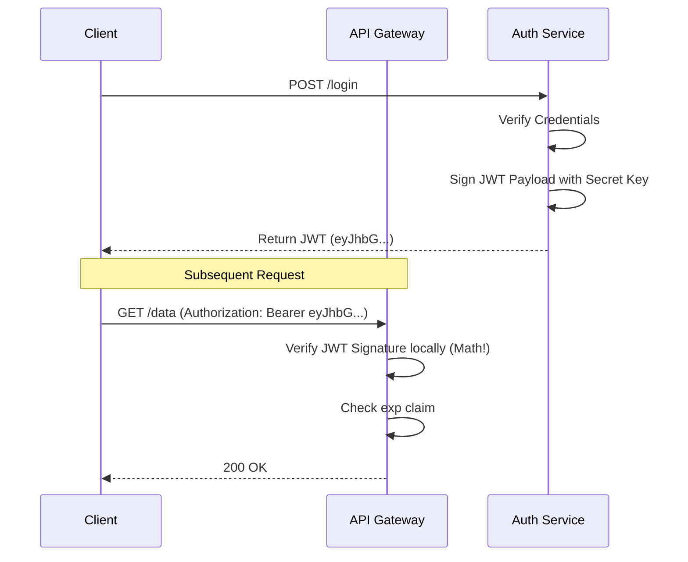
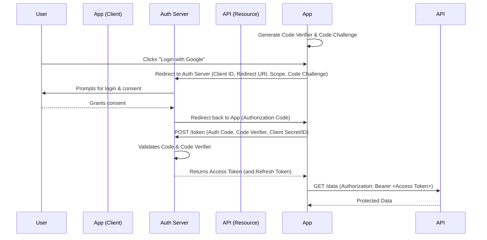
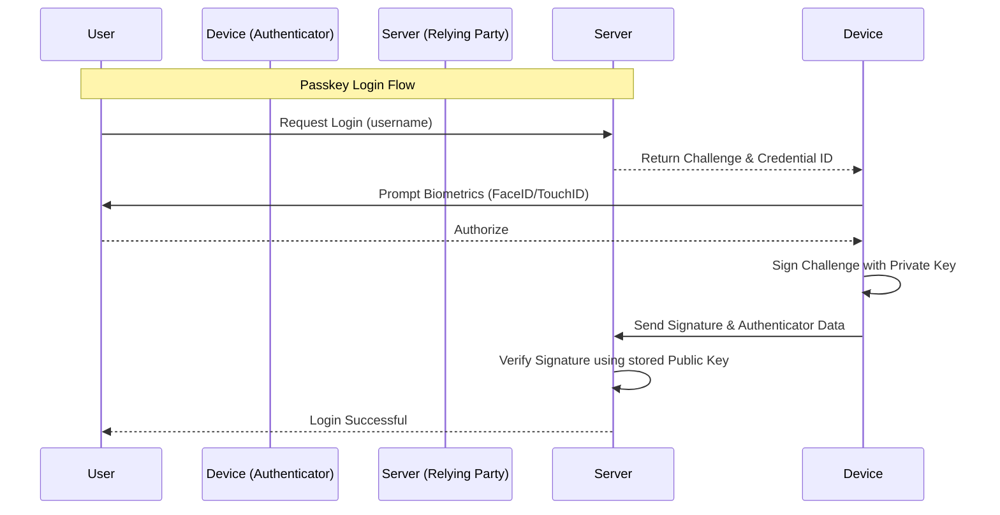
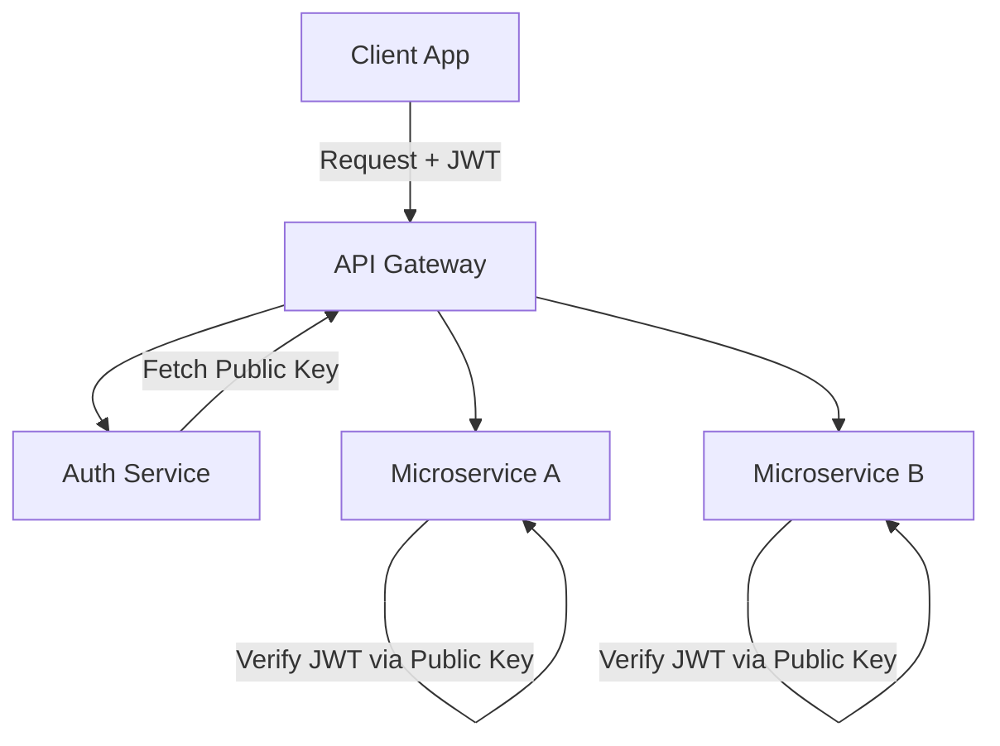
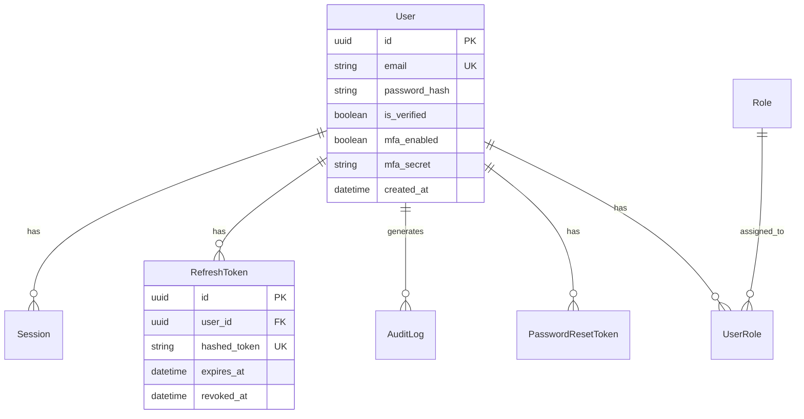

# Authentication: The Complete Engineering Handbook

Welcome to the definitive guide on Authentication. This document covers everything from basic principles to advanced production architectures.

**Difficulty:** Beginner to Advanced (Progressive)
**Prerequisites:** HTTP, REST APIs, Basic Node.js/Database knowledge
**Target Audience:** Software Engineers, Backend Developers, Full-stack Developers, Security Enthusiasts
**Learning Objectives:** Master passwords, sessions, tokens, OAuth, MFA, architecture, and production implementation of robust authentication systems.

## Table of Contents
1. [Authentication Fundamentals](#1-authentication-fundamentals)
2. [Password Authentication](#2-password-authentication)
3. [Sessions & Cookies](#3-sessions--cookies)
4. [Token Authentication & JWT](#4-token-authentication--jwt)
5. [OAuth 2.0 & OpenID Connect](#5-oauth-20--openid-connect)
6. [Multi-Factor Authentication & Passwordless](#6-multi-factor-authentication--passwordless)
7. [Authorization](#7-authorization)
8. [Authentication Security](#8-authentication-security)
9. [Authentication Architecture](#9-authentication-architecture)
10. [Production Implementation](#10-production-implementation)
11. [Database & API Design](#11-database--api-design)
12. [Framework Integration Patterns](#12-framework-integration-patterns)
13. [Authentication System Design](#13-authentication-system-design)
14. [Interview Preparation](#14-interview-preparation)
15. [Common Mistakes & Mitigations](#15-common-mistakes--mitigations)
16. [Production Checklist & Cheat Sheet](#16-production-checklist--cheat-sheet)

---

## 1. Authentication Fundamentals

### Identity and Credentials
Authentication (AuthN) is the process of verifying a user's identity. When a user claims to be "Alice", the system requires proof. This proof is provided via **credentials**. 
Credentials can be something you know (password), something you have (hardware key), or something you are (biometrics).

### Authentication vs Authorization
A critical distinction in system design:
- **Authentication (AuthN):** *Who are you?* (Logging in, verifying identity).
- **Authorization (AuthZ):** *What are you allowed to do?* (Permissions, roles, access control).

| Feature | Authentication (AuthN) | Authorization (AuthZ) |
| :--- | :--- | :--- |
| **Question** | Who are you? | What can you do? |
| **Mechanism** | Passwords, OTPs, Biometrics | RBAC, ABAC, ACLs |
| **Result** | User Identity (Session/Token) | Access Granted / Denied |
| **Failure State**| 401 Unauthorized | 403 Forbidden |

### Authentication Factors
Authentication mechanisms are categorized into factors:
1. **Knowledge Factor (Something you know):** Passwords, PINs, security questions.
2. **Possession Factor (Something you have):** Smartphone (OTP app), Security Key (YubiKey), Smart Card.
3. **Inherence Factor (Something you are):** Fingerprint, Facial Recognition, Retina Scan.

### Complete Authentication Lifecycle
The lifecycle encompasses more than just logging in:
1. **Registration:** Creating a new identity.
2. **Email Verification/Activation:** Ensuring the user controls the contact method.
3. **Login:** Establishing a session or obtaining a token.
4. **Session Management:** Maintaining authenticated state across requests.
5. **Password Reset / Account Recovery:** Restoring access when credentials are lost.
6. **Logout:** Terminating the authenticated state.

---

## 2. Password Authentication

Password authentication is the most common, yet most vulnerable form of AuthN. 

### Plaintext Password Risks
Never store passwords in plaintext. If the database is compromised, attackers immediately gain access to all user accounts. Furthermore, since users reuse passwords, this compromises their accounts on other platforms.

### Hashing vs Encryption
- **Encryption** is a two-way function. You encrypt data to hide it, and decrypt it later using a key.
- **Hashing** is a one-way mathematical function. It turns an input (password) into a fixed-length string of characters. You cannot reverse a hash back to the original password.

For passwords, we **must use hashing**.

### Salt and Pepper
- **Salt:** A unique, random string added to each user's password before hashing. This defeats **Rainbow Tables** (pre-computed hash dictionaries) and ensures that two users with the same password have different hashes.
- **Pepper:** A secret string added to the password *before* hashing, or used as a key to encrypt the hash. Unlike the salt (stored in the database), the pepper is stored securely on the application server (e.g., in a secret manager). If the database is stolen but the server isn't, the attacker cannot crack the hashes.

### Hashing Algorithms
Standard fast hashes (like MD5 or SHA-256) are useless for passwords because modern GPUs can calculate billions of hashes per second. We need **Key Derivation Functions (KDFs)** that are deliberately slow and resource-intensive.

| Algorithm | Mechanism | Security | Recommendation |
| :--- | :--- | :--- | :--- |
| **Argon2** | Memory-hard & CPU-hard. | Highest | **Best Choice** (Use Argon2id) |
| **bcrypt** | CPU-hard. Max 72 chars. | High | **Excellent standard** |
| **scrypt** | Memory-hard. | High | Good alternative |
| **PBKDF2** | CPU-hard (variable iterations) | Moderate | Use only if constrained (NIST approved) |

### Common Password Attacks
- **Brute Force:** Guessing every possible combination. Mitigated by rate limiting and account lockouts.
- **Dictionary Attack:** Guessing common words and leaked passwords. Mitigated by enforcing password complexity and checking against breached password lists (e.g., HaveIBeenPwned).
- **Credential Stuffing:** Using stolen username/password pairs from one breach to log into another service. Mitigated by MFA.
- **Password Spraying:** Trying one common password (like `Summer2024!`) against thousands of accounts to bypass lockout policies.

---

## 3. Sessions & Cookies

Because HTTP is a stateless protocol, servers need a way to remember who sent the request. 

### Stateful Authentication (Server-Side Sessions)
In stateful authentication, the server maintains the state of the user. 
1. User logs in.
2. Server verifies credentials.
3. Server creates a Session object in a database/memory store and generates a unique, unguessable **Session ID**.
4. Server sends the Session ID to the client (usually as a cookie).
5. On subsequent requests, the client sends the Session ID. The server looks it up in the store to identify the user.

```mermaid
sequenceDiagram
    participant Client
    participant Server
    participant Redis (Session Store)
    
    Client->>Server: POST /login (username, password)
    Server->>Server: Verify Password
    Server->>Redis: Create Session (user_id)
    Redis-->>Server: Return Session ID (e.g., abc123xyz)
    Server-->>Client: Set-Cookie: session_id=abc123xyz; HttpOnly; Secure
    
    Note over Client,Server: Subsequent Request
    Client->>Server: GET /profile (Cookie: session_id=abc123xyz)
    Server->>Redis: Lookup Session ID (abc123xyz)
    Redis-->>Server: Return user_id
    Server-->>Client: 200 OK (Profile Data)
```

### Session Storage: Redis
While sessions can be stored in memory (RAM) or relational databases, **Redis** is the industry standard. It is an in-memory key-value store that is incredibly fast and supports automatic TTL (Time-To-Live) expiration, perfect for expiring sessions.

### Session Expiration
- **Idle Timeout:** Expires the session if the user is inactive for X minutes.
- **Absolute Timeout:** Expires the session after Y hours, regardless of activity, forcing a re-login.

### Session Security Features
- **Session Rotation:** Generating a new Session ID when privilege levels change (e.g., after login, or before a sensitive action like changing a password) to prevent **Session Fixation**.
- **Session Invalidation:** Deleting the session upon logout, or providing an interface to "Log out of all other devices."
- **Session Hijacking:** Stealing a Session ID (via XSS or network sniffing). Mitigated by HTTPS and HttpOnly cookies.

### Cookies
Cookies are small pieces of data stored by the browser. When configured correctly, they are the most secure way to store session identifiers.

#### Cookie Attributes (Crucial for Security)
- **HttpOnly:** Prevents JavaScript (e.g., `document.cookie`) from accessing the cookie. Completely mitigates XSS-based session theft.
- **Secure:** Ensures the cookie is only sent over encrypted HTTPS connections.
- **SameSite:** Mitigates Cross-Site Request Forgery (CSRF).
  - `Strict`: Cookie is only sent for first-party requests.
  - `Lax`: Default. Sent for top-level navigations (e.g., clicking a link).
  - `None`: Sent with cross-site requests. **Must** be used with `Secure`. Required for third-party contexts (e.g., embedded iframes).
- **Domain & Path:** Restricts which URLs the cookie is sent to.
- **Max-Age & Expires:** Determines when the browser should delete the cookie.

### Cookies vs localStorage vs sessionStorage

| Feature | Cookies (HttpOnly) | localStorage | sessionStorage |
| :--- | :--- | :--- | :--- |
| **XSS Vulnerable?** | No | Yes (Trivially stolen) | Yes |
| **CSRF Vulnerable?** | Yes (Mitigated by SameSite) | No | No |
| **Data Sent** | Automatically with every request | Manually added to headers | Manually added |
| **Lifespan** | Until Max-Age/Expires | Persistent until cleared | Cleared when tab closes |
| **Best For** | Session IDs, Refresh Tokens | UI preferences, non-sensitive data | Ephemeral UI state |

**Rule of Thumb:** Never store Session IDs or Access Tokens in `localStorage`.

---

## 4. Token Authentication & JWT

### Stateful vs Stateless Authentication
- **Stateful (Sessions):** Server stores session data. Better control (immediate revocation), harder to scale globally.
- **Stateless (Tokens):** Client stores state in a cryptographic token. Server verifies the token using math. Highly scalable, difficult to revoke immediately.

### Bearer Tokens
A Bearer Token says: "Whoever bears this token is granted access." They are typically sent in the `Authorization` header:
`Authorization: Bearer <token>`

### JWT (JSON Web Token)
JWT is the standard format for stateless tokens. A JWT contains a payload of data (claims) that is cryptographically signed by the server.

#### JWT Structure
A JWT consists of three parts separated by dots: `Header.Payload.Signature`
1. **Header:** Contains the token type (`typ: "JWT"`) and signing algorithm (e.g., `alg: "HS256"`).
2. **Payload:** Contains the claims (statements about an entity).
   - *Registered Claims:* `iss` (Issuer), `sub` (Subject/User ID), `aud` (Audience), `exp` (Expiration time), `iat` (Issued at).
   - *Custom Claims:* e.g., `role: "admin"`.
3. **Signature:** Created by hashing the Header and Payload with a secret key. This guarantees the payload hasn't been tampered with.

*Note: JWTs are **Encoded**, not **Encrypted** (unless using JWE). Anyone who intercepts a JWT can decode and read the payload. Do not put sensitive data (passwords, PII) in the payload.*



### Symmetric vs Asymmetric Signing
- **Symmetric (HS256):** Uses a single secret key to both sign and verify the JWT. Simple, but any service that needs to verify the token also has the power to forge it.
- **Asymmetric (RS256/ES256):** Uses a Private Key to sign the JWT, and a Public Key to verify it. Ideal for microservices: the Auth Service holds the Private Key, while other microservices use the Public Key to verify tokens without being able to forge them.

### Access Tokens & Refresh Tokens
Because stateless JWTs cannot be easily revoked, they must have a short lifespan (e.g., 15 minutes). When the Access Token expires, the user shouldn't have to log in again. This is solved by **Refresh Tokens**.

- **Access Token:** Short-lived (e.g., 15m), stateless (JWT), sent with every API request.
- **Refresh Token:** Long-lived (e.g., 7 days), stateful (stored in DB), used exclusively to get new Access Tokens.

**Refresh Token Rotation:** Every time a Refresh Token is used, it is invalidated and a new one is issued. If an attacker steals a Refresh Token and uses it, the server detects the reuse of an old token and immediately invalidates the entire token family, forcing the user to log in again.

### JWT Logout
Logging out a stateless JWT is challenging because you can't just "delete" it from a database.
1. **Client-side deletion:** Delete the token from the client. The token is still technically valid until `exp`.
2. **Token Blacklist:** Store revoked JWT IDs (`jti` claim) in Redis until they naturally expire. This introduces state back into a stateless system but is necessary for immediate revocation.


## 5. OAuth 2.0 & OpenID Connect

### OAuth 2.0 (Delegated Authorization)
OAuth 2.0 is an authorization framework, **not** an authentication protocol. It allows an application to obtain limited access to an HTTP service on behalf of a user. (e.g., "Allow App X to read your Google Calendar").

#### Roles
1. **Resource Owner:** The user.
2. **Client:** The application requesting access (e.g., your web app).
3. **Authorization Server:** The server verifying identity and issuing tokens (e.g., Google's OAuth server).
4. **Resource Server:** The API hosting the data (e.g., Google Calendar API).

#### Authorization Code Flow with PKCE (Production Standard)
The most secure flow for modern applications (Web, Mobile, SPA). PKCE (Proof Key for Code Exchange) prevents authorization code interception attacks.



### OpenID Connect (OIDC)
OIDC is an authentication layer built *on top* of OAuth 2.0. While OAuth 2.0 provides an Access Token for API access, OIDC introduces the **ID Token**.

- **ID Token:** A JWT containing identity claims about the authenticated user (name, email, picture).
- **UserInfo Endpoint:** An OIDC standard endpoint to fetch user details using the Access Token.
- **Discovery Document:** `/.well-known/openid-configuration`. Contains metadata about the identity provider, including supported endpoints and the **JWKS URI** (JSON Web Key Set) containing the public keys used to verify ID Tokens.

| Feature | OAuth 2.0 | OpenID Connect (OIDC) |
| :--- | :--- | :--- |
| **Primary Purpose** | Delegated Authorization | Authentication / Identity |
| **Token Type** | Access Token (Opaque or JWT) | ID Token (Always JWT) + Access Token |
| **Standard Scopes**| API-specific (e.g., `calendar.read`) | `openid`, `profile`, `email` |

---

## 6. Multi-Factor Authentication & Passwordless

### Multi-Factor Authentication (MFA / 2FA)
MFA significantly reduces the risk of account takeover by requiring multiple factors.

| MFA Method | Description | Security Level | Drawbacks |
| :--- | :--- | :--- | :--- |
| **SMS OTP** | Code sent via text. | Low | Vulnerable to SIM swapping, SS7 attacks. |
| **Email OTP** | Code sent via email. | Low-Med | If email is compromised, MFA is useless. |
| **TOTP (Authenticator)** | Time-based One Time Password (Google Auth). | High | Requires setup; device can be lost. |
| **Hardware Key** | Physical token (YubiKey). | Highest | Hardware cost; physical loss. |
| **Backup Codes** | Static codes generated once. | High | Must be stored securely by user. |

### Passwordless Authentication
Moving away from passwords entirely eliminates phishing, credential stuffing, and brute force attacks.

#### WebAuthn & Passkeys (FIDO2)
Passkeys use public-key cryptography to replace passwords.
1. **Registration:** The device (e.g., iPhone) generates a public/private key pair. The private key is securely stored in the device's secure enclave (protected by biometrics/PIN). The public key is sent to the server.
2. **Login:** The server sends a random "challenge". The device signs the challenge using the private key (requiring user biometric verification). The server verifies the signature using the stored public key.



---

## 7. Authorization

Once identity is established, the system must enforce boundaries.

### Authorization Models
- **Role-Based Access Control (RBAC):** Users are assigned Roles (Admin, Editor, Viewer). Roles have Permissions. Simplest to implement, but rigid.
- **Attribute-Based Access Control (ABAC):** Uses attributes (User Dept, Resource Owner, Time of day) to evaluate policies. Highly flexible, complex to manage.
- **Access Control Lists (ACL):** Explicit lists of who can access a specific resource. (e.g., Google Drive file sharing).
- **Relationship-Based Access Control (ReBAC):** Authorization based on graph relationships (e.g., User is Member of Group which Owns Document).

### Important Authorization Concepts
- **Least Privilege:** Grant users only the permissions necessary to perform their tasks.
- **Resource Ownership:** Ensuring User A cannot delete User B's posts (e.g., `WHERE author_id = current_user_id`). This is often missed when only checking for the "Editor" role.
- **Middleware:** AuthZ logic should be implemented centrally in middleware, not scattered throughout controller logic.

---

## 8. Authentication Security

Security is an ongoing process. Here are critical mitigations:

1. **HTTPS / TLS:** Absolute prerequisite. Use HSTS (HTTP Strict Transport Security) to force HTTPS.
2. **CSRF (Cross-Site Request Forgery):** Mitigated by `SameSite` cookies and Anti-CSRF tokens (for stateful web apps).
3. **XSS (Cross-Site Scripting):** An attacker injects malicious JS. Mitigations: Content Security Policy (CSP), sanitizing inputs, escaping outputs, and using `HttpOnly` cookies so JS cannot steal session IDs.
4. **Rate Limiting & Account Lockout:** Protect login and password reset endpoints. (e.g., max 5 failed login attempts per minute per IP, max 3 attempts per user).
5. **Token Theft / Replay Attacks:** Mitigated by short-lived access tokens, refresh token rotation, and binding tokens to device/IP (advanced).
6. **Secret Management:** Never hardcode secrets in code. Use environment variables or Secret Managers (AWS Secrets Manager, HashiCorp Vault).
7. **Key Rotation:** Regularly change JWT signing keys.

---

## 9. Authentication Architecture

### Small Applications (Monolith)
- **Architecture:** Client -> Monolithic Backend -> Database.
- **Auth Strategy:** Server-side sessions (Cookies + Redis). Simple, secure, handles state natively.

### Microservices Architecture
- **Architecture:** Client -> API Gateway -> Microservices.
- **Auth Strategy (Centralized):**
  1. Gateway routes `/login` to Auth Service.
  2. Auth Service issues asymmetric JWT (RS256).
  3. Client sends JWT to Gateway.
  4. Gateway forwards request + JWT to downstream services.
  5. Downstream services verify JWT locally using the Public Key.



### Multi-Tenant SaaS
- Requires segmenting users by Tenant (Organization).
- Database requires `tenant_id` on almost every table.
- JWTs must include `tenant_id` claim.
- AuthZ middleware must assert the user's `tenant_id` matches the accessed resource's `tenant_id`.

### Enterprise SSO & Identity Federation
- Large organizations don't want employees creating new passwords for every app.
- They use Identity Providers (IdP) like Okta, Azure AD, or Ping Identity.
- The application uses SAML or OIDC to federate identity to the IdP.


## 10. Production Implementation

We will implement authentication using a modern stack: Node.js, TypeScript, Express, PostgreSQL, Prisma, and Redis.

### Password Hashing (Argon2)
Using the `argon2` package.
```typescript
import argon2 from 'argon2';

export async function hashPassword(password: string): Promise<string> {
  // Production considerations: use environment variables for pepper if needed
  return await argon2.hash(password, {
    type: argon2.argon2id,
    memoryCost: 2 ** 16, // 64 MB
    timeCost: 3,         // Iterations
    parallelism: 1,      // Threads
  });
}

export async function verifyPassword(hash: string, password: string): Promise<boolean> {
  try {
    return await argon2.verify(hash, password);
  } catch (err) {
    return false; // Prevents timing attacks or crashes on invalid hash formats
  }
}
```

### Express Session Middleware (Cookie + Redis)
Setting up express-session with Redis in production.
```typescript
import session from 'express-session';
import RedisStore from 'connect-redis';
import { createClient } from 'redis';
import express from 'express';

const app = express();
const redisClient = createClient({ url: process.env.REDIS_URL });
redisClient.connect().catch(console.error);

app.use(session({
  store: new RedisStore({ client: redisClient }),
  secret: process.env.SESSION_SECRET!,
  resave: false, // Do not save session if unmodified
  saveUninitialized: false, // Do not create session until something stored
  cookie: {
    secure: process.env.NODE_ENV === 'production', // true for HTTPS only
    httpOnly: true, // Prevent XSS
    sameSite: 'lax', // CSRF protection
    maxAge: 1000 * 60 * 60 * 24 * 7 // 7 days
  }
}));
```

### JWT and Refresh Token Rotation
For stateless architectures using Access and Refresh tokens.

```typescript
import jwt from 'jsonwebtoken';
import { randomBytes } from 'crypto';

// Generate Access Token (15m expiry)
export function generateAccessToken(userId: string): string {
  return jwt.sign({ sub: userId }, process.env.JWT_SECRET!, { expiresIn: '15m' });
}

// Generate Cryptographically Secure Opaque Refresh Token
export function generateRefreshToken(): string {
  return randomBytes(40).toString('hex');
}
```
*Note: Refresh tokens should be hashed (e.g., SHA-256) before storing in the database to mitigate database leaks.*

### Authentication & Authorization Middleware
Protecting routes in Express.

```typescript
import { Request, Response, NextFunction } from 'express';

// Authentication Middleware
export const requireAuth = (req: Request, res: Response, next: NextFunction) => {
  if (!req.session || !req.session.userId) {
    return res.status(401).json({ error: 'Unauthorized' });
  }
  next();
};

// Authorization Middleware (RBAC)
export const requireRole = (role: string) => {
  return (req: Request, res: Response, next: NextFunction) => {
    // Assuming req.user is populated by requireAuth
    if (req.user?.role !== role) {
      return res.status(403).json({ error: 'Forbidden: Insufficient privileges' });
    }
    next();
  };
};

// Usage
app.post('/admin/delete', requireAuth, requireRole('ADMIN'), (req, res) => { /*...*/ });
```

---

## 11. Database & API Design

### Database Schema (Prisma/PostgreSQL)
A robust production schema.



**Prisma Example:**
```prisma
model User {
  id               String   @id @default(uuid())
  email            String   @unique
  passwordHash     String
  isVerified       Boolean  @default(false)
  mfaEnabled       Boolean  @default(false)
  mfaSecret        String?
  refreshTokens    RefreshToken[]
  createdAt        DateTime @default(now())
}

model RefreshToken {
  id          String   @id @default(uuid())
  tokenHash   String   @unique
  userId      String
  user        User     @relation(fields: [userId], references: [id])
  expiresAt   DateTime
  revokedAt   DateTime?
}
```

### API Design
Standard RESTful Authentication Endpoints:

| Endpoint | Method | Purpose | Auth Required |
| :--- | :--- | :--- | :--- |
| `/auth/register` | `POST` | Create new account | No |
| `/auth/login` | `POST` | Authenticate & get session/token | No |
| `/auth/logout` | `POST` | Destroy session / Revoke tokens | Yes |
| `/auth/refresh` | `POST` | Get new Access Token via Refresh Token | No (Requires valid Refresh Token) |
| `/auth/verify-email` | `POST` | Confirm email ownership via token | No |
| `/auth/forgot-password`| `POST` | Trigger reset email | No |
| `/auth/reset-password` | `POST` | Set new password via token | No |
| `/auth/me` | `GET` | Get current authenticated user details | Yes |
| `/auth/enable-mfa` | `POST` | Setup TOTP or WebAuthn | Yes |

---

## 12. Framework Integration Patterns

Authentication differs depending on the framework:
- **Node.js/Express:** Highly manual. Often uses Passport.js for OAuth, or custom middleware. Best for learning mechanics.
- **Next.js / React:** Uses `NextAuth.js` (Auth.js) heavily. Handles JWTs in cookies, social logins, and SSR authentication beautifully.
- **Spring Boot (Java):** `Spring Security`. Highly abstract, complex configuration using filter chains, but extremely powerful for enterprise RBAC.
- **Django (Python):** Built-in authentication framework. Out-of-the-box session management and admin panel.
- **Laravel (PHP):** `Laravel Sanctum` for APIs and `Breeze/Jetstream` for web. Excellent built-in token and session handling.
- **Go:** Typically standard library `net/http` combined with JWT libraries. Manual but highly performant.

---

## 13. Authentication System Design

### Scenario 1: Small B2B SaaS
- **Requirements:** Simple login, team roles, no huge scale.
- **Architecture:** Node.js Monolith, PostgreSQL, Redis.
- **Strategy:** Stateful Sessions with Cookies. Simple to implement, easy to revoke, secure.

### Scenario 2: High-Scale E-Commerce
- **Requirements:** Millions of users, mobile app + web app, high availability.
- **Architecture:** Microservices, API Gateway.
- **Strategy:** Stateless JWTs (Access Tokens) + Refresh Tokens. API Gateway validates the JWT signatures so microservices don't get bottlenecked by auth lookups.

### Scenario 3: Enterprise Internal Platform
- **Requirements:** 50,000 employees, centralized identity, access to 100 internal apps.
- **Architecture:** Identity Provider (Okta/Keycloak).
- **Strategy:** OAuth 2.0 / OIDC. Applications act as Clients and never see the user's password. They only receive Identity Tokens from the IdP.

---

## 14. Interview Preparation

### Questions
1. **Explain the difference between Authentication and Authorization.**
   - *Answer:* AuthN is proving who you are (password). AuthZ is proving you have permission to do something (admin role).
2. **Why shouldn't you store JWTs in localStorage?**
   - *Answer:* `localStorage` is accessible via JavaScript. If your site has an XSS vulnerability, the attacker can steal the token and impersonate the user. Use `HttpOnly` cookies instead.
3. **How do you instantly revoke a stateless JWT?**
   - *Answer:* You can't natively. You must introduce a blacklist (like Redis) storing the token's ID (`jti`) until it expires.
4. **What is a Salt, and how does it prevent Rainbow Table attacks?**
   - *Answer:* A salt is random data appended to a password before hashing. A rainbow table is a precomputed list of hashes. Because the salt is unique per user, an attacker would have to generate a completely new rainbow table for every single user, rendering the attack unfeasible.

---

## 15. Common Mistakes & Mitigations

| Mistake | Danger | Mitigation |
| :--- | :--- | :--- |
| **Plaintext Passwords** | Total system compromise upon DB leak. | Use Argon2 or bcrypt. |
| **Long-lived Access Tokens**| If stolen, attacker has infinite access. | Set expiry to ~15m. Use Refresh Tokens. |
| **Missing Rate Limiting** | Allows Brute Force & Credential Stuffing. | Block IP/User after 5 failed attempts. |
| **Auth Logic in Controllers**| Forgetting to check permissions on new endpoints. | Use central AuthZ Middleware. |
| **Trusting Client-Side Roles**| Client can manipulate JWT payload if unverified. | ALWAYS verify the JWT signature on the server. |
| **Detailed Error Messages** | Returning "User not found" vs "Wrong password". Allows user enumeration. | Return generic "Invalid credentials". |

---

## 16. Production Checklist & Cheat Sheet

### Production Checklist
- [ ] Are passwords hashed using Argon2 or bcrypt with unique salts?
- [ ] Is HTTPS strictly enforced (HSTS enabled)?
- [ ] Are Session IDs or Refresh Tokens stored in `HttpOnly`, `Secure`, `SameSite` cookies?
- [ ] Is there rate-limiting on `/login`, `/register`, and `/forgot-password`?
- [ ] Are Access Tokens short-lived (e.g., 15 minutes)?
- [ ] Is Refresh Token rotation implemented?
- [ ] Do sensitive actions (change password, delete account) require re-authentication or MFA?
- [ ] Are generic error messages used ("Invalid credentials") to prevent user enumeration?
- [ ] Are authentication secrets (JWT Secret, Pepper, API Keys) stored in a secure vault/environment, never in code?
- [ ] Is Audit Logging implemented for successful/failed logins and password changes?

### Cheat Sheet
- **AuthN:** Authentication (Identity).
- **AuthZ:** Authorization (Permissions).
- **Argon2:** Best password hashing algorithm.
- **Cookie Flags:** `HttpOnly` (stops XSS), `Secure` (forces HTTPS), `SameSite` (stops CSRF).
- **JWT Parts:** Header (Algorithm), Payload (Claims/Data), Signature (Verification).
- **Symmetric JWT (HS256):** 1 Secret Key for signing and verifying.
- **Asymmetric JWT (RS256):** Private Key for signing, Public Key for verifying.
- **Access Token:** Short lifespan, proves authorization.
- **Refresh Token:** Long lifespan, used only to get new Access Tokens.
- **OIDC:** OpenID Connect (Identity layer on OAuth 2.0).
- **MFA:** Multi-Factor Authentication (OTP, Authenticator Apps).
- **WebAuthn/Passkeys:** Public Key cryptography replacing passwords.


