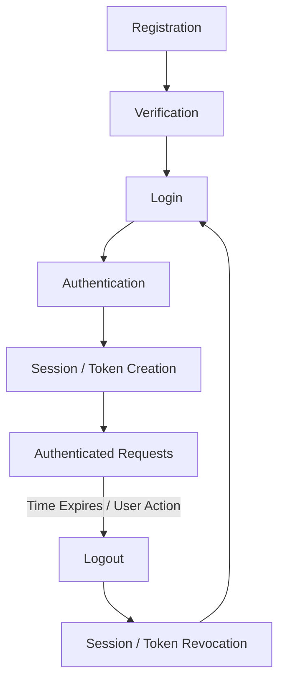

# Part I: Authentication Foundations

Before we can build secure applications, we must understand the fundamental concepts that govern identity and trust on the internet. This part covers the basic building blocks of authentication engineering.

---

## 1. What Is Authentication?

### What is it?
Authentication is the process of verifying the identity of a user, device, or system. 

### Technical Definition
In computer science, authentication is the mechanism by which a system mathematically or logically proves that an entity (the "principal") is indeed who or what they claim to be, usually by validating a piece of provided evidence (a "credential").

### Real-World Analogy
Imagine arriving at a secure bank vault. 
- You walk up and state your name (Claiming Identity).
- The guard asks for your government-issued ID.
- The guard verifies your face matches the ID.

The process of the guard verifying your ID is **authentication**.

### Digital Identity and Credentials
In the physical world, your face or passport proves your identity. In the digital world, the server cannot see your face. Instead, you provide a **Digital Identity** (usually an email or username) and a **Credential** (a password, a one-time code, or a cryptographic signature). The authentication process verifies that the credential matches the digital identity stored in the database.

---

## 2. Why Authentication Exists

### Why does it exist?
Without authentication, computer systems have zero accountability and no concept of private ownership. 

### What problem does it solve?
In the early days of computing, systems were largely open. As computers networked globally via the internet, a massive problem emerged: **Trust boundaries**. You can no longer trust that the person sending a network request is a friendly coworker sitting in the next room.

Authentication solves this by enforcing a trust boundary. It exists to guarantee:
- **Access Control:** Ensuring only specific users can access specific systems.
- **Data Privacy:** Ensuring User A cannot read User B's private messages or bank statements.
- **Data Integrity:** Ensuring malicious actors cannot modify or delete database records anonymously.
- **Non-Repudiation:** Providing mathematical proof that a specific user performed an action, so they cannot later deny it.

---

## 3. Authentication vs Authorization

One of the most common mistakes made by junior developers is confusing Authentication and Authorization. While they often happen sequentially, they are entirely different security domains.

### Authentication (AuthN)
> **Question:** "Who are you?"

Authentication is strictly about **Identity Verification**. It happens first. 
- **Example:** Logging into an AWS console using your email, password, and a YubiKey.
- **Failure:** Results in an `HTTP 401 Unauthorized` status code. (Note: The HTTP standard confusingly named 401 "Unauthorized" instead of "Unauthenticated", but 401 always means an authentication failure).

### Authorization (AuthZ)
> **Question:** "What are you allowed to do?"

Authorization is about **Access Control and Permissions**. It happens *after* the system already knows who you are.
- **Example:** You are successfully logged into AWS, but when you try to delete an S3 bucket, AWS denies the request because your user account lacks the `s3:DeleteBucket` permission.
- **Failure:** Results in an `HTTP 403 Forbidden` status code.

### Summary Comparison

| Feature | Authentication (AuthN) | Authorization (AuthZ) |
| :--- | :--- | :--- |
| **Primary Goal** | Verify identity | Determine access rights |
| **Timing** | Happens **before** Authorization | Happens **after** Authentication |
| **Data Handled** | Passwords, Tokens, Biometrics | Roles, Rules, Policies, Permissions |
| **Failure Result**| 401 Unauthorized | 403 Forbidden |

---

## 4. Identity

### What is it?
In software engineering, identity is the representation of an entity within a system. 

### User Identity vs Digital Identity
- **User Identity:** The actual human being (e.g., Jane Doe, born 1990).
- **Digital Identity:** The database record representing Jane Doe (e.g., `user_id: 8f7b-29c1`, `email: jane@example.com`).

### Identity Provider (IdP)
An Identity Provider is a centralized service that creates, manages, and stores digital identities. Instead of building your own user database, you might delegate identity management to an IdP like Google, Microsoft Entra, or Auth0.

### Identity Lifecycle
Identities do not exist forever. They follow a strict lifecycle:
1. **Provisioning:** Creating the digital identity (signing up).
2. **Active:** The identity is actively used to authenticate.
3. **Suspension:** Temporarily disabling the identity (e.g., due to suspicious activity).
4. **Deprovisioning:** Permanently deleting or archiving the identity when a user leaves a service.

---

## 5. Credentials

### What are they?
A credential is the specific data used to prove an identity. 

**CRITICAL CONCEPT:** An identity is *not* a credential. 
A single digital identity (`user_id: 123`) can have multiple credentials attached to it. If a user forgets their password, you do not delete their identity; you simply revoke the old password credential and attach a new one.

### Types of Credentials
- **Password:** A pre-shared secret string.
- **PIN:** A short, numeric secret, often tied to physical hardware.
- **OTP (One-Time Password):** A temporary, automatically generated code.
- **Token:** A cryptographic string (like a JWT) representing a previously verified identity.
- **Security Key / Passkey:** A cryptographic public/private key pair.
- **Biometric:** Mathematical representations of fingerprints or facial geometry.

---

## 6. Authentication Factors

To prove you hold a credential, you must provide an Authentication Factor. 

### Something you know (Knowledge)
Information that only the user and the system should know.
- **Examples:** Passwords, PINs, answers to security questions.
- **Weakness:** Can be easily guessed, phished, or stolen from a database.

### Something you have (Possession)
A physical or logical object in the user's possession.
- **Examples:** A smartphone (receiving an SMS OTP), an Authenticator App, a hardware security key (YubiKey).
- **Weakness:** Can be physically stolen or lost.

### Something you are (Inherence)
A biological characteristic of the user.
- **Examples:** Fingerprint, Face ID, retina scan.
- **Weakness:** Cannot be changed if compromised.

### Why two factors are stronger than one
A single factor is a single point of failure. If an attacker steals a password, they compromise the account. **Multi-Factor Authentication (MFA)** requires at least two *independent* factors. If an attacker steals a password (Knowledge), they still cannot log in because they do not have the user's physical smartphone (Possession).

---

## 7. Authentication Lifecycle

Authentication is not just the moment of login; it is a continuous loop.



---

## 8. Registration Flow

Before a user can log in, they must establish an identity.

1. **User Registration:** The client submits a desired identifier (email) and a credential (password).
2. **Input Validation:** The server ensures the email is valid and the password meets security policies.
3. **Password Hashing:** The server passes the plaintext password through a one-way hashing algorithm (like bcrypt) to generate a secure hash. The plaintext password is deleted from memory.
4. **Database Storage:** The server saves the email and the password hash into the database.
5. **Email Verification:** The server generates a temporary, secure token and emails it to the user as a link. This proves the user actually owns the email address.
6. **Account Activation:** The user clicks the link, the server validates the token, and marks the account as active.

---

## 9. Login Flow

Once registered, the user can authenticate.

```text
Client
  ↓ (1) POST /login {email, password}
Server
  ↓ (2) Query DB by email
Database
  ↓ (3) Returns User Record & Password Hash
Server
  ↓ (4) Hashes input password and compares with DB hash
Server (Verify Credentials)
  ↓ (5) Match Success! Generate Session ID or JWT
Server
  ↓ (6) Set-Cookie: session=xyz
Client (Authenticated)
```

---

## 10. Logout Flow

Logout is the process of terminating trust.

1. **User Action:** The user clicks "Logout".
2. **Session Invalidation:** The server deletes the session ID from its database or Redis cache.
3. **Token Revocation:** If using tokens, the server adds the token to a revocation list or deletes the associated refresh token.
4. **Cookie Deletion:** The server sends an HTTP response instructing the browser to delete the session cookie (e.g., `Set-Cookie: session=; Max-Age=0`).
5. **Client-side Cleanup:** The frontend application clears any cached user state.

**Common Mistake:** Simply deleting a cookie via JavaScript on the frontend is NOT a secure logout. The server must invalidate the session on the backend. If an attacker stole the cookie earlier, they can continue using it if the server still considers it valid.

---

## 11. Authentication Terminology

| Term | Definition |
| :--- | :--- |
| **Identity** | The digital representation of a user or system. |
| **Credential** | The proof provided to verify an identity (e.g., password, key). |
| **Principal** | An authenticated entity (user, service account) requesting access. |
| **Session** | Server-side state tracking an authenticated user over time. |
| **Token** | A portable piece of data (often a string) representing an identity or authorization grant. |
| **Claim** | A statement about an entity (e.g., "This user is an admin") packed inside a token like a JWT. |
| **Identity Provider (IdP)** | A service that manages identities and authenticates users (e.g., Google, Okta). |
| **Authentication Server** | The server responsible for validating credentials and issuing tokens. |
| **Authorization Server** | A server (often part of the IdP in OAuth) that issues Access Tokens granting permissions. |
| **Resource Server** | The API or backend server that holds the protected data and requires an Access Token. |
| **Access Token** | A short-lived token used to access protected resources. |
| **Refresh Token** | A long-lived token used solely to obtain new Access Tokens. |
| **Scope** | A specific permission requested in an OAuth flow (e.g., `read:email`). |
| **Role** | A group of permissions assigned to a user (e.g., `Admin`, `Editor`). |
| **Permission** | The right to perform a specific action on a specific resource. |

---

## Common Mistakes
- **Confusing AuthN and AuthZ:** Returning a 401 when a user lacks permissions, or checking permissions before checking if a token is actually valid.
- **Storing Plaintext Passwords:** Failing to hash passwords during the Registration flow.
- **Client-Side Logout Only:** Forgetting to destroy the session on the server-side during the Logout flow.

## Best Practices
- Always hash passwords using a specialized password-hashing algorithm during registration.
- Always require email verification or phone verification to establish a root of trust before activating an account.
- Clearly separate your Authentication Middleware (which verifies the token) from your Authorization Middleware (which checks roles/permissions) in your codebase.

---

**Previous:** [← Cover and Table of Contents](./part-00-cover-toc.md)

**Next:** [Password Authentication →](./part-02-password-authentication.md)
