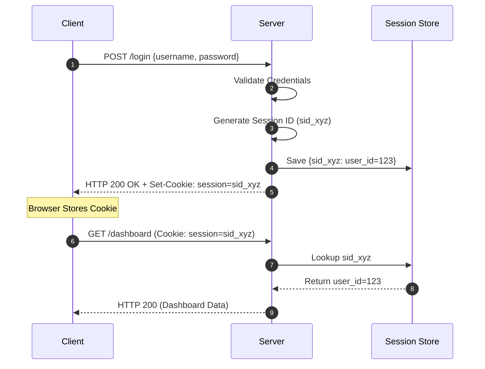

# Part III: Sessions and Cookies

HTTP is inherently a **stateless** protocol. This means that every HTTP request (GET, POST) sent from a browser to a server is treated as an entirely isolated event. 

If you log in with your email and password, the server verifies you. But when you click a link to go to `/dashboard`, the browser sends a *new* request. Because HTTP is stateless, the server looks at the `/dashboard` request and says, "Who are you?"

To solve this, we must create **State**. We do this using Sessions and Cookies.

---

## 1. Sessions

### What is a session?
A session is a mechanism for storing user-specific data on the server-side while issuing a unique identifier to the client to reference that data.

### Why do sessions exist?
Sessions exist to stitch independent HTTP requests together into a continuous, authenticated experience, preventing the user from having to send their password with every single request.

### The Session ID
The core of a session is the **Session ID**. This is a cryptographically random, unguessable string generated by the server. It acts as a temporary key to unlock the user's state.

### Server-Side Session and Store
The data associated with the session (e.g., `user_id: 123`, `role: admin`, `login_time`) is securely stored on the server. The client only ever holds the random Session ID, never the actual data.

---

## 2. Session Lifecycle



---

## 3. Session Storage

Where does the server store the Session ID mapping?

### Memory (In-Memory Sessions)
- **What it is:** Storing sessions in variables (like an Array or Map) in the backend application's RAM.
- **Why it creates scaling problems:** If your application restarts, all RAM is cleared, and every user is instantly logged out. Furthermore, if you scale your app horizontally (e.g., behind a load balancer with 3 instances), Server A does not know about the sessions stored in Server B's RAM.
- **Verdict:** Never use in production.

### Database
- **What it is:** Storing sessions in a relational database (PostgreSQL, MySQL).
- **Pros:** Persistent, survives server restarts, scales horizontally.
- **Cons:** Very slow. Every authenticated HTTP request requires a database lookup, creating a massive bottleneck.

### Distributed Cache (Redis)
- **What it is:** An in-memory, key-value data store accessible by all servers.
- **Pros:** Blazing fast (because it is in RAM), centralized (all scaled servers can access it), and natively supports expiration (TTL).
- **Verdict:** The industry standard for session storage.

---

## 4. Session Security

Because the Session ID is the "key" to the user's account, it must be fiercely protected.

### Session Hijacking
- **Attack:** An attacker steals the user's Session ID (via network sniffing or XSS) and uses it to impersonate the user.
- **Prevention:** Always use HTTPS to encrypt network traffic, and configure secure cookie attributes.

### Session Fixation
- **Attack:** An attacker obtains a valid anonymous Session ID, tricks the victim into logging in using that specific ID, and then uses the ID to access the victim's now-authenticated account.
- **Prevention (Session Rotation):** The server must generate a brand new Session ID the moment a user logs in (or elevates privileges), destroying the pre-login Session ID.

### Expiration and Invalidation
Sessions must not live forever.
- **Absolute Timeout:** The session is destroyed exactly 24 hours after creation, regardless of activity.
- **Idle Timeout (Sliding Session):** The session is destroyed if the user is inactive for 30 minutes. Every time they make a request, the 30-minute timer resets.
- **Logout:** The server must explicitly delete the session from the Session Store.

---

## 5. Cookies

### What are cookies?
An HTTP Cookie is a small piece of data (max 4KB) that a server sends to a user's web browser.

### Browser Behavior
The beauty of cookies lies in browser automation. 
Once a server sets a cookie, the browser automatically stores it and injects it into the HTTP headers of every subsequent request to that specific server. Frontend developers do not need to write JavaScript to attach it.

### Cookie Lifecycle
- **Set-Cookie:** The server sends the `Set-Cookie` header in the HTTP response.
- **Storage:** The browser saves it to its internal cookie jar.
- **Request:** The browser automatically sends the `Cookie` header on future requests.

---

## 6. Cookie Attributes

A raw cookie is highly insecure. To make it suitable for authentication, you must configure its Security Attributes.

| Attribute | Purpose | Security Benefit |
| :--- | :--- | :--- |
| **HttpOnly** | Prevents client-side JavaScript (e.g., `document.cookie`) from reading the cookie. | Defends against Cross-Site Scripting (XSS) attacks stealing the Session ID. |
| **Secure** | Ensures the browser only sends the cookie over encrypted (HTTPS) connections. | Prevents Man-In-The-Middle (MITM) network sniffing. |
| **SameSite** | Controls whether the cookie is sent with cross-site requests. | Defends against Cross-Site Request Forgery (CSRF) attacks. |
| **Domain** | Specifies which hosts can receive the cookie. | Prevents sending the cookie to unauthorized subdomains. |
| **Path** | Specifies the URL path that must exist for the cookie to be sent. | Isolates cookies within specific app routes. |
| **Max-Age/Expires** | Determines when the browser should automatically delete the cookie. | Prevents sessions from living forever on the client machine. |

---

## 7. SameSite

The `SameSite` attribute is critical for modern web security.

- **Strict:** The browser only sends the cookie if the request originates from the same site that set the cookie. (Safest, but breaks UX if a user clicks a link from their email to your site, as they will appear logged out on the initial page load).
- **Lax:** The cookie is not sent on cross-site subrequests (like loading images), but *is* sent when the user navigates to the origin site (e.g., following a link). **This is the modern default and recommended setting.**
- **None:** The cookie is sent on all requests. Must be paired with the `Secure` attribute. Usually reserved for third-party SSO flows or embedded widgets.

---

## 8. Cookie-Based Authentication Flow

```text
Browser
   ↓ (1) POST /login
Server
   ↓ (2) Validate User
   ↓ (3) Create Session in Redis
   ↓ (4) Return HTTP 200
         Set-Cookie: session=xyz; HttpOnly; Secure; SameSite=Lax
Browser
   ↓ (5) Automatically stores cookie
Browser
   ↓ (6) GET /dashboard
         Cookie: session=xyz
Server
   ↓ (7) Lookup session in Redis -> Authenticated
```

---

## 9. Sessions With Redis (Production Architecture)

In a production environment, you will have multiple backend servers behind a Load Balancer to handle traffic. 

### Architecture
1. **Load Balancer:** Distributes incoming traffic across available Node.js servers.
2. **Stateless Nodes:** The Node.js servers hold no session data in memory.
3. **Redis Cluster:** A centralized, highly available Redis cluster stores all sessions.

### Why Redis?
- **TTL (Time To Live):** Redis natively supports expiring keys. When creating a session, you set a TTL of 24 hours. Redis automatically deletes the session from memory after 24 hours without any extra code on your backend.
- **Horizontal Scaling:** If Node API 1 creates the session and the Load Balancer routes the user's next request to Node API 2, Node API 2 can still authenticate the user because it checks the central Redis store.
- **Failure Handling:** If a Node server crashes, no user is logged out because the state lives in Redis. If the primary Redis node fails, a Redis replica takes over.

---

## Common Mistakes
- **Missing HttpOnly:** Allowing authentication cookies to be read by JavaScript, opening the door for XSS attacks.
- **Sticky Sessions:** Configuring the load balancer to always route a specific user to a specific server just to use in-memory sessions. This ruins load distribution and causes mass logouts if a server fails.
- **No Session Rotation:** Failing to generate a new Session ID upon login, leaving the app vulnerable to Session Fixation.

## Best Practices
- Always use `HttpOnly`, `Secure`, and `SameSite=Lax` (or `Strict`) for authentication cookies.
- Use a distributed, in-memory cache like Redis for session storage to allow your backend application to scale horizontally.
- Always implement Session Rotation upon privilege elevation (login).

---

## Summary
Sessions provide state to the stateless HTTP protocol. The server generates a unique Session ID, stores the state in a fast database like Redis, and sends the ID to the client via a Cookie. The browser automatically handles storing and returning the cookie. Securing this flow requires strict adherence to cookie attributes, specifically `HttpOnly` and `SameSite`.

---

**Previous:** [← Password Authentication](./part-02-password-authentication.md)

**Next:** [Token Authentication →](./part-04-token-authentication.md)
