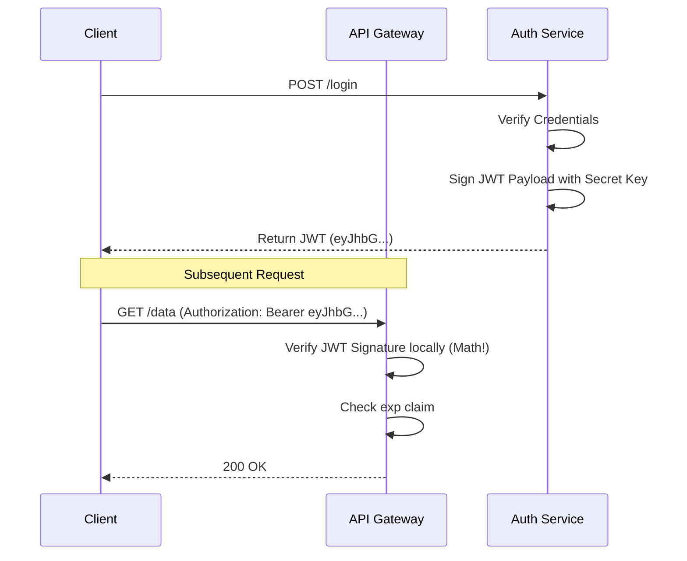

# Authentication: The Complete Engineering Handbook

Welcome to the definitive guide on Authentication. This document covers everything from basic principles to advanced production architectures.

**Difficulty:** Beginner to Advanced (Progressive)
**Prerequisites:** HTTP, REST APIs, Basic Node.js/Database knowledge
**Target Audience:** Software Engineers, Backend Developers, Full-stack Developers, Security Enthusiasts
**Learning Objectives:** Master passwords, sessions, tokens, OAuth, MFA, architecture, and production implementation of robust authentication systems.

## Table of Contents
1. [Authentication Fundamentals](#1-authentication-fundamentals)
2. [Password Authentication](#2-password-authentication)
3. [Sessions & Cookies](#3-sessions--cookies)
4. [Token Authentication & JWT](#4-token-authentication--jwt)
5. [OAuth 2.0 & OpenID Connect](#5-oauth-20--openid-connect)
6. [Multi-Factor Authentication & Passwordless](#6-multi-factor-authentication--passwordless)
7. [Authorization](#7-authorization)
8. [Authentication Security](#8-authentication-security)
9. [Authentication Architecture](#9-authentication-architecture)
10. [Production Implementation](#10-production-implementation)
11. [Database & API Design](#11-database--api-design)
12. [Framework Integration Patterns](#12-framework-integration-patterns)
13. [Authentication System Design](#13-authentication-system-design)
14. [Interview Preparation](#14-interview-preparation)
15. [Common Mistakes & Mitigations](#15-common-mistakes--mitigations)
16. [Production Checklist & Cheat Sheet](#16-production-checklist--cheat-sheet)

---

## 1. Authentication Fundamentals

### Identity and Credentials
Authentication (AuthN) is the process of verifying a user's identity. When a user claims to be "Alice", the system requires proof. This proof is provided via **credentials**. 
Credentials can be something you know (password), something you have (hardware key), or something you are (biometrics).

### Authentication vs Authorization
A critical distinction in system design:
- **Authentication (AuthN):** *Who are you?* (Logging in, verifying identity).
- **Authorization (AuthZ):** *What are you allowed to do?* (Permissions, roles, access control).

| Feature | Authentication (AuthN) | Authorization (AuthZ) |
| :--- | :--- | :--- |
| **Question** | Who are you? | What can you do? |
| **Mechanism** | Passwords, OTPs, Biometrics | RBAC, ABAC, ACLs |
| **Result** | User Identity (Session/Token) | Access Granted / Denied |
| **Failure State**| 401 Unauthorized | 403 Forbidden |

### Authentication Factors
Authentication mechanisms are categorized into factors:
1. **Knowledge Factor (Something you know):** Passwords, PINs, security questions.
2. **Possession Factor (Something you have):** Smartphone (OTP app), Security Key (YubiKey), Smart Card.
3. **Inherence Factor (Something you are):** Fingerprint, Facial Recognition, Retina Scan.

### Complete Authentication Lifecycle
The lifecycle encompasses more than just logging in:
1. **Registration:** Creating a new identity.
2. **Email Verification/Activation:** Ensuring the user controls the contact method.
3. **Login:** Establishing a session or obtaining a token.
4. **Session Management:** Maintaining authenticated state across requests.
5. **Password Reset / Account Recovery:** Restoring access when credentials are lost.
6. **Logout:** Terminating the authenticated state.

---

## 2. Password Authentication

Password authentication is the most common, yet most vulnerable form of AuthN. 

### Plaintext Password Risks
Never store passwords in plaintext. If the database is compromised, attackers immediately gain access to all user accounts. Furthermore, since users reuse passwords, this compromises their accounts on other platforms.

### Hashing vs Encryption
- **Encryption** is a two-way function. You encrypt data to hide it, and decrypt it later using a key.
- **Hashing** is a one-way mathematical function. It turns an input (password) into a fixed-length string of characters. You cannot reverse a hash back to the original password.

For passwords, we **must use hashing**.

### Salt and Pepper
- **Salt:** A unique, random string added to each user's password before hashing. This defeats **Rainbow Tables** (pre-computed hash dictionaries) and ensures that two users with the same password have different hashes.
- **Pepper:** A secret string added to the password *before* hashing, or used as a key to encrypt the hash. Unlike the salt (stored in the database), the pepper is stored securely on the application server (e.g., in a secret manager). If the database is stolen but the server isn't, the attacker cannot crack the hashes.

### Hashing Algorithms
Standard fast hashes (like MD5 or SHA-256) are useless for passwords because modern GPUs can calculate billions of hashes per second. We need **Key Derivation Functions (KDFs)** that are deliberately slow and resource-intensive.

| Algorithm | Mechanism | Security | Recommendation |
| :--- | :--- | :--- | :--- |
| **Argon2** | Memory-hard & CPU-hard. | Highest | **Best Choice** (Use Argon2id) |
| **bcrypt** | CPU-hard. Max 72 chars. | High | **Excellent standard** |
| **scrypt** | Memory-hard. | High | Good alternative |
| **PBKDF2** | CPU-hard (variable iterations) | Moderate | Use only if constrained (NIST approved) |

### Common Password Attacks
- **Brute Force:** Guessing every possible combination. Mitigated by rate limiting and account lockouts.
- **Dictionary Attack:** Guessing common words and leaked passwords. Mitigated by enforcing password complexity and checking against breached password lists (e.g., HaveIBeenPwned).
- **Credential Stuffing:** Using stolen username/password pairs from one breach to log into another service. Mitigated by MFA.
- **Password Spraying:** Trying one common password (like `Summer2024!`) against thousands of accounts to bypass lockout policies.

---

## 3. Sessions & Cookies

Because HTTP is a stateless protocol, servers need a way to remember who sent the request. 

### Stateful Authentication (Server-Side Sessions)
In stateful authentication, the server maintains the state of the user. 
1. User logs in.
2. Server verifies credentials.
3. Server creates a Session object in a database/memory store and generates a unique, unguessable **Session ID**.
4. Server sends the Session ID to the client (usually as a cookie).
5. On subsequent requests, the client sends the Session ID. The server looks it up in the store to identify the user.

```mermaid
sequenceDiagram
    participant Client
    participant Server
    participant Redis (Session Store)
    
    Client->>Server: POST /login (username, password)
    Server->>Server: Verify Password
    Server->>Redis: Create Session (user_id)
    Redis-->>Server: Return Session ID (e.g., abc123xyz)
    Server-->>Client: Set-Cookie: session_id=abc123xyz; HttpOnly; Secure
    
    Note over Client,Server: Subsequent Request
    Client->>Server: GET /profile (Cookie: session_id=abc123xyz)
    Server->>Redis: Lookup Session ID (abc123xyz)
    Redis-->>Server: Return user_id
    Server-->>Client: 200 OK (Profile Data)
```

### Session Storage: Redis
While sessions can be stored in memory (RAM) or relational databases, **Redis** is the industry standard. It is an in-memory key-value store that is incredibly fast and supports automatic TTL (Time-To-Live) expiration, perfect for expiring sessions.

### Session Expiration
- **Idle Timeout:** Expires the session if the user is inactive for X minutes.
- **Absolute Timeout:** Expires the session after Y hours, regardless of activity, forcing a re-login.

### Session Security Features
- **Session Rotation:** Generating a new Session ID when privilege levels change (e.g., after login, or before a sensitive action like changing a password) to prevent **Session Fixation**.
- **Session Invalidation:** Deleting the session upon logout, or providing an interface to "Log out of all other devices."
- **Session Hijacking:** Stealing a Session ID (via XSS or network sniffing). Mitigated by HTTPS and HttpOnly cookies.

### Cookies
Cookies are small pieces of data stored by the browser. When configured correctly, they are the most secure way to store session identifiers.

#### Cookie Attributes (Crucial for Security)
- **HttpOnly:** Prevents JavaScript (e.g., `document.cookie`) from accessing the cookie. Completely mitigates XSS-based session theft.
- **Secure:** Ensures the cookie is only sent over encrypted HTTPS connections.
- **SameSite:** Mitigates Cross-Site Request Forgery (CSRF).
  - `Strict`: Cookie is only sent for first-party requests.
  - `Lax`: Default. Sent for top-level navigations (e.g., clicking a link).
  - `None`: Sent with cross-site requests. **Must** be used with `Secure`. Required for third-party contexts (e.g., embedded iframes).
- **Domain & Path:** Restricts which URLs the cookie is sent to.
- **Max-Age & Expires:** Determines when the browser should delete the cookie.

### Cookies vs localStorage vs sessionStorage

| Feature | Cookies (HttpOnly) | localStorage | sessionStorage |
| :--- | :--- | :--- | :--- |
| **XSS Vulnerable?** | No | Yes (Trivially stolen) | Yes |
| **CSRF Vulnerable?** | Yes (Mitigated by SameSite) | No | No |
| **Data Sent** | Automatically with every request | Manually added to headers | Manually added |
| **Lifespan** | Until Max-Age/Expires | Persistent until cleared | Cleared when tab closes |
| **Best For** | Session IDs, Refresh Tokens | UI preferences, non-sensitive data | Ephemeral UI state |

**Rule of Thumb:** Never store Session IDs or Access Tokens in `localStorage`.

---

## 4. Token Authentication & JWT

### Stateful vs Stateless Authentication
- **Stateful (Sessions):** Server stores session data. Better control (immediate revocation), harder to scale globally.
- **Stateless (Tokens):** Client stores state in a cryptographic token. Server verifies the token using math. Highly scalable, difficult to revoke immediately.

### Bearer Tokens
A Bearer Token says: "Whoever bears this token is granted access." They are typically sent in the `Authorization` header:
`Authorization: Bearer <token>`

### JWT (JSON Web Token)
JWT is the standard format for stateless tokens. A JWT contains a payload of data (claims) that is cryptographically signed by the server.

#### JWT Structure
A JWT consists of three parts separated by dots: `Header.Payload.Signature`
1. **Header:** Contains the token type (`typ: "JWT"`) and signing algorithm (e.g., `alg: "HS256"`).
2. **Payload:** Contains the claims (statements about an entity).
   - *Registered Claims:* `iss` (Issuer), `sub` (Subject/User ID), `aud` (Audience), `exp` (Expiration time), `iat` (Issued at).
   - *Custom Claims:* e.g., `role: "admin"`.
3. **Signature:** Created by hashing the Header and Payload with a secret key. This guarantees the payload hasn't been tampered with.

*Note: JWTs are **Encoded**, not **Encrypted** (unless using JWE). Anyone who intercepts a JWT can decode and read the payload. Do not put sensitive data (passwords, PII) in the payload.*



### Symmetric vs Asymmetric Signing
- **Symmetric (HS256):** Uses a single secret key to both sign and verify the JWT. Simple, but any service that needs to verify the token also has the power to forge it.
- **Asymmetric (RS256/ES256):** Uses a Private Key to sign the JWT, and a Public Key to verify it. Ideal for microservices: the Auth Service holds the Private Key, while other microservices use the Public Key to verify tokens without being able to forge them.

### Access Tokens & Refresh Tokens
Because stateless JWTs cannot be easily revoked, they must have a short lifespan (e.g., 15 minutes). When the Access Token expires, the user shouldn't have to log in again. This is solved by **Refresh Tokens**.

- **Access Token:** Short-lived (e.g., 15m), stateless (JWT), sent with every API request.
- **Refresh Token:** Long-lived (e.g., 7 days), stateful (stored in DB), used exclusively to get new Access Tokens.

**Refresh Token Rotation:** Every time a Refresh Token is used, it is invalidated and a new one is issued. If an attacker steals a Refresh Token and uses it, the server detects the reuse of an old token and immediately invalidates the entire token family, forcing the user to log in again.

### JWT Logout
Logging out a stateless JWT is challenging because you can't just "delete" it from a database.
1. **Client-side deletion:** Delete the token from the client. The token is still technically valid until `exp`.
2. **Token Blacklist:** Store revoked JWT IDs (`jti` claim) in Redis until they naturally expire. This introduces state back into a stateless system but is necessary for immediate revocation.
