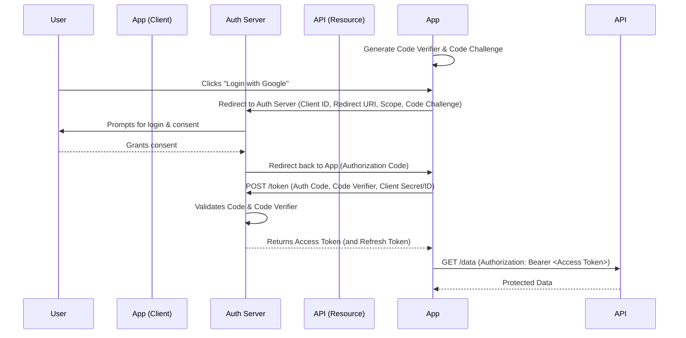
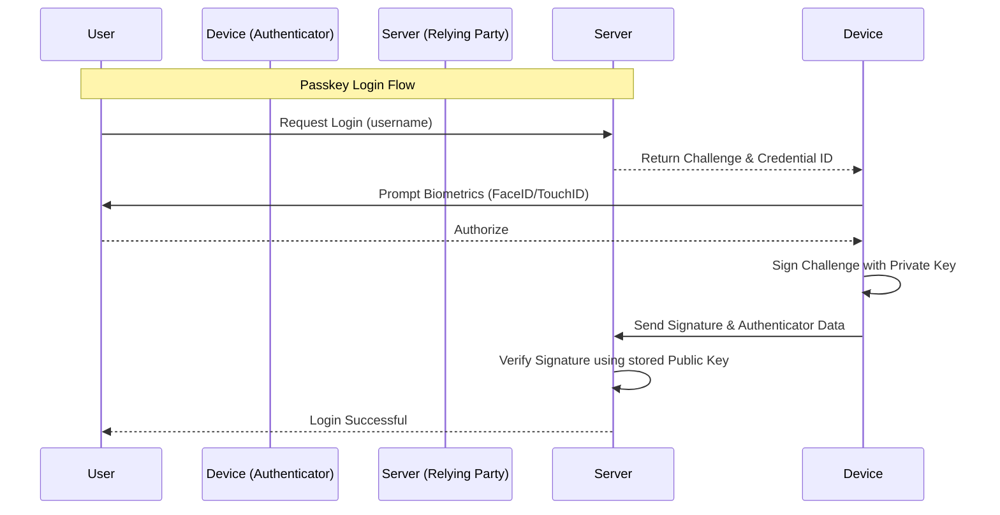
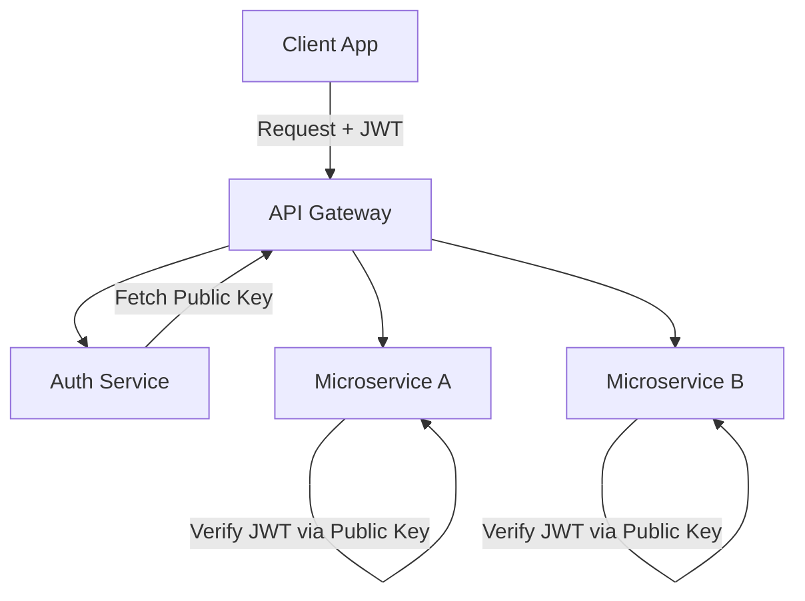

## 5. OAuth 2.0 & OpenID Connect

### OAuth 2.0 (Delegated Authorization)
OAuth 2.0 is an authorization framework, **not** an authentication protocol. It allows an application to obtain limited access to an HTTP service on behalf of a user. (e.g., "Allow App X to read your Google Calendar").

#### Roles
1. **Resource Owner:** The user.
2. **Client:** The application requesting access (e.g., your web app).
3. **Authorization Server:** The server verifying identity and issuing tokens (e.g., Google's OAuth server).
4. **Resource Server:** The API hosting the data (e.g., Google Calendar API).

#### Authorization Code Flow with PKCE (Production Standard)
The most secure flow for modern applications (Web, Mobile, SPA). PKCE (Proof Key for Code Exchange) prevents authorization code interception attacks.

### OpenID Connect (OIDC)
OIDC is an authentication layer built *on top* of OAuth 2.0. While OAuth 2.0 provides an Access Token for API access, OIDC introduces the **ID Token**.

- **ID Token:** A JWT containing identity claims about the authenticated user (name, email, picture).
- **UserInfo Endpoint:** An OIDC standard endpoint to fetch user details using the Access Token.
- **Discovery Document:** `/.well-known/openid-configuration`. Contains metadata about the identity provider, including supported endpoints and the **JWKS URI** (JSON Web Key Set) containing the public keys used to verify ID Tokens.

| Feature | OAuth 2.0 | OpenID Connect (OIDC) |
| :--- | :--- | :--- |
| **Primary Purpose** | Delegated Authorization | Authentication / Identity |
| **Token Type** | Access Token (Opaque or JWT) | ID Token (Always JWT) + Access Token |
| **Standard Scopes**| API-specific (e.g., `calendar.read`) | `openid`, `profile`, `email` |

---

## 6. Multi-Factor Authentication & Passwordless

### Multi-Factor Authentication (MFA / 2FA)
MFA significantly reduces the risk of account takeover by requiring multiple factors.

| MFA Method | Description | Security Level | Drawbacks |
| :--- | :--- | :--- | :--- |
| **SMS OTP** | Code sent via text. | Low | Vulnerable to SIM swapping, SS7 attacks. |
| **Email OTP** | Code sent via email. | Low-Med | If email is compromised, MFA is useless. |
| **TOTP (Authenticator)** | Time-based One Time Password (Google Auth). | High | Requires setup; device can be lost. |
| **Hardware Key** | Physical token (YubiKey). | Highest | Hardware cost; physical loss. |
| **Backup Codes** | Static codes generated once. | High | Must be stored securely by user. |

### Passwordless Authentication
Moving away from passwords entirely eliminates phishing, credential stuffing, and brute force attacks.

#### WebAuthn & Passkeys (FIDO2)
Passkeys use public-key cryptography to replace passwords.
1. **Registration:** The device (e.g., iPhone) generates a public/private key pair. The private key is securely stored in the device's secure enclave (protected by biometrics/PIN). The public key is sent to the server.
2. **Login:** The server sends a random "challenge". The device signs the challenge using the private key (requiring user biometric verification). The server verifies the signature using the stored public key.

---

## 7. Authorization

Once identity is established, the system must enforce boundaries.

### Authorization Models
- **Role-Based Access Control (RBAC):** Users are assigned Roles (Admin, Editor, Viewer). Roles have Permissions. Simplest to implement, but rigid.
- **Attribute-Based Access Control (ABAC):** Uses attributes (User Dept, Resource Owner, Time of day) to evaluate policies. Highly flexible, complex to manage.
- **Access Control Lists (ACL):** Explicit lists of who can access a specific resource. (e.g., Google Drive file sharing).
- **Relationship-Based Access Control (ReBAC):** Authorization based on graph relationships (e.g., User is Member of Group which Owns Document).

### Important Authorization Concepts
- **Least Privilege:** Grant users only the permissions necessary to perform their tasks.
- **Resource Ownership:** Ensuring User A cannot delete User B's posts (e.g., `WHERE author_id = current_user_id`). This is often missed when only checking for the "Editor" role.
- **Middleware:** AuthZ logic should be implemented centrally in middleware, not scattered throughout controller logic.

---

## 8. Authentication Security

Security is an ongoing process. Here are critical mitigations:

1. **HTTPS / TLS:** Absolute prerequisite. Use HSTS (HTTP Strict Transport Security) to force HTTPS.
2. **CSRF (Cross-Site Request Forgery):** Mitigated by `SameSite` cookies and Anti-CSRF tokens (for stateful web apps).
3. **XSS (Cross-Site Scripting):** An attacker injects malicious JS. Mitigations: Content Security Policy (CSP), sanitizing inputs, escaping outputs, and using `HttpOnly` cookies so JS cannot steal session IDs.
4. **Rate Limiting & Account Lockout:** Protect login and password reset endpoints. (e.g., max 5 failed login attempts per minute per IP, max 3 attempts per user).
5. **Token Theft / Replay Attacks:** Mitigated by short-lived access tokens, refresh token rotation, and binding tokens to device/IP (advanced).
6. **Secret Management:** Never hardcode secrets in code. Use environment variables or Secret Managers (AWS Secrets Manager, HashiCorp Vault).
7. **Key Rotation:** Regularly change JWT signing keys.

---

## 9. Authentication Architecture

### Small Applications (Monolith)
- **Architecture:** Client -> Monolithic Backend -> Database.
- **Auth Strategy:** Server-side sessions (Cookies + Redis). Simple, secure, handles state natively.

### Microservices Architecture
- **Architecture:** Client -> API Gateway -> Microservices.
- **Auth Strategy (Centralized):**
  1. Gateway routes `/login` to Auth Service.
  2. Auth Service issues asymmetric JWT (RS256).
  3. Client sends JWT to Gateway.
  4. Gateway forwards request + JWT to downstream services.
  5. Downstream services verify JWT locally using the Public Key.

### Multi-Tenant SaaS
- Requires segmenting users by Tenant (Organization).
- Database requires `tenant_id` on almost every table.
- JWTs must include `tenant_id` claim.
- AuthZ middleware must assert the user's `tenant_id` matches the accessed resource's `tenant_id`.

### Enterprise SSO & Identity Federation
- Large organizations don't want employees creating new passwords for every app.
- They use Identity Providers (IdP) like Okta, Azure AD, or Ping Identity.
- The application uses SAML or OIDC to federate identity to the IdP.
