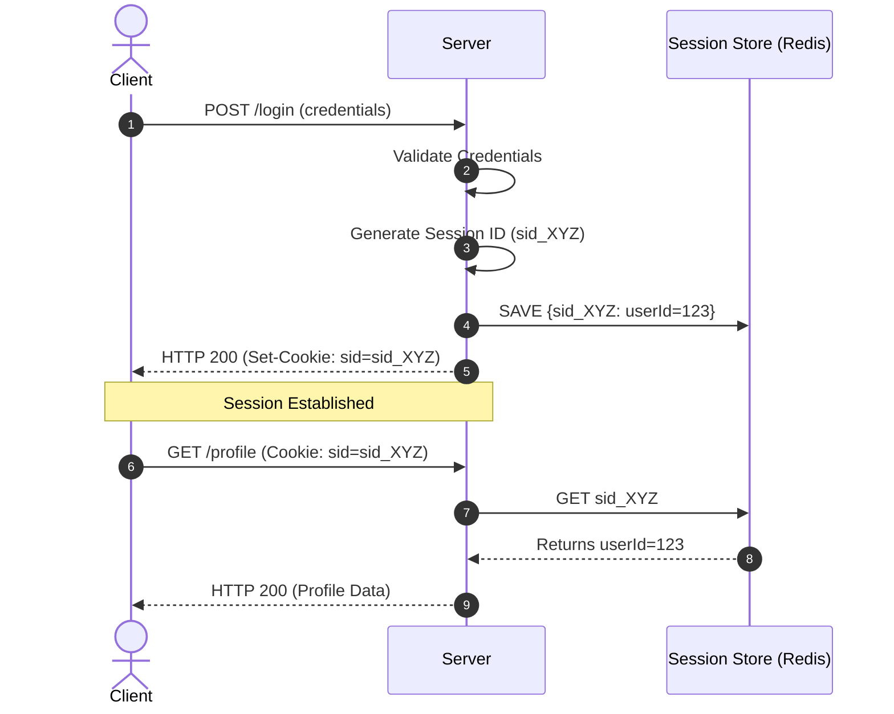
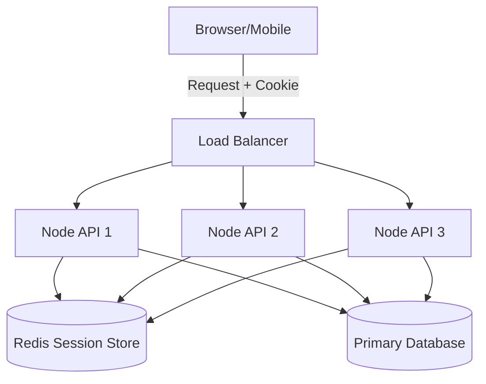

# PART III: Sessions

## Chapter 11: The Stateful Web

### History and The Problem
HTTP is a **stateless** protocol. This means that every single request (GET, POST, PUT) sent from a browser to a server is treated as an entirely isolated event. The server retains no memory of previous requests. 

If you log in with your email and password on `/login`, the server verifies you. But when you click a link to go to `/dashboard`, the browser sends a new request to the server. Because HTTP is stateless, the server looks at the `/dashboard` request and says, "Who are you?"

To solve this, early web developers needed a way to create "State"—a way to stitch independent HTTP requests together into a continuous **Session**. 

### How Sessions Work
A session is a mechanism for storing user-specific data on the server-side while issuing a unique identifier to the client to reference that data.

1. **Initialization:** The user authenticates (e.g., provides a correct password).
2. **Creation:** The server creates a unique, cryptographically random string called a **Session ID**.
3. **Storage (Server):** The server saves this Session ID in a "Session Store" (memory, database, or cache) alongside the user's data (e.g., `user_id`, `role`, `login_time`).
4. **Transmission:** The server sends the Session ID back to the client, almost always in a `Set-Cookie` HTTP header.
5. **Subsequent Requests:** For every subsequent request, the browser automatically sends the Session ID back to the server in the `Cookie` header.
6. **Validation:** The server looks up the Session ID in its Session Store, retrieves the user data, and processes the request.



### Session IDs
The security of a session architecture rests entirely on the Session ID. 
- It must be **globally unique**.
- It must be **unguessable** (high entropy).
- It should be generated using a Cryptographically Secure Pseudorandom Number Generator (CSPRNG), like `crypto.randomBytes(32)` in Node.js.
- A predictable Session ID allows an attacker to guess another user's ID and take over their account.

---

## Chapter 12: Session Storage and Scaling

### Session Stores
Where does the server store the Session ID mapping?

1. **Memory Store:** 
   - The session data is stored in the RAM of the server process (e.g., an array or Map in Node.js).
   - **Advantage:** Extremely fast.
   - **Disadvantage:** If the server restarts, all users are instantly logged out. It does not scale horizontally (if you have two servers behind a load balancer, Server A doesn't know about sessions created on Server B). *Never use in production.*

2. **Database Sessions:**
   - Stored in a relational database (PostgreSQL, MySQL).
   - **Advantage:** Persistent across server restarts. Scales horizontally.
   - **Disadvantage:** Very slow. Every single HTTP request requires a database lookup, creating a massive bottleneck for high-traffic applications.

3. **Redis (The Gold Standard):**
   - Redis is an in-memory, key-value data store.
   - **Advantage:** Blazing fast (in-memory) but centralized, meaning all servers in a cluster can access the same Redis instance. It natively supports TTL (Time To Live), automatically deleting expired sessions.

### Scaling Sessions: Sticky Sessions vs Centralized Store
When a backend scales to multiple servers via a Load Balancer, sessions introduce a problem.

**Sticky Sessions (Anti-Pattern):**
The load balancer is configured to always route User A to Server 1, and User B to Server 2. 
- *Problem:* If Server 1 crashes, all of User A's sessions are lost. It prevents even distribution of traffic.

**Centralized Store (Best Practice):**
The load balancer routes requests in a Round-Robin fashion. Any server can handle any request because all servers look up the Session ID in a centralized Redis cluster.

### Production Architecture (Redis)



---

## Chapter 13: Session Lifecycle and Security

### Expiration
Sessions must not live forever.
- **Absolute Timeout:** The session dies exactly 24 hours after creation, forcing the user to log in again regardless of activity.
- **Idle Timeout (Sliding Session):** The session dies if the user is inactive for 30 minutes. Every time the user makes a request, the TTL is reset to 30 minutes.

### Logout
Logging out is not just deleting the cookie on the client. **You must delete the session from the server-side store.** If you only delete the cookie, an attacker who intercepted the session ID previously can still use it.

### Session Attacks and Mitigations

**1. Session Hijacking:**
- An attacker intercepts the Session ID (via network sniffing, XSS, or malware).
- *Mitigation:* ALWAYS use HTTPS to prevent network sniffing. Use `HttpOnly` cookies to prevent XSS (Cross-Site Scripting) attacks from stealing the cookie via JavaScript.

**2. Session Fixation:**
- An attacker visits the site, gets an anonymous Session ID, and sends a link to the victim: `http://app.com/login?session=ATTACKER_ID`. If the victim logs in, the attacker's session ID is now elevated to an authenticated state, and the attacker is logged in as the victim.
- *Mitigation:* **Session Rotation**.

### Session Rotation (Crucial Best Practice)
Whenever a user's privilege level changes (e.g., logging in, changing a password, escalating to admin), the server MUST generate a brand new Session ID, copy the data over, and delete the old Session ID. This completely defeats Session Fixation.

---

## Chapter 14: Implementation in Node.js (Express + Redis)

This is a production-ready example of implementing secure, Redis-backed sessions in Express.js.

### Prerequisites
```bash
npm install express express-session connect-redis redis
```

### Server Setup (`server.js`)
```javascript
import express from 'express';
import session from 'express-session';
import RedisStore from 'connect-redis';
import { createClient } from 'redis';

const app = express();

// 1. Initialize Redis Client
const redisClient = createClient({ url: 'redis://localhost:6379' });
redisClient.connect().catch(console.error);

// 2. Configure Express Session Middleware
app.use(session({
    store: new RedisStore({ client: redisClient }),
    secret: process.env.SESSION_SECRET, // Must be a long, random string
    resave: false,             // Do not save session if unmodified
    saveUninitialized: false,  // Do not create a session until something is stored
    name: 'sessionId',         // Change default 'connect.sid' to obscure tech stack
    cookie: {
        secure: process.env.NODE_ENV === 'production', // true requires HTTPS
        httpOnly: true,        // Prevents client-side JS from reading the cookie
        sameSite: 'lax',       // CSRF protection
        maxAge: 1000 * 60 * 60 * 24 // 24 hours
    }
}));

// 3. Login Route (Authentication & Session Creation)
app.post('/api/login', express.json(), async (req, res) => {
    const { username, password } = req.body;
    
    // Validate password (pseudo-code)
    const user = await authenticateUser(username, password);
    if (!user) return res.status(401).send('Unauthorized');

    // SECURITY: Session Rotation to prevent Fixation
    req.session.regenerate((err) => {
        if (err) return res.status(500).send('Session Error');
        
        // Store user ID in the new session
        req.session.userId = user.id;
        res.send('Logged in successfully');
    });
});

// 4. Protected Route
app.get('/api/dashboard', (req, res) => {
    // Check if session exists and has a userId
    if (!req.session.userId) {
        return res.status(401).send('Unauthorized');
    }
    res.send(`Welcome to dashboard, User ${req.session.userId}`);
});

// 5. Logout Route
app.post('/api/logout', (req, res) => {
    req.session.destroy((err) => {
        if (err) return res.status(500).send('Could not log out.');
        res.clearCookie('sessionId'); // Clear the cookie on client
        res.send('Logged out');
    });
});

app.listen(3000, () => console.log('Server running on port 3000'));
```

### Line-by-Line Production Notes
- `resave: false`: Prevents race conditions where parallel requests overwrite each other's session data in Redis.
- `saveUninitialized: false`: Complies with privacy laws (GDPR) by not setting tracking cookies on unauthenticated visitors, and saves massive amounts of Redis memory.
- `req.session.regenerate()`: This is the Session Rotation mechanism. It creates a new ID and deletes the old one upon login.
- `req.session.destroy()`: This explicitly deletes the session key from Redis, executing a true server-side logout.
