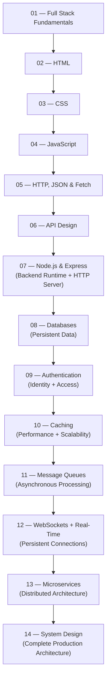

<div align="center">

# Full Stack Web Development & System Design

**A structured, single-source-of-truth documentation project for learning full-stack web development — from the fundamentals of the web to production-grade distributed systems.**

[](.)
[](.)
[](.)
[](./LICENSE)
[](.)

*Maintained by **[Tushar Kanti Dey](https://tushardevx01.tech)** under [EnggVault](https://github.com/Enggvault)*

</div>

## Table of Contents

- [Project Description](#project-description)
- [Learning Roadmap](#learning-roadmap)
- [Module Overview](#module-overview)
- [Technology Connection Map](#technology-connection-map)
- [Cross-Topic Practical Project](#cross-topic-practical-project)
- [Repository Structure](#repository-structure)
- [Quick Start](#quick-start)
- [Features](#features)
- [Prerequisites](#prerequisites)
- [How to Use This Repository](#how-to-use-this-repository)
- [Contribution Guide](#contribution-guide)
- [License](#license)
- [Author](#author)

## Project Description

This repository is a curated, structured learning resource for developers who want to understand how the modern web works and how to build production-quality full-stack applications.

Each module covers exactly one topic. Every concept has a single canonical location. Modules cross-reference each other where continuity is needed — definitions are never repeated.

The writing follows the conventions of professional technical documentation: concise, technically accurate, and example-driven.

## Learning Roadmap

Read modules in order. Each module assumes the reader has completed all preceding modules. The complete roadmap communicates this progression:



## Module Overview

| # | Topic | Core Purpose | Main Technologies | Outcome |
| -- | ---------------------- | --------------------------- | ----------------------------------- | ---------------------------------- |
| 01 | [Full Stack Fundamentals](./01-full-stack-fundamentals/README.md) | Web Architecture | Internet, browsers, HTTP | Understand how the web works |
| 02 | [HTML](./02-html/README.md) | Document Structure | HTML5, semantic markup | Build accessible web pages |
| 03 | [CSS](./03-css/README.md) | Styling and Layout | CSS3, Flexbox, Grid | Create responsive designs |
| 04 | [JavaScript](./04-javascript/README.md) | Client-side Logic | ES6+, DOM manipulation | Build interactive interfaces |
| 05 | [HTTP, JSON & Fetch](./05-http-json-fetch/README.md) | Data Fetching | HTTP, JSON, Promises | Communicate with APIs |
| 06 | [API Design](./06-api-design/README.md) | Interface Contracts | REST, GraphQL, gRPC | Design robust API contracts |
| 07 | [Node.js + Express](./07-nodejs-express/README.md) | Backend runtime and APIs | Node.js, TypeScript, Express | Build backend services |
| 08 | [Databases](./08-databases/README.md) | Persistent data | PostgreSQL, SQL, MongoDB, Prisma | Design and query databases |
| 09 | [Authentication](./09-authentication/README.md) | Identity and access | Sessions, JWT, OAuth, OIDC | Secure applications |
| 10 | [Caching](./10-caching/README.md) | Performance and scalability | Redis, HTTP Cache, CDN | Reduce latency and load |
| 11 | [Message Queues](./11-message-queues/README.md) | Async processing | Kafka, RabbitMQ, Redis Streams, SQS | Build event-driven systems |
| 12 | [WebSockets + Real-Time](./12-websockets-realtime/README.md) | Persistent communication | WebSocket, SSE, Redis | Build real-time features |
| 13 | [Microservices](./13-microservices/README.md) | Distributed architecture | REST, gRPC, Kafka, Docker | Build distributed services |
| 14 | [System Design](./14-system-design/README.md) | Complete architecture | All above | Design scalable production systems |

## Technology Connection Map

How the technologies connect across the backend roadmap (Modules 07-14):

```text
Node.js + Express (The engine running the backend APIs)
        ↓
PostgreSQL / MongoDB (The persistent storage for users, orders, etc.)
        ↓
Authentication (Securing the APIs with JWTs/Sessions)
        ↓
Redis (In-memory caching to speed up DB queries and store sessions)
        ↓
Kafka / RabbitMQ (Decoupling slow, async tasks like email sending)
        ↓
WebSockets (Pushing real-time updates back to the client)
        ↓
Microservices (Splitting the large Node app into smaller, independent services)
        ↓
System Design (Architecting how all these pieces fit together to handle 1M+ users)
```

## Cross-Topic Practical Project

At the end of this roadmap, you will have the skills to build a **"Production-Ready Real-Time SaaS Platform"**.

**Architecture Blueprint:**
```text
Frontend (React/Vue)
   ↓
CDN (Cloudflare)
   ↓
Load Balancer
   ↓
API Gateway
   ↓
Node.js / Express Services (07: Backend API)
   ↓
Authentication (09: Passkeys / JWT validation)
   ↓
Redis Cache (10: Fast lookup for sessions & popular data)
   ↓
PostgreSQL (08: Persistent data for users/billing)
   ↓
Kafka (11: Async jobs like PDF generation)
   ↓
WebSocket Service (12: Real-time dashboard updates)
   ↓
Background Workers (13: Isolated microservices for heavy tasks)
```

## Repository Structure

```
Full-stack/
├── README.md                         ← This file
├── 01-full-stack-fundamentals/       — Internet basics
├── 02-html/                          — HTML reference
├── 03-css/                           — CSS reference
├── 04-javascript/                    — JavaScript reference
├── 05-http-json-fetch/               — HTTP, JSON, Fetch reference
├── 06-api-design/                    — API design reference
├── 07-nodejs-express/                — Node.js & Express reference
├── 08-databases/                     — Databases & SQL reference
├── 09-authentication/                — Authentication reference
├── 10-caching/                       — Caching & Performance reference
├── 11-message-queues/                — Message Queues reference
├── 12-websockets-realtime/           — WebSockets reference
├── 13-microservices/                 — Microservices reference
└── 14-system-design/                 — System Design reference
```
*(Every directory contains exactly `README.md` and `notes.md`)*

## Quick Start

1. **Clone the repository**
   ```bash
   git clone https://github.com/Enggvault/Full-stack.git
   cd Full-stack
   ```

2. **Open in your editor**
   ```bash
   code .
   ```

3. **Start reading** — open [`01-full-stack-fundamentals/notes.md`](./01-full-stack-fundamentals/notes.md) and follow the navigation links at the top and bottom of each module.

## Features

- **Single source of truth** — every concept is defined exactly once
- **Dependency-ordered curriculum** — each module builds on the previous
- **Cross-referenced** — internal Markdown links eliminate redundancy
- **Professional documentation style** — reads like MDN, not classroom notes
- **Self-contained** — no external tooling required; read in any Markdown viewer

## Prerequisites

No prior programming experience is assumed for Module 01. Starting from Module 04, basic familiarity with a code editor (VS Code recommended) and a browser's developer tools is expected.

## How to Use This Repository

1. **Read sequentially.** Modules are ordered by dependency. Module 05 requires Module 04, which requires Module 03, and so on.
2. **Use the notes as a reference.** After the initial read, each `notes.md` file is designed to be revisited as a quick-reference document.
3. **Follow cross-references.** When a `notes.md` file references another module, follow it. Concepts are explained once and referenced everywhere they apply.
4. **Run the code examples.** Every code block is self-contained. Open a browser console or a local `.js` file and execute them.

## Contribution Guide

Contributions that maintain the documentation's quality and architecture are welcome.

**Before submitting a pull request:**
- Ensure the change belongs in the correct module. Do not add explanations that duplicate content already present in another module — add a cross-reference instead.
- Follow the heading hierarchy: `#` for the page title, `##` for major sections.
- Keep prose concise. This is documentation, not a tutorial blog post.
- Validate Markdown rendering before submitting.

## License

This project is licensed under the [MIT License](./LICENSE).

## Author

<div align="center">

Developed and maintained by **[Tushar Kanti Dey](https://tushardevx01.tech)**

[](https://github.com/Enggvault)

If this repository is useful, consider starring it. ⭐

</div>
