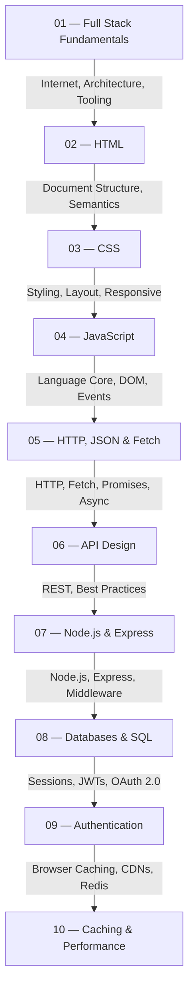

<div align="center">

# Full Stack Web Development

**A structured, single-source-of-truth documentation project for learning full-stack web development — from the fundamentals of the web to API design.**

[](.)
[](.)
[](.)
[](./LICENSE)
[](.)

*Maintained by **[Tushar Kanti Dey](https://tushardevx01.tech)** under [EnggVault](https://github.com/Enggvault)*

</div>


## Table of Contents

- [Project Description](#project-description)
- [Learning Roadmap](#learning-roadmap)
- [Module Overview](#module-overview)
- [Repository Structure](#repository-structure)
- [Quick Start](#quick-start)
- [Features](#features)
- [Prerequisites](#prerequisites)
- [Recommended Learning Order](#recommended-learning-order)
- [How to Use This Repository](#how-to-use-this-repository)
- [Contribution Guide](#contribution-guide)
- [Future Modules](#future-modules)
- [License](#license)
- [Author](#author)


## Project Description

This repository is a curated, structured learning resource for developers who want to understand how the modern web works and how to build production-quality full-stack applications.

Each module covers exactly one topic. Every concept has a single canonical location. Modules cross-reference each other where continuity is needed — definitions are never repeated.

The writing follows the conventions of professional technical documentation: concise, technically accurate, and example-driven.


## Learning Roadmap

Read modules in order. Each module assumes the reader has completed all preceding modules.




## Module Overview

| # | Module | Key Topics | Difficulty |
|:--|:-------|:-----------|:----------:|
| 01 | [Full Stack Fundamentals](./01-full-stack-fundamentals/README.md) | Internet, browsers, client-server, tech stacks, tooling | ⬛ Beginner |
| 02 | [HTML](./02-html/README.md) | Document structure, semantics, forms, accessibility, SEO | ⬛ Beginner |
| 03 | [CSS](./03-css/README.md) | Selectors, Box Model, Flexbox, Grid, responsive, animations | ⬛ Beginner |
| 04 | [JavaScript](./04-javascript/README.md) | Language core, DOM, events, storage, OOP, modules | 🟦 Intermediate |
| 05 | [HTTP, JSON & Fetch](./05-http-json-fetch/README.md) | HTTP protocol, JSON, Fetch API, Promises, async/await, CRUD | 🟦 Intermediate |
| 06 | [API Design](./06-api-design/README.md) | REST, auth, versioning, pagination, GraphQL, gRPC, security | 🟥 Advanced |
| 07 | [Node.js & Express](./07-nodejs-express/README.md) | Node.js internals, Express routing, middleware, file system, authentication | 🟥 Advanced |
| 08 | [Databases & SQL](./08-databases/README.md) | SQL syntax, Joins, Normalization, ACID, Query Optimization, NoSQL vs SQL | 🟥 Advanced |
| 09 | [Authentication](./09-authentication/README.md) | Identity, Cookies, Sessions, JWT, OAuth 2.0, Security | 🟥 Advanced |
| 10 | [Caching & Performance](./10-caching/README.md) | Browser Caching, CDNs, Redis, Cache Eviction, Stampede Prevention | 🟥 Advanced |


## Repository Structure

```
Full-stack/
├── README.md                         ← This file
├── 01-full-stack-fundamentals/
│   ├── README.md                     — Module overview and objectives
│   └── notes.md                      — Full stack fundamentals reference
├── 02-html/
│   ├── README.md
│   └── notes.md                      — HTML reference
├── 03-css/
│   ├── README.md
│   └── notes.md                      — CSS reference
├── 04-javascript/
│   ├── README.md
│   └── notes.md                      — JavaScript reference
├── 05-http-json-fetch/
│   ├── README.md
│   └── notes.md                      — HTTP, JSON, Fetch reference
├── 06-api-design/
│   ├── README.md
│   └── notes.md                      — API design reference
├── 07-nodejs-express/
│   ├── README.md
│   └── notes.md                      — Node.js & Express reference
├── 08-databases/
│   ├── README.md
│   └── notes.md                      — Databases & SQL reference
├── 09-authentication/
│   ├── README.md
│   └── notes.md                      — Authentication reference
└── 10-caching/
    ├── README.md
    └── notes.md                      — Caching & Performance reference
```


## Quick Start

1. **Clone the repository**

   ```bash
   git clone https://github.com/Enggvault/Full-stack.git
   cd Full-stack
   ```

2. **Open in your editor**

   ```bash
   code .
   ```

3. **Start reading** — open [`01-full-stack-fundamentals/notes.md`](./01-full-stack-fundamentals/notes.md) and follow the navigation links at the top and bottom of each module.


## Features

- **Single source of truth** — every concept is defined exactly once
- **Dependency-ordered curriculum** — each module builds on the previous
- **Cross-referenced** — internal Markdown links eliminate redundancy
- **Professional documentation style** — reads like MDN, not classroom notes
- **Modern code examples** — ES2024+, `const`/`let`, `async`/`await`, Fetch API
- **Self-contained** — no external tooling required; read in any Markdown viewer


## Prerequisites

No prior programming experience is assumed for Module 01. Starting from Module 04, basic familiarity with a code editor (VS Code recommended) and a browser's developer tools is expected.


## Recommended Learning Order

```
01 → Full Stack Fundamentals (start here)
02 → HTML
03 → CSS
04 → JavaScript
05 → HTTP, JSON & Fetch
06 → API Design
07 → Node.js & Express
08 → Databases & SQL
09 → Authentication
10 → Caching & Performance
```

Each module's `README.md` lists its specific prerequisites and links to the next module.


## How to Use This Repository

1. **Read sequentially.** Modules are ordered by dependency. Module 05 requires Module 04, which requires Module 03, and so on.
2. **Use the notes as a reference.** After the initial read, each `notes.md` file is designed to be revisited as a quick-reference document.
3. **Follow cross-references.** When a `notes.md` file references another module, follow it. Concepts are explained once and referenced everywhere they apply.
4. **Run the code examples.** Every code block is self-contained. Open a browser console or a local `.js` file and execute them.


## Contribution Guide

Contributions that maintain the documentation's quality and architecture are welcome.

**Before submitting a pull request:**

- Ensure the change belongs in the correct module. Do not add explanations that duplicate content already present in another module — add a cross-reference instead.
- Follow the heading hierarchy: `#` for the page title, `##` for major sections, `###` for topics.
- Use `const` and `let` in all JavaScript examples. Never `var`.
- Write in the second or third person. Avoid first-person plural ("we", "let's") and conversational phrases ("imagine", "let's learn").
- Keep prose concise. This is documentation, not a tutorial blog post.
- Validate Markdown rendering before submitting.


## Future Modules

Planned additions to the roadmap:

| # | Module | Status |
|:--|:-------|:------:|
| 11 | System Design | Planned |
| 12 | React | Planned |
| 13 | Next.js | Planned |
| 14 | Deployment & DevOps | Planned |


## License

This project is licensed under the [MIT License](./LICENSE).


## Author

<div align="center">

Developed and maintained by **[Tushar Kanti Dey](https://tushardevx01.tech)**

[](https://github.com/Enggvault)

If this repository is useful, consider starring it. ⭐

</div>
